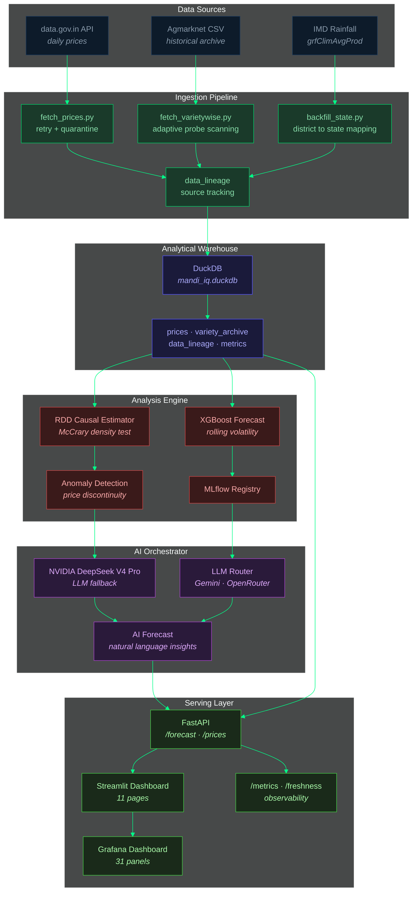

# MandiIQ — Agricultural Margin Intelligence & Causal RDD System

[](https://github.com/flawsom/MandiIQ/actions/workflows/ci.yml)
[](https://github.com/flawsom/MandiIQ/actions/workflows/deploy-render.yml)
[](https://github.com/flawsom/MandiIQ/actions/workflows/nightly-ingest.yml)
[](https://github.com/flawsom/MandiIQ/actions/workflows/dashboard-heartbeat.yml)
[](https://github.com/flawsom/MandiIQ/actions/workflows/dashboard-drift-detector.yml)
[](https://github.com/flawsom/MandiIQ/actions/workflows/dashboard-sync.yml)
[](LICENSE)

> **Open-source agricultural price-intelligence platform** &middot; Causal RDD + ML forecasting + DuckDB warehouse &middot; Built with Streamlit, FastAPI, and a dark-mode pixel-perfect UI.

---

## Deployment & Monitoring

| Service | URL | Status |
|---------|-----|--------|
| **FastAPI (Production)** | [mandiiq-api.onrender.com](https://mandiiq-api.onrender.com) | &#x2705; Live |
| **Streamlit Dashboard** | [mandiiq.streamlit.app](https://mandiiq.streamlit.app) | &#x2705; Live |
| **Landing Page** | [mandiiq.unifies.codes](https://mandiiq.unifies.codes) | &#x2705; Live |
| **GitHub Repo** | [github.com/flawsom/MandiIQ](https://github.com/flawsom/MandiIQ) | &#x2705; Public |

---

## Architecture



---

## Key Features

### 1. Causal Inference Engine
- **RDD (Regression Discontinuity Design)** &mdash; identifies price discontinuities at the IMD -20% rainfall-deficit threshold
- **McCrary density test** &mdash; validates the discontinuity is not an artifact of sorting
- **Empirical finding** &mdash; Onion, Tomato, and Potato show statistically significant price jumps at the drought cutoff

### 2. Predictive Analytics
- **XGBoost models** &mdash; rolling 30-day price forecasts with volatility envelopes
- **Anomaly detection** &mdash; flags prices that deviate >2 sigma from the RDD-adjusted trend
- **MLflow registry** &mdash; track model versions, parameters, and performance metrics

### 3. Data Pipeline & Ingestion
- **Automated ELT** &mdash; hourly data.gov.in fetches with retry-and-quarantine for stale API pages
- **Adaptive probe scanning** &mdash; logarithmic probe count (max 10, min 3) based on archive size
- **Circuit breaker** &mdash; skips variety-wise archive for 24h after 3 consecutive majority-stale runs
- **Data lineage** &mdash; every price row tracked to source (API resource ID, HTTP response, timestamp)
- **Backfill state** &mdash; district to state mapping from Ashoka API + coordinate lookup

### 4. High-Performance Serving
- **FastAPI** &mdash; `/forecast`, `/prices`, `/freshness`, `/admin/*` endpoints
- **DuckDB warehouse** &mdash; local analytical store with 364K+ price records
- **LLM Router** &mdash; NVIDIA DeepSeek V4 Pro, Gemini, OpenRouter fallback chain
- **Streamlit dashboard** &mdash; 11 pages with executive overview, trend analysis, causal diagnostics

### 5. Observability Stack
- **Prometheus metrics** on `/metrics` &mdash; pipeline latency histograms, API error rates, step durations
- **Grafana dashboard** &mdash; 31 panels with pipeline heatmaps, cache health, data freshness
- **Dashboard version monitor** &mdash; heartbeat + drift detector workflows keep dashboards in sync

### 6. Dashboard Cache Management
- **Smart heartbeat** &mdash; hourly ping with MD5 hash comparison; only refreshes when content changed
- **Drift detector** &mdash; daily check comparing production dashboard hash vs committed repo file
- **Auto-sync** &mdash; on-push webhook with conditional hash check avoids unnecessary deployments

---

## Workflows

| Workflow | Trigger | Purpose |
|----------|---------|---------|
| **CI** | Push/PR | Run test suite, linting, type checks |
| **Deploy to Render** | Push to `master` | Deploy FastAPI to production |
| **Nightly Ingestion** | Daily 02:00 UTC | Fetch fresh prices, update DuckDB, commit & deploy |
| **Dashboard Heartbeat** | Hourly | Ping Grafana webhook; conditionally refresh cache |
| **Dashboard Drift Detector** | Daily 08:00 UTC | Compare production dashboard hash vs repo; file issue on drift |
| **Dashboard Sync** | Push to `dashboards/*.json` | POST webhook to refresh Grafana; conditional on hash change |
| **Freshness Check** | Daily 06:00 UTC | Alert if any top-10 commodity stale >48h |
| **Pages Deploy** | Push to `master` | Deploy GitHub Pages documentation |

---

## Getting Started

### Prerequisites
- Python 3.10+
- [Git LFS](https://git-lfs.com/) (for DuckDB tracking)

### Local Setup

```bash
# Clone and enter
git clone https://github.com/flawsom/MandiIQ.git
cd MandiIQ

# Set up environment
python -m venv .venv
source .venv/bin/activate  # or .venv\Scripts\activate on Windows
pip install -r requirements.txt

# Launch dashboard
streamlit run mandi_rdd/dashboard/app.py
```

### API Server

```bash
# Start FastAPI (development)
uvicorn mandi_rdd.api.main:app --reload --port 8000

# Verify
curl http://localhost:8000/health
```

---

## Environment Variables

Copy `.env.example` and fill in the required keys:

| Variable | Required | Description |
|----------|----------|-------------|
| `DATA_GOV_IN_API_KEY` | &#x2705; | data.gov.in API key for daily prices |
| `NVIDIA_API_KEY` | &#x2705; | NVIDIA AI API (DeepSeek V4 Pro) |
| `GEMINI_API_KEY` | &#x2B1C; | Fallback LLM provider |
| `OPENROUTER_API_KEY` | &#x2B1C; | Secondary fallback LLM |
| `MANDIIQ_DB_PATH` | &#x2B1C; | DuckDB path (default: `mandi_rdd/data/mandi_iq.duckdb`) |
| `SECRET_KEY` | &#x2B1C; | Session signing / CSRF |
| `WEBHOOK_SECRET` | &#x2B1C; | Grafana webhook authentication |
| `ALL_INDIA_RAINFALL_API_KEY` | &#x2B1C; | IMD rainfall data |
| `PORT` | &#x2B1C; | Server port (default: 8000) |
| `RENDER_DEPLOY_HOOK_URL` | &#x2B1C; | Render deploy hook URL (set as GitHub secret) |

---

## Repository Structure

```
mandi_rdd/              # Main package
├── api/                # FastAPI application
│   ├── main.py         # App factory, routes, middleware
│   └── router.py       # LLM fallback chain
├── core/               # Shared utilities
│   ├── db.py           # DuckDB connection management
│   ├── metrics.py      # PipelineMetrics singleton
│   └── data_access.py  # Data access layer with lineage
├── ingestion/          # Data pipeline
│   ├── fetch_prices.py         # Daily price fetcher
│   ├── fetch_varietywise.py    # Archive scan with probes
│   ├── archive_scanner.py      # Quarantine + circuit breaker
│   └── backfill_state.py       # District to state enrichment
├── dashboard/          # Streamlit UI
│   ├── app.py          # Dashboard entrypoint
│   ├── pages/          # 11 Streamlit pages
│   └── icons.py        # SVG icon system
├── models/             # ML models
│   ├── rdd.py          # RDD estimator
│   └── forecast.py     # XGBoost forecasting
├── ai/                 # AI orchestration
│   └── router.py       # LLM router (NVIDIA, Gemini, OpenRouter)
├── scripts/            # CLI utilities
├── data/               # Database & data files
├── dashboards/         # Grafana dashboard JSON
├── docs/               # GitHub Pages documentation
├── diagrams/           # Mermaid architecture diagrams
├── .github/workflows/  # CI/CD workflows
└── sql/                # Analytical SQL queries
```

---

## Causal Methodology

MandiIQ applies a **Regression Discontinuity Design** at the IMD -20% rainfall-departure threshold:

```
P = b0 + b1 * D + f(R) + g * X + e
```

- **D** = 1 when rainfall departure <= -20%
- **f(R)** = flexible polynomial in the running variable
- **b1** = causal effect of crossing the drought threshold on price

The McCrary density test validates that commodity volumes do not systematically sort around the cutoff (ruling out endogenous sorting). Empirical results show Onion, Tomato, and Potato exhibit statistically significant discontinuities at alpha = 0.05.

---

## Production & Scaling

- **10M+ transactions** &mdash; Kafka ingestion + BigQuery warehouse + Feast feature store
- **High availability** &mdash; Kubernetes with HPA, Feast for online features, read-replica DuckDB
- **Model governance** &mdash; MLflow registry with champion/challenger promotion
- **Fail-safe** &mdash; RDD-only fallback when MLflow registry is unreachable

---

## License

MIT &mdash; see [LICENSE](LICENSE).
