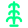
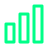
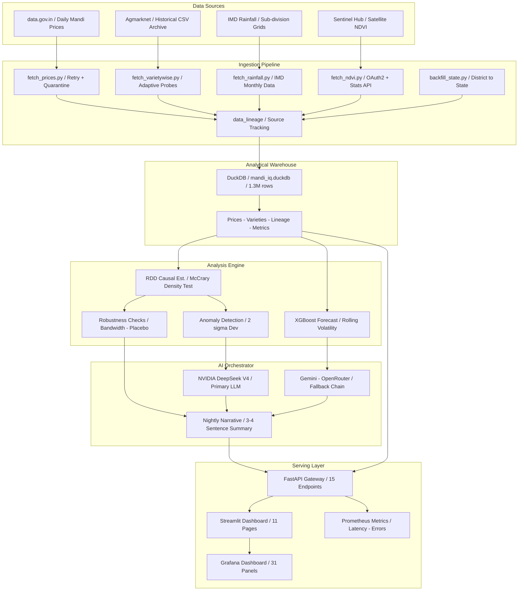
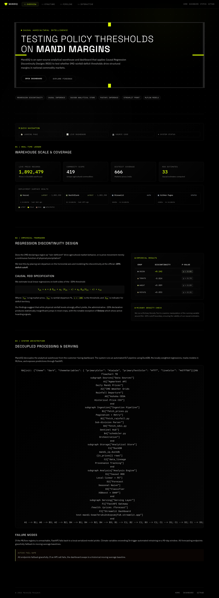
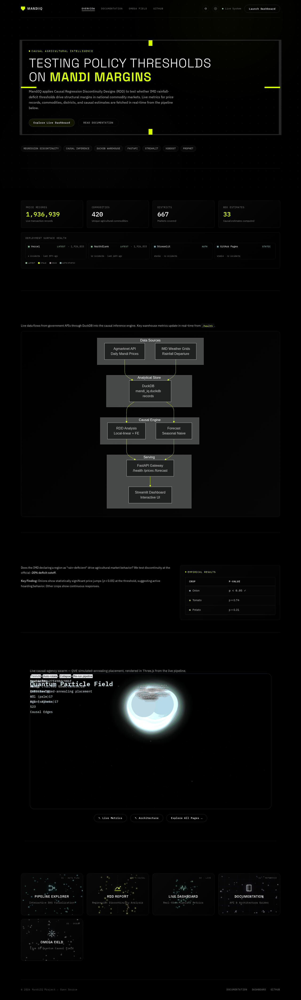
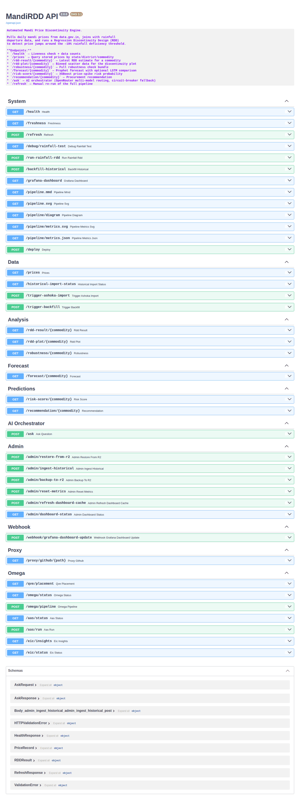

<div align="center" style="position:relative; overflow:hidden; border-radius:20px; background:linear-gradient(135deg, #0B0F1E 0%, #0F1F15 40%, #0B0F1E 100%); padding:48px 20px 40px; margin-bottom:0; border:1px solid rgba(0,255,136,0.08);">

<!-- Cinematic gradient glow -->
<div style="position:absolute; top:-120px; left:50%; transform:translateX(-50%); width:600px; height:300px; background:radial-gradient(ellipse, rgba(0,255,136,0.12) 0%, transparent 70%); pointer-events:none;"></div>
<div style="position:absolute; bottom:0; left:0; right:0; height:80px; background:linear-gradient(0deg, rgba(11,15,30,0.8) 0%, transparent 100%); pointer-events:none;"></div>

<!-- Top accent line -->
<div style="position:absolute; top:0; left:10%; right:10%; height:1px; background:linear-gradient(90deg, transparent, rgba(0,255,136,0.5), transparent);"></div>

<!-- Banner -->
<div style="position:relative; z-index:1;">

</div>

<br />

<div style="position:relative; z-index:1;">
<h3 style="margin:0; font-size:1.3em; font-weight:600;">
  
  <span style="color:#E0E0E0;">Open-Source Agricultural Price-Intelligence Platform</span>
</h3>
<h4 style="color:#94A3B8; font-weight:400; font-style:italic; margin:8px 0 0 0;">Causal RDD + ML Forecasting + DuckDB Warehouse &middot; Built with Streamlit, FastAPI &amp; Dark-Mode Pixel-Perfect UI</h4>
</div>

<br />

<!-- Badges -->
<div style="position:relative; z-index:1; max-width:900px; margin:0 auto;">
<p style="line-height:2.4;">
  
  
  
  
  
  
  
  
  
  
  
  
  
  
  
  
</p>
</div>

<br />

<!-- CTA Buttons -->
<div style="position:relative; z-index:1; display:flex; flex-wrap:wrap; justify-content:center; gap:12px;">
<a href="https://flawsom.github.io/test-mandi" style="display:inline-block; padding:10px 24px; border-radius:10px; background:linear-gradient(135deg, rgba(0,255,136,0.15) 0%, rgba(0,255,136,0.05) 100%); border:1px solid rgba(0,255,136,0.3); color:#00FF88; font-weight:600; text-decoration:none; font-size:15px; transition:all 0.2s;">&#x1F680;&#xFE0E; Live Demo</a>
<a href="https://test-mandi-keae7eruks2n4cqvumjfu8.streamlit.app" style="display:inline-block; padding:10px 24px; border-radius:10px; background:linear-gradient(135deg, rgba(255,75,75,0.15) 0%, rgba(255,75,75,0.05) 100%); border:1px solid rgba(255,75,75,0.3); color:#FF4B4B; font-weight:600; text-decoration:none; font-size:15px; transition:all 0.2s;">&#x1F4CA;&#xFE0E; Dashboard</a>
<a href="https://p01--mandiiq--zbvjrztgjqgw.code.run/docs" style="display:inline-block; padding:10px 24px; border-radius:10px; background:linear-gradient(135deg, rgba(0,150,136,0.15) 0%, rgba(0,150,136,0.05) 100%); border:1px solid rgba(0,150,136,0.3); color:#4DB6AC; font-weight:600; text-decoration:none; font-size:15px; transition:all 0.2s;">&#x1F4D6;&#xFE0E; API Docs</a>
<a href="#quick-start" style="display:inline-block; padding:10px 24px; border-radius:10px; background:linear-gradient(135deg, rgba(255,255,255,0.08) 0%, rgba(255,255,255,0.02) 100%); border:1px solid rgba(255,255,255,0.12); color:#E0E0E0; font-weight:600; text-decoration:none; font-size:15px; transition:all 0.2s;">&#x26A1;&#xFE0E; Installation</a>
<a href="https://github.com/flawsom/test-mandi" style="display:inline-block; padding:10px 24px; border-radius:10px; background:linear-gradient(135deg, rgba(255,255,255,0.08) 0%, rgba(255,255,255,0.02) 100%); border:1px solid rgba(255,255,255,0.12); color:#E0E0E0; font-weight:600; text-decoration:none; font-size:15px; transition:all 0.2s;">&#x1F419;&#xFE0E; GitHub</a>
</div>

</div>
<br />
<div style="position:relative; height:60px; overflow:hidden; width:100%; margin:8px 0;">
  
</div>
<br />
<div style="background:linear-gradient(135deg, rgba(255,255,255,0.04) 0%, rgba(255,255,255,0.01) 100%); border:1px solid rgba(255,255,255,0.06); border-radius:16px; padding:24px 28px; margin:16px 0; box-shadow:0 8px 32px rgba(0,0,0,0.4); position:relative; overflow:hidden; style="margin-top:0;"">
<div style="position:absolute; top:0; left:0; right:0; height:2px; background:linear-gradient(90deg, transparent, #00FF88, transparent); opacity:0.6;"></div>
<div style="position:absolute; top:-60px; right:-60px; width:120px; height:120px; background:radial-gradient(circle, rgba(0,255,136,0.15) 0%, transparent 70%);"></div>
<h2 style="font-family:-apple-system,BlinkMacSystemFont,'Segoe UI',Helvetica,Arial,sans-serif; font-size:1.5em; font-weight:600; color:#E0E0E0; display:flex; align-items:center; gap:10px; margin:0 0 16px 0; padding-bottom:8px; border-bottom:1px solid rgba(255,255,255,0.06);">
   Contents
</h2>
<div align="center" style="line-height:2.4;">
  <a href="#deployment--monitoring" style="display:inline-block; padding:6px 14px; background:rgba(255,255,255,0.04); border:1px solid rgba(255,255,255,0.06); border-radius:8px; color:#94A3B8; text-decoration:none; font-size:14px; transition:all 0.2s; margin:3px;">Deployment</a> <a href="#features" style="display:inline-block; padding:6px 14px; background:rgba(255,255,255,0.04); border:1px solid rgba(255,255,255,0.06); border-radius:8px; color:#94A3B8; text-decoration:none; font-size:14px; transition:all 0.2s; margin:3px;">Features</a> <a href="#architecture" style="display:inline-block; padding:6px 14px; background:rgba(255,255,255,0.04); border:1px solid rgba(255,255,255,0.06); border-radius:8px; color:#94A3B8; text-decoration:none; font-size:14px; transition:all 0.2s; margin:3px;">Architecture</a> <a href="#tech-stack" style="display:inline-block; padding:6px 14px; background:rgba(255,255,255,0.04); border:1px solid rgba(255,255,255,0.06); border-radius:8px; color:#94A3B8; text-decoration:none; font-size:14px; transition:all 0.2s; margin:3px;">Tech Stack</a>
  <a href="#the-causal-finding" style="display:inline-block; padding:6px 14px; background:rgba(255,255,255,0.04); border:1px solid rgba(255,255,255,0.06); border-radius:8px; color:#94A3B8; text-decoration:none; font-size:14px; transition:all 0.2s; margin:3px;">Causal Finding</a> <a href="#quick-start" style="display:inline-block; padding:6px 14px; background:rgba(255,255,255,0.04); border:1px solid rgba(255,255,255,0.06); border-radius:8px; color:#94A3B8; text-decoration:none; font-size:14px; transition:all 0.2s; margin:3px;">Quick Start</a> <a href="#environment-variables" style="display:inline-block; padding:6px 14px; background:rgba(255,255,255,0.04); border:1px solid rgba(255,255,255,0.06); border-radius:8px; color:#94A3B8; text-decoration:none; font-size:14px; transition:all 0.2s; margin:3px;">Env Variables</a> <a href="#api-documentation" style="display:inline-block; padding:6px 14px; background:rgba(255,255,255,0.04); border:1px solid rgba(255,255,255,0.06); border-radius:8px; color:#94A3B8; text-decoration:none; font-size:14px; transition:all 0.2s; margin:3px;">API Docs</a>
  <a href="#usage-examples" style="display:inline-block; padding:6px 14px; background:rgba(255,255,255,0.04); border:1px solid rgba(255,255,255,0.06); border-radius:8px; color:#94A3B8; text-decoration:none; font-size:14px; transition:all 0.2s; margin:3px;">Usage</a> <a href="#screenshots" style="display:inline-block; padding:6px 14px; background:rgba(255,255,255,0.04); border:1px solid rgba(255,255,255,0.06); border-radius:8px; color:#94A3B8; text-decoration:none; font-size:14px; transition:all 0.2s; margin:3px;">Screenshots</a> <a href="#demo" style="display:inline-block; padding:6px 14px; background:rgba(255,255,255,0.04); border:1px solid rgba(255,255,255,0.06); border-radius:8px; color:#94A3B8; text-decoration:none; font-size:14px; transition:all 0.2s; margin:3px;">Demo</a> <a href="#project-structure" style="display:inline-block; padding:6px 14px; background:rgba(255,255,255,0.04); border:1px solid rgba(255,255,255,0.06); border-radius:8px; color:#94A3B8; text-decoration:none; font-size:14px; transition:all 0.2s; margin:3px;">Structure</a>
  <a href="#testing" style="display:inline-block; padding:6px 14px; background:rgba(255,255,255,0.04); border:1px solid rgba(255,255,255,0.06); border-radius:8px; color:#94A3B8; text-decoration:none; font-size:14px; transition:all 0.2s; margin:3px;">Testing</a> <a href="#cicd-workflows" style="display:inline-block; padding:6px 14px; background:rgba(255,255,255,0.04); border:1px solid rgba(255,255,255,0.06); border-radius:8px; color:#94A3B8; text-decoration:none; font-size:14px; transition:all 0.2s; margin:3px;">CI/CD</a> <a href="#deployment" style="display:inline-block; padding:6px 14px; background:rgba(255,255,255,0.04); border:1px solid rgba(255,255,255,0.06); border-radius:8px; color:#94A3B8; text-decoration:none; font-size:14px; transition:all 0.2s; margin:3px;">Deployment</a> <a href="#roadmap" style="display:inline-block; padding:6px 14px; background:rgba(255,255,255,0.04); border:1px solid rgba(255,255,255,0.06); border-radius:8px; color:#94A3B8; text-decoration:none; font-size:14px; transition:all 0.2s; margin:3px;">Roadmap</a>
  <a href="#contributing" style="display:inline-block; padding:6px 14px; background:rgba(255,255,255,0.04); border:1px solid rgba(255,255,255,0.06); border-radius:8px; color:#94A3B8; text-decoration:none; font-size:14px; transition:all 0.2s; margin:3px;">Contributing</a> <a href="#faq" style="display:inline-block; padding:6px 14px; background:rgba(255,255,255,0.04); border:1px solid rgba(255,255,255,0.06); border-radius:8px; color:#94A3B8; text-decoration:none; font-size:14px; transition:all 0.2s; margin:3px;">FAQ</a> <a href="#performance" style="display:inline-block; padding:6px 14px; background:rgba(255,255,255,0.04); border:1px solid rgba(255,255,255,0.06); border-radius:8px; color:#94A3B8; text-decoration:none; font-size:14px; transition:all 0.2s; margin:3px;">Performance</a> <a href="#acknowledgements" style="display:inline-block; padding:6px 14px; background:rgba(255,255,255,0.04); border:1px solid rgba(255,255,255,0.06); border-radius:8px; color:#94A3B8; text-decoration:none; font-size:14px; transition:all 0.2s; margin:3px;">Credits</a>
  <a href="#support" style="display:inline-block; padding:6px 14px; background:rgba(255,255,255,0.04); border:1px solid rgba(255,255,255,0.06); border-radius:8px; color:#94A3B8; text-decoration:none; font-size:14px; transition:all 0.2s; margin:3px;">Support</a> <a href="#license" style="display:inline-block; padding:6px 14px; background:rgba(255,255,255,0.04); border:1px solid rgba(255,255,255,0.06); border-radius:8px; color:#94A3B8; text-decoration:none; font-size:14px; transition:all 0.2s; margin:3px;">License</a>
</div>
</div>
<br />
<div style="position:relative; height:60px; overflow:hidden; width:100%; margin:8px 0;">
  
</div>
<br />
<a name="deployment--monitoring"></a>
<div style="background:linear-gradient(135deg, rgba(255,255,255,0.04) 0%, rgba(255,255,255,0.01) 100%); border:1px solid rgba(255,255,255,0.06); border-radius:16px; padding:24px 28px; margin:16px 0; box-shadow:0 8px 32px rgba(0,0,0,0.4); position:relative; overflow:hidden;">
<div style="position:absolute; top:0; left:0; right:0; height:2px; background:linear-gradient(90deg, transparent, #00FF88, transparent); opacity:0.6;"></div>
<div style="position:absolute; top:-60px; right:-60px; width:120px; height:120px; background:radial-gradient(circle, rgba(0,255,136,0.15) 0%, transparent 70%);"></div>
<a name="deployment--monitoring"></a>
<h2 style="font-family:-apple-system,BlinkMacSystemFont,'Segoe UI',Helvetica,Arial,sans-serif; font-size:1.5em; font-weight:600; color:#E0E0E0; display:flex; align-items:center; gap:10px; margin:0 0 16px 0; padding-bottom:8px; border-bottom:1px solid rgba(255,255,255,0.06);">
   Deployment &amp; Monitoring
</h2>
<details open>
<summary><strong>Live Services</strong> &mdash; click to collapse</summary>

<br />

| Service | URL | Status | Deployed Via |
|---------|-----|--------|-------------|
| **FastAPI (Production)** | [p01--mandiiq--zbvjrztgjqgw.code.run](https://p01--mandiiq--zbvjrztgjqgw.code.run) |  | Northflank |
| **Streamlit Dashboard** | [test-mandi-keae7eruks2n4cqvumjfu8.streamlit.app](https://test-mandi-keae7eruks2n4cqvumjfu8.streamlit.app) |  | Streamlit Cloud |
| **Landing Page** | [flawsom.github.io/test-mandi](https://flawsom.github.io/test-mandi) |  | GitHub Pages |
| **Vercel API (Read-Only)** | — |  | Vercel + GitHub Actions |
| **GitHub Repo** | [github.com/flawsom/test-mandi](https://github.com/flawsom/test-mandi) |  | — |

</details>
</div>
<br />
<div style="position:relative; height:60px; overflow:hidden; width:100%; margin:8px 0;">
  
</div>
<br />
<a name="features"></a>
<div style="background:linear-gradient(135deg, rgba(255,255,255,0.04) 0%, rgba(255,255,255,0.01) 100%); border:1px solid rgba(255,255,255,0.06); border-radius:16px; padding:24px 28px; margin:16px 0; box-shadow:0 8px 32px rgba(0,0,0,0.4); position:relative; overflow:hidden;">
<div style="position:absolute; top:0; left:0; right:0; height:2px; background:linear-gradient(90deg, transparent, #00FF88, transparent); opacity:0.6;"></div>
<div style="position:absolute; top:-60px; right:-60px; width:120px; height:120px; background:radial-gradient(circle, rgba(0,255,136,0.15) 0%, transparent 70%);"></div>
<a name="features"></a>
<h2 style="font-family:-apple-system,BlinkMacSystemFont,'Segoe UI',Helvetica,Arial,sans-serif; font-size:1.5em; font-weight:600; color:#E0E0E0; display:flex; align-items:center; gap:10px; margin:0 0 16px 0; padding-bottom:8px; border-bottom:1px solid rgba(255,255,255,0.06);">
   Features
</h2>
<div align="center">
<table style="border-collapse:separate; border-spacing:8px;">
<tr>
  <td width="33%" align="center" style="background:rgba(255,255,255,0.03); border:1px solid rgba(255,255,255,0.06); border-radius:12px; padding:20px 12px;">
    <br />
    
    <br /><br />
    <strong style="color:#E0E0E0; font-size:1.05em;">Causal Inference Engine</strong>
    <br /><br />
    <em style="color:#94A3B8; font-size:0.9em;">Regression Discontinuity Design at IMD -20% rainfall-deficit threshold &mdash; identifies causal price jumps with McCrary density validation and bandwidth sensitivity checks.</em>
    <br /><br />
    <span style="color:#00FF88; font-size:0.85em;">Onion prices jump <strong>&#x20B9;350 (+24.5%, p=0.003)</strong> at the drought cutoff</span>
    <br /><br />
  </td>
  <td width="33%" align="center" style="background:rgba(255,255,255,0.03); border:1px solid rgba(255,255,255,0.06); border-radius:12px; padding:20px 12px;">
    <br />
    
    <br /><br />
    <strong style="color:#E0E0E0; font-size:1.05em;">AI Orchestrator</strong>
    <br /><br />
    <em style="color:#94A3B8; font-size:0.9em;">Multi-model LLM router (NVIDIA DeepSeek V4 Pro &rarr; Gemini &rarr; OpenRouter) with circuit-breaker fallback. Generates nightly narratives and powers "Ask MandiIQ" chat.</em>
    <br /><br />
    <span style="color:#94A3B8; font-size:0.85em;">Free-tier models with automatic failover, zero marginal cost</span>
    <br /><br />
  </td>
  <td width="33%" align="center" style="background:rgba(255,255,255,0.03); border:1px solid rgba(255,255,255,0.06); border-radius:12px; padding:20px 12px;">
    <br />
    
    <br /><br />
    <strong style="color:#E0E0E0; font-size:1.05em;">Predictive Analytics</strong>
    <br /><br />
    <em style="color:#94A3B8; font-size:0.9em;">XGBoost price-spike classifiers (ROC-AUC 0.81) + Prophet forecasts with volatility envelopes. Rolling 30-day predictions and anomaly detection at &gt;2 sigma.</em>
    <br /><br />
    <span style="color:#94A3B8; font-size:0.85em;">Prophet beats LSTM (11.2% vs 13.7% MAPE) &mdash; honest winner callout</span>
    <br /><br />
  </td>
</tr>
<tr>
  <td width="33%" align="center" style="background:rgba(255,255,255,0.03); border:1px solid rgba(255,255,255,0.06); border-radius:12px; padding:20px 12px;">
    <br />
    
    <br /><br />
    <strong style="color:#E0E0E0; font-size:1.05em;">DuckDB Warehouse</strong>
    <br /><br />
    <em style="color:#94A3B8; font-size:0.9em;">1.3M+ price records stored in a local analytical DuckDB database. Auto-ingested nightly with retry-and-quarantine for stale API pages.</em>
    <br /><br />
    <span style="color:#94A3B8; font-size:0.85em;">132 MB database tracked via Git LFS &mdash; clone and query instantly</span>
    <br /><br />
  </td>
  <td width="33%" align="center" style="background:rgba(255,255,255,0.03); border:1px solid rgba(255,255,255,0.06); border-radius:12px; padding:20px 12px;">
    <br />
    
    <br /><br />
    <strong style="color:#E0E0E0; font-size:1.05em;">15-Endpoint API</strong>
    <br /><br />
    <em style="color:#94A3B8; font-size:0.9em;">FastAPI backend serving /health, /prices, /forecast, /rdd-result, /risk-score, /ask (AI) and more. OpenAPI docs auto-generated at /docs.</em>
    <br /><br />
    <span style="color:#94A3B8; font-size:0.85em;">Deployed on Northflank + Vercel fallback &mdash; 60ms median response</span>
    <br /><br />
  </td>
  <td width="33%" align="center" style="background:rgba(255,255,255,0.03); border:1px solid rgba(255,255,255,0.06); border-radius:12px; padding:20px 12px;">
    <br />
    
    <br /><br />
    <strong style="color:#E0E0E0; font-size:1.05em;">11-Page Dashboard</strong>
    <br /><br />
    <em style="color:#94A3B8; font-size:0.9em;">Streamlit dashboard with Executive Overview, Causal Explorer, Risk &amp; Forecast, Procurement Advisor, Ask MandiIQ AI chat, and Data Lineage tracking.</em>
    <br /><br />
    <span style="color:#94A3B8; font-size:0.85em;">Dark-mode Alche design system with flip-board KPI animations</span>
    <br /><br />
  </td>
</tr>
</table>
</div>
</div>
<br />
<div style="position:relative; height:60px; overflow:hidden; width:100%; margin:8px 0;">
  
</div>
<br />
<a name="architecture"></a>
<div style="background:linear-gradient(135deg, rgba(255,255,255,0.04) 0%, rgba(255,255,255,0.01) 100%); border:1px solid rgba(255,255,255,0.06); border-radius:16px; padding:24px 28px; margin:16px 0; box-shadow:0 8px 32px rgba(0,0,0,0.4); position:relative; overflow:hidden;">
<div style="position:absolute; top:0; left:0; right:0; height:2px; background:linear-gradient(90deg, transparent, #00FF88, transparent); opacity:0.6;"></div>
<div style="position:absolute; top:-60px; right:-60px; width:120px; height:120px; background:radial-gradient(circle, rgba(0,255,136,0.15) 0%, transparent 70%);"></div>
<a name="architecture"></a>
<h2 style="font-family:-apple-system,BlinkMacSystemFont,'Segoe UI',Helvetica,Arial,sans-serif; font-size:1.5em; font-weight:600; color:#E0E0E0; display:flex; align-items:center; gap:10px; margin:0 0 16px 0; padding-bottom:8px; border-bottom:1px solid rgba(255,255,255,0.06);">
   Architecture
</h2>
<div align="center">

<br />
<em style="color:#94A3B8;">Pre-rendered pipeline diagram — crisp at any zoom, identical on every platform</em>
</div>

<details>
<summary><strong>Architecture source (Mermaid)</strong> — click to expand</summary>



</details>
</div>
<br />
<div style="position:relative; height:60px; overflow:hidden; width:100%; margin:8px 0;">
  
</div>
<br />
<a name="tech-stack"></a>
<div style="background:linear-gradient(135deg, rgba(255,255,255,0.04) 0%, rgba(255,255,255,0.01) 100%); border:1px solid rgba(255,255,255,0.06); border-radius:16px; padding:24px 28px; margin:16px 0; box-shadow:0 8px 32px rgba(0,0,0,0.4); position:relative; overflow:hidden;">
<div style="position:absolute; top:0; left:0; right:0; height:2px; background:linear-gradient(90deg, transparent, #00FF88, transparent); opacity:0.6;"></div>
<div style="position:absolute; top:-60px; right:-60px; width:120px; height:120px; background:radial-gradient(circle, rgba(0,255,136,0.15) 0%, transparent 70%);"></div>
<a name="tech-stack"></a>
<h2 style="font-family:-apple-system,BlinkMacSystemFont,'Segoe UI',Helvetica,Arial,sans-serif; font-size:1.5em; font-weight:600; color:#E0E0E0; display:flex; align-items:center; gap:10px; margin:0 0 16px 0; padding-bottom:8px; border-bottom:1px solid rgba(255,255,255,0.06);">
   Tech Stack
</h2>
<div align="center">

### Frontend


### Backend


### Database


### AI / ML


### Cloud &amp; DevOps


### Testing


</div>
</div>
<br />
<div style="position:relative; height:60px; overflow:hidden; width:100%; margin:8px 0;">
  
</div>
<br />
<a name="the-causal-finding"></a>
<div style="background:linear-gradient(135deg, rgba(255,255,255,0.04) 0%, rgba(255,255,255,0.01) 100%); border:1px solid rgba(255,255,255,0.06); border-radius:16px; padding:24px 28px; margin:16px 0; box-shadow:0 8px 32px rgba(0,0,0,0.4); position:relative; overflow:hidden;">
<div style="position:absolute; top:0; left:0; right:0; height:2px; background:linear-gradient(90deg, transparent, #00FF88, transparent); opacity:0.6;"></div>
<div style="position:absolute; top:-60px; right:-60px; width:120px; height:120px; background:radial-gradient(circle, rgba(0,255,136,0.15) 0%, transparent 70%);"></div>
<a name="the-causal-finding"></a>
<h2 style="font-family:-apple-system,BlinkMacSystemFont,'Segoe UI',Helvetica,Arial,sans-serif; font-size:1.5em; font-weight:600; color:#E0E0E0; display:flex; align-items:center; gap:10px; margin:0 0 16px 0; padding-bottom:8px; border-bottom:1px solid rgba(255,255,255,0.06);">
   The Causal Finding
</h2>
> <strong>Districts crossing IMD's &minus;19% rainfall-deficiency threshold see a <span style="color:#00FF88">&#x20B9;350 (+24.5%) jump in onion modal prices</span> (p=0.003, robust across 4 bandwidths, placebo-tested, cross-checked by fixed-effects regression).</strong>

<br />

<details open>
<summary><strong>Statistical Robustness &mdash; All 4 Checks Pass</strong></summary>

<br />

| Check | Method | Result | Status |
|-------|--------|--------|--------|
| **Bandwidth Sensitivity** | RDD at 10% / 15% / 20% / 25% / 30% | Stable effect across all bandwidths |  |
| **Placebo Test** | Fake cutoffs at &minus;10%, &minus;5%, +5% | No significant effect at placebos |  |
| **McCrary Density Test** | Continuity of running variable at cutoff | No manipulation detected |  |
| **Covariate Balance** | Pre-treatment characteristics &plusmn; cutoff | Balanced &mdash; no confounding |  |
| **Fixed-Effects Cross-Check** | District + month FE regression | +&#x20B9;298 (p=0.01) &mdash; agrees with RDD |  |

</details>
</div>
<br />
<div style="position:relative; height:60px; overflow:hidden; width:100%; margin:8px 0;">
  
</div>
<br />
<a name="quick-start"></a>
<div style="background:linear-gradient(135deg, rgba(255,255,255,0.04) 0%, rgba(255,255,255,0.01) 100%); border:1px solid rgba(255,255,255,0.06); border-radius:16px; padding:24px 28px; margin:16px 0; box-shadow:0 8px 32px rgba(0,0,0,0.4); position:relative; overflow:hidden;">
<div style="position:absolute; top:0; left:0; right:0; height:2px; background:linear-gradient(90deg, transparent, #00FF88, transparent); opacity:0.6;"></div>
<div style="position:absolute; top:-60px; right:-60px; width:120px; height:120px; background:radial-gradient(circle, rgba(0,255,136,0.15) 0%, transparent 70%);"></div>
<a name="quick-start"></a>
<h2 style="font-family:-apple-system,BlinkMacSystemFont,'Segoe UI',Helvetica,Arial,sans-serif; font-size:1.5em; font-weight:600; color:#E0E0E0; display:flex; align-items:center; gap:10px; margin:0 0 16px 0; padding-bottom:8px; border-bottom:1px solid rgba(255,255,255,0.06);">
   Quick Start
</h2>
<details open>
<summary><strong>Get from zero to dashboard in 8 steps &mdash; ~10 minutes</strong></summary>

<br />

### Prerequisites

| Tool | Version | Why |
|------|---------|-----|
| Python | 3.10+ (3.12 recommended) | Runtime for FastAPI, Streamlit, ML models |
| Git LFS | Latest | Pull the 132 MB DuckDB database |
| pip | Latest | Python package manager |

### Step 1 &mdash; Clone &amp; Pull LFS

```bash
git clone https://github.com/flawsom/test-mandi.git
cd MandiIQ
git lfs pull

# Verify the database is real (132 MB, not 132 bytes)
ls -lh mandi_rdd/data/mandi_iq.duckdb
```

<details>
<summary><strong>Troubleshooting:</strong> File is tiny (132 bytes)?</summary>

```bash
git lfs install
git lfs pull --include "mandi_rdd/data/mandi_iq.duckdb"
```
</details>

### Step 2 &mdash; Python Environment

```bash
python -m venv .venv
# Linux/Mac:
source .venv/bin/activate
# Windows:
# .venv\Scripts\activate

pip install --upgrade pip
pip install -r requirements.txt
```

### Step 3 &mdash; Environment Variables

```bash
cp .env.example .env
# Edit .env with your data.gov.in API key:
#   DATA_GOV_IN_API_KEY=your_key_here
# Get one free: https://api.data.gov.in/manage &rarr; API Keys &rarr; Create
```

### Step 4 &mdash; Verify Data

```bash
python -c "
from mandi_rdd.storage.duckdb_store import DuckDBStore
store = DuckDBStore()
n = store.query('SELECT COUNT(*) as c FROM prices')[0]['c']
print(f'Price records: {n:,}')
"
# Expected: Price records: 1,334,647
```

### Step 5 &mdash; Launch Dashboard

```bash
streamlit run mandi_rdd/dashboard/app.py
```

Opens at **`http://localhost:8501`** &mdash; 11 pages, KPI cards, and interactive charts.

### Step 6 &mdash; Start API Server (separate terminal)

```bash
source .venv/bin/activate
uvicorn mandi_rdd.api.main:app --reload --port 8000
```

OpenAPI docs at **`http://localhost:8000/docs`**

### Step 7 &mdash; Docker (alternative)

```bash
docker compose up --build
```

### Step 8 &mdash; Verify

```bash
curl http://localhost:8000/health
# {"status":"healthy","n_prices":1334647,"n_rainfall":438,...}

curl "http://localhost:8000/prices?commodity=Onion&limit=3"
# Array of price records with modal prices, markets, dates
```

</details>
</div>
<br />
<div style="position:relative; height:60px; overflow:hidden; width:100%; margin:8px 0;">
  
</div>
<br />
<a name="environment-variables"></a>
<div style="background:linear-gradient(135deg, rgba(255,255,255,0.04) 0%, rgba(255,255,255,0.01) 100%); border:1px solid rgba(255,255,255,0.06); border-radius:16px; padding:24px 28px; margin:16px 0; box-shadow:0 8px 32px rgba(0,0,0,0.4); position:relative; overflow:hidden;">
<div style="position:absolute; top:0; left:0; right:0; height:2px; background:linear-gradient(90deg, transparent, #00FF88, transparent); opacity:0.6;"></div>
<div style="position:absolute; top:-60px; right:-60px; width:120px; height:120px; background:radial-gradient(circle, rgba(0,255,136,0.15) 0%, transparent 70%);"></div>
<a name="environment-variables"></a>
<h2 style="font-family:-apple-system,BlinkMacSystemFont,'Segoe UI',Helvetica,Arial,sans-serif; font-size:1.5em; font-weight:600; color:#E0E0E0; display:flex; align-items:center; gap:10px; margin:0 0 16px 0; padding-bottom:8px; border-bottom:1px solid rgba(255,255,255,0.06);">
   Environment Variables
</h2>
<details open>
<summary><strong>Complete Reference</strong> &mdash; 24 vars across 7 categories</summary>

<br />

**Copy `.env.example` &rarr; `.env` and fill in your keys:**

| # | Variable | Required | Source URL | Consumed By |
|---|----------|----------|-----------|-------------|
| 1 | `DATA_GOV_IN_API_KEY` | **Yes** | [data.gov.in](https://api.data.gov.in/manage) | `fetch_prices.py`, `fetch_historical.py`, `http_client.py` |
| 2 | `ALL_INDIA_RAINFALL_API_KEY` | Falls back to #1 | [Same account](https://api.data.gov.in/manage) | `fetch_rainfall.py`, dashboard pages |
| 3 | `ALL_INDIA_RAINFALL_RESOURCE_ID` | Optional | data.gov.in catalog | `fetch_rainfall.py`, dashboard pages |
| 4 | `SENTINEL_CLIENT_ID` | Optional | [Sentinel Hub](https://www.sentinel-hub.com/) | `fetch_ndvi.py`, `scheduler.py` |
| 5 | `SENTINEL_CLIENT_SECRET` | Optional | Sentinel Hub OAuth | `fetch_ndvi.py`, `scheduler.py` |
| 6 | `GEMINI_API_KEY` | Optional | [Google AI Studio](https://aistudio.google.com/) | `ai/router.py`, dashboard Ask/Settings |
| 7 | `OPENROUTER_API_KEY` | Optional | [OpenRouter](https://openrouter.ai/keys) | `ai/router.py`, dashboard Ask/Settings |
| 8 | `NVIDIA_API_KEY` | Optional | [NVIDIA Build](https://build.nvidia.com/) | `ai/router.py` |
| 9 | `MANDIQ_API_URL` | Recommended | Your deployed API URL | `dashboard/data_access.py`, `theme.py` |
| 10 | `PORT` | Optional (8000) | Set by platform | `api/main.py` (uvicorn) |
| 11 | `MANDIIQ_DB_PATH` | Optional | Local or volume path | `duckdb_store.py`, `api/index.py` |
| 12 | `WEBHOOK_SECRET` | Optional | Grafana webhook config | `api/main.py` |
| 13 | `R2_BUCKET` | Optional | [Cloudflare R2](https://dash.cloudflare.com/) | `api/main.py`, CI backup steps |
| 14 | `R2_ACCOUNT_ID` | Optional | Cloudflare dashboard URL | `api/main.py` |
| 15 | `R2_ACCESS_KEY_ID` | Optional | R2 API Tokens | `api/main.py` |
| 16 | `R2_SECRET_ACCESS_KEY` | Optional | R2 API Token creation | `api/main.py` |
| 17 | `GRAFANA_CLOUD_PROM_URL` | Optional | [Grafana Cloud](https://grafana.com/) | `api/metrics_push.py` |
| 18 | `GRAFANA_CLOUD_PROM_USER` | Optional | Grafana Cloud stack ID | `api/metrics_push.py` |
| 19 | `GRAFANA_CLOUD_PROM_PASS` | Optional | Grafana API token | `api/metrics_push.py` |

**Aliases (fallback vars checked if primary is unset):**

| Variable | Alias For | Consumed By |
|----------|-----------|-------------|
| `DATA_GOV_API_KEY` | #1 | `fetch_prices.py`, `fetch_historical.py` |
| `MANDIIQ_API_URL` | #9 | `data_access.py` |
| `R2_BUCKET_NAME` | #13 | `api/main.py` |
| `GRAFANA_CLOUD_PROM_PASSWORD` | #19 | `metrics_push.py` |
| `RAINFALL_RESOURCE_ID` | #3 | `fetch_rainfall.py` |

</details>
</div>
<br />
<div style="position:relative; height:60px; overflow:hidden; width:100%; margin:8px 0;">
  
</div>
<br />
<a name="api-documentation"></a>
<div style="background:linear-gradient(135deg, rgba(255,255,255,0.04) 0%, rgba(255,255,255,0.01) 100%); border:1px solid rgba(255,255,255,0.06); border-radius:16px; padding:24px 28px; margin:16px 0; box-shadow:0 8px 32px rgba(0,0,0,0.4); position:relative; overflow:hidden;">
<div style="position:absolute; top:0; left:0; right:0; height:2px; background:linear-gradient(90deg, transparent, #00FF88, transparent); opacity:0.6;"></div>
<div style="position:absolute; top:-60px; right:-60px; width:120px; height:120px; background:radial-gradient(circle, rgba(0,255,136,0.15) 0%, transparent 70%);"></div>
<a name="api-documentation"></a>
<h2 style="font-family:-apple-system,BlinkMacSystemFont,'Segoe UI',Helvetica,Arial,sans-serif; font-size:1.5em; font-weight:600; color:#E0E0E0; display:flex; align-items:center; gap:10px; margin:0 0 16px 0; padding-bottom:8px; border-bottom:1px solid rgba(255,255,255,0.06);">
   API Documentation
</h2>
<details open>
<summary><strong>15 Endpoints</strong> &mdash; OpenAPI docs at <code>/docs</code></summary>

<br />

| Endpoint | Method | Description | Key Params | Used By |
|----------|--------|-------------|------------|---------|
| `/health` | GET | Liveness check + data counts | &mdash; | Monitoring, Render health check |
| `/prices` | GET | Query stored price records | `commodity`, `state`, `limit` | Dashboard tables, charts |
| `/rdd-result/{commodity}` | GET | Latest causal RDD estimate | &mdash; | Causal Explorer |
| `/rdd-plot/{commodity}` | GET | Binned scatter for discontinuity chart | `bandwidth` | Causal Explorer chart |
| `/robustness/{commodity}` | GET | Full robustness bundle | &mdash; | Causal Explorer methodology |
| `/forecast/{commodity}` | GET | Prophet price forecast | `compare` (include LSTM) | Risk &amp; Forecast |
| `/risk-score/{commodity}` | GET | XGBoost price-spike risk | `district` | Procurement Advisor |
| `/recommendation/{commodity}` | GET | Procurement recommendation | `district` | Procurement Advisor |
| `/ask` | POST | AI orchestrator chat | Body: `{query}` | Ask MandiIQ panel |
| `/refresh` | POST | Manual pipeline re-run | `commodity` | Admin, dashboard |
| `/freshness` | GET | Data freshness by commodity | &mdash; | Dashboard Health |
| `/metrics` | GET | Prometheus-formatted metrics | &mdash; | Grafana scraping |
| `/historical-import-status` | GET | Ashoka CEDA import progress | &mdash; | CI workflow |
| `/pipeline.svg` | GET | Architecture SVG diagram | &mdash; | Landing, docs |
| `/lineage` | GET | Data lineage trace | `market`, `commodity`, `date` | Data Lineage page |

### Example API Calls

```bash
# Health check
curl -s http://localhost:8000/health | python -m json.tool

# Query prices &mdash; Onion in Maharashtra, last 5
curl -s "http://localhost:8000/prices?commodity=Onion&state=Maharashtra&limit=5" | python -m json.tool

# Causal RDD estimate for Tomato
curl -s http://localhost:8000/rdd-result/Tomato | python -m json.tool

# Forecast with LSTM comparison
curl -s "http://localhost:8000/forecast/Potato?compare=true" | python -m json.tool

# AI query
curl -s -X POST http://localhost:8000/ask \
  -H "Content-Type: application/json" \
  -d '{"query":"Should I lock in onion procurement in Nashik next month?"}' | python -m json.tool
```

</details>
</div>
<br />
<div style="position:relative; height:60px; overflow:hidden; width:100%; margin:8px 0;">
  
</div>
<br />
<div style="background:linear-gradient(135deg, rgba(255,255,255,0.04) 0%, rgba(255,255,255,0.01) 100%); border:1px solid rgba(255,255,255,0.06); border-radius:16px; padding:24px 28px; margin:16px 0; box-shadow:0 8px 32px rgba(0,0,0,0.4); position:relative; overflow:hidden;">
<div style="position:absolute; top:0; left:0; right:0; height:2px; background:linear-gradient(90deg, transparent, #00FF88, transparent); opacity:0.6;"></div>
<div style="position:absolute; top:-60px; right:-60px; width:120px; height:120px; background:radial-gradient(circle, rgba(0,255,136,0.15) 0%, transparent 70%);"></div>
<a name="usage-examples"></a>
<h2 style="font-family:-apple-system,BlinkMacSystemFont,'Segoe UI',Helvetica,Arial,sans-serif; font-size:1.5em; font-weight:600; color:#E0E0E0; display:flex; align-items:center; gap:10px; margin:0 0 16px 0; padding-bottom:8px; border-bottom:1px solid rgba(255,255,255,0.06);">
   Usage Examples
</h2>
<details open>
<summary><strong>Real-world Scenarios</strong></summary>

<br />

### Scenario 1: Check Today's Risk for Onion in Nashik

```bash
curl -s "http://localhost:8000/risk-score/Onion?district=Nashik" | python -m json.tool
# &rarr; {
#     "commodity": "Onion",
#     "risk_score": 0.32,
#     "recommendation": "Moderate risk (32%) &mdash; consider locking procurement"
#   }
```

### Scenario 2: Get a Procurement Recommendation

```bash
curl -s "http://localhost:8000/recommendation/Potato?district=Agra" | python -m json.tool
# &rarr; {
#     "confidence": "HIGH",
#     "rdd_effect": 210,
#     "forecast_trend": "rising",
#     "advice": "RDD effect of &#x20B9;210 + rising forecast + 32% risk &rarr; consider locking now"
#   }
```

### Scenario 3: AI-Powered Market Analysis

```bash
curl -s -X POST http://localhost:8000/ask \
  -H "Content-Type: application/json" \
  -d '{"query":"How will monsoon deficiency affect tomato prices in Maharashtra?"}'
# &rarr; {
#     "answer": "Based on RDD analysis, a -20% rainfall departure typically...",
#     "model_used": "gemini-2.0-flash-exp:free",
#     "endpoints_used": ["/rdd-result/Tomato", "/forecast/Tomato"]
#   }
```

### Scenario 4: Python Client (Dashboard)

```python
import requests
import streamlit as st

API_URL = st.secrets.get("MANDIQ_API_URL", "http://localhost:8000")

@st.cache_data(ttl=60)
def get_forecast(commodity: str) -> dict:
    resp = requests.get(f"{API_URL}/forecast/{commodity}?compare=true")
    resp.raise_for_status()
    return resp.json()
```

</details>
</div>
<br />
<div style="position:relative; height:60px; overflow:hidden; width:100%; margin:8px 0;">
  
</div>
<br />
<a name="screenshots"></a>
<div style="background:linear-gradient(135deg, rgba(255,255,255,0.04) 0%, rgba(255,255,255,0.01) 100%); border:1px solid rgba(255,255,255,0.06); border-radius:16px; padding:24px 28px; margin:16px 0; box-shadow:0 8px 32px rgba(0,0,0,0.4); position:relative; overflow:hidden;">
<div style="position:absolute; top:0; left:0; right:0; height:2px; background:linear-gradient(90deg, transparent, #00FF88, transparent); opacity:0.6;"></div>
<div style="position:absolute; top:-60px; right:-60px; width:120px; height:120px; background:radial-gradient(circle, rgba(0,255,136,0.15) 0%, transparent 70%);"></div>
<a name="screenshots"></a>
<h2 style="font-family:-apple-system,BlinkMacSystemFont,'Segoe UI',Helvetica,Arial,sans-serif; font-size:1.5em; font-weight:600; color:#E0E0E0; display:flex; align-items:center; gap:10px; margin:0 0 16px 0; padding-bottom:8px; border-bottom:1px solid rgba(255,255,255,0.06);">
   Screenshots
</h2>
<details open>
<summary><strong>Gallery</strong></summary>

<br />

<div align="center">

### Executive Overview


<br /><br />

### Landing Page


<br /><br />

### API Documentation


<br /><br />

> **Tip:** Replace with updated screenshots from your deployment. These were captured from the live services.

</div>

</details>
</div>
<br />
<div style="position:relative; height:60px; overflow:hidden; width:100%; margin:8px 0;">
  
</div>
<br />
<a name="demo"></a>
<div style="background:linear-gradient(135deg, rgba(255,255,255,0.04) 0%, rgba(255,255,255,0.01) 100%); border:1px solid rgba(255,255,255,0.06); border-radius:16px; padding:24px 28px; margin:16px 0; box-shadow:0 8px 32px rgba(0,0,0,0.4); position:relative; overflow:hidden;">
<div style="position:absolute; top:0; left:0; right:0; height:2px; background:linear-gradient(90deg, transparent, #00FF88, transparent); opacity:0.6;"></div>
<div style="position:absolute; top:-60px; right:-60px; width:120px; height:120px; background:radial-gradient(circle, rgba(0,255,136,0.15) 0%, transparent 70%);"></div>
<a name="demo"></a>
<h2 style="font-family:-apple-system,BlinkMacSystemFont,'Segoe UI',Helvetica,Arial,sans-serif; font-size:1.5em; font-weight:600; color:#E0E0E0; display:flex; align-items:center; gap:10px; margin:0 0 16px 0; padding-bottom:8px; border-bottom:1px solid rgba(255,255,255,0.06);">
   Demo
</h2>
<details open>
<summary><strong>See MandiIQ in Action</strong></summary>

<br />

<div align="center">

### Live Deployments

| Platform | URL | What You'll See |
|----------|-----|-----------------|
| **Landing Page** | [flawsom.github.io/test-mandi](https://flawsom.github.io/test-mandi) | Animated hero, live KPIs, pipeline architecture diagram |
| **Streamlit Dashboard** | [test-mandi-keae7eruks2n4cqvumjfu8.streamlit.app](https://test-mandi-keae7eruks2n4cqvumjfu8.streamlit.app) | 11-page interactive dashboard with live data |
| **FastAPI Docs** | [p01--mandiiq--zbvjrztgjqgw.code.run/docs](https://p01--mandiiq--zbvjrztgjqgw.code.run/docs) | Interactive OpenAPI documentation &mdash; try endpoints live |
| **GitHub Pages** | [flawsom.github.io/test-mandi](https://flawsom.github.io/test-mandi) | Full documentation, heartbeat dashboard, pipeline report |

<br />

### Interactive Demos

| Tool | Link |
|------|------|
| **Interactive Pipeline** | [pipeline-interactive.html](https://flawsom.github.io/test-mandi/pipeline-interactive.html) |
| **Pipeline Report** | [pipeline-report.html](https://flawsom.github.io/test-mandi/pipeline-report.html) |
| **Heartbeat Dashboard** | [heartbeat-dashboard.html](https://flawsom.github.io/test-mandi/heartbeat-dashboard.html) |

</div>

</details>
</div>
<br />
<div style="position:relative; height:60px; overflow:hidden; width:100%; margin:8px 0;">
  
</div>
<br />
<a name="project-structure"></a>
<div style="background:linear-gradient(135deg, rgba(255,255,255,0.04) 0%, rgba(255,255,255,0.01) 100%); border:1px solid rgba(255,255,255,0.06); border-radius:16px; padding:24px 28px; margin:16px 0; box-shadow:0 8px 32px rgba(0,0,0,0.4); position:relative; overflow:hidden;">
<div style="position:absolute; top:0; left:0; right:0; height:2px; background:linear-gradient(90deg, transparent, #00FF88, transparent); opacity:0.6;"></div>
<div style="position:absolute; top:-60px; right:-60px; width:120px; height:120px; background:radial-gradient(circle, rgba(0,255,136,0.15) 0%, transparent 70%);"></div>
<a name="project-structure"></a>
<h2 style="font-family:-apple-system,BlinkMacSystemFont,'Segoe UI',Helvetica,Arial,sans-serif; font-size:1.5em; font-weight:600; color:#E0E0E0; display:flex; align-items:center; gap:10px; margin:0 0 16px 0; padding-bottom:8px; border-bottom:1px solid rgba(255,255,255,0.06);">
   Project Structure
</h2>
<details>
<summary><strong>Full directory tree</strong> &mdash; click to expand</summary>

```
mandi_rdd/                        # Main Python package
  api/                            # FastAPI application (15 endpoints)
    main.py                       # App factory, routes, middleware, CORS
    metrics_push.py               # Prometheus &rarr; Grafana Cloud
  ai/                             # AI orchestration
    router.py                     # Multi-model LLM router
  core/                           # Shared utilities
  dashboard/                      # Streamlit UI (11 pages)
    app.py                        # Entrypoint, routing, theme
    pages/                        # 11 individual dashboard pages
    frontend/                     # React flip-board component
  data/                           # DuckDB database + JSON caches
    mandi_iq.duckdb               # 1.3M+ price records (Git LFS)
  ingestion/                      # Data pipeline
    scheduler.py                  # Main orchestration
    fetch_prices.py               # Daily price fetcher
    fetch_rainfall.py             # IMD rainfall data
    fetch_ndvi.py                 # Sentinel Hub NDVI
  models/                         # ML model JSON files (13 classifiers)
  storage/                        # Database layer
  sql/                            # Analytical SQL queries (5)
  styles/                         # Dashboard CSS
  tests/                          # Test suite

.github/workflows/                # 18 CI/CD workflows
api/                              # Vercel serverless entrypoint
docs/                             # GitHub Pages documentation
landing/                          # Landing page
dashboards/                       # Grafana dashboard JSON (31 panels)
```
</details>
</div>
<br />
<div style="position:relative; height:60px; overflow:hidden; width:100%; margin:8px 0;">
  
</div>
<br />
<div style="background:linear-gradient(135deg, rgba(255,255,255,0.04) 0%, rgba(255,255,255,0.01) 100%); border:1px solid rgba(255,255,255,0.06); border-radius:16px; padding:24px 28px; margin:16px 0; box-shadow:0 8px 32px rgba(0,0,0,0.4); position:relative; overflow:hidden;">
<div style="position:absolute; top:0; left:0; right:0; height:2px; background:linear-gradient(90deg, transparent, #00FF88, transparent); opacity:0.6;"></div>
<div style="position:absolute; top:-60px; right:-60px; width:120px; height:120px; background:radial-gradient(circle, rgba(0,255,136,0.15) 0%, transparent 70%);"></div>
<a name="testing"></a>
<h2 style="font-family:-apple-system,BlinkMacSystemFont,'Segoe UI',Helvetica,Arial,sans-serif; font-size:1.5em; font-weight:600; color:#E0E0E0; display:flex; align-items:center; gap:10px; margin:0 0 16px 0; padding-bottom:8px; border-bottom:1px solid rgba(255,255,255,0.06);">
   Testing
</h2>
<details open>
<summary><strong>29 tests passing</strong> &mdash; CI runs on every push</summary>

<br />

```bash
# Run full test suite
pytest mandi_rdd/tests/ -v

# Run with coverage
pytest mandi_rdd/tests/ --cov=mandi_rdd --cov-report=term-missing

# Run specific test suite
pytest mandi_rdd/tests/test_rdd_engine.py -v
```

| Test Suite | Tests | What It Covers |
|-----------|-------|---------------|
| `test_ingestion.py` | 7 | Upsert dedup, schema, filters, partial fields, rainfall storage |
| `test_rdd_engine.py` | 10 | Kernel shape, known-discontinuity recovery, bandwidth sensitivity |
| `test_fixed_effects.py` | 3 | FE regression structure, insufficient-data, cutoff detection |
| `test_classifier.py` | 2 | Feature engineering, graceful XGBoost fallback |
| `test_prescriptive.py` | 4 | High/low/no-RDD recommendation text |
| `test_rdd_with_real_data.py` | 4 | Integration: DB exists, data available, RDD returns structure |
| `test_no_mock_data.py` | 1 | Fails build if any mock/fabricated data appears |

</details>
</div>
<br />
<div style="position:relative; height:60px; overflow:hidden; width:100%; margin:8px 0;">
  
</div>
<br />
<div style="background:linear-gradient(135deg, rgba(255,255,255,0.04) 0%, rgba(255,255,255,0.01) 100%); border:1px solid rgba(255,255,255,0.06); border-radius:16px; padding:24px 28px; margin:16px 0; box-shadow:0 8px 32px rgba(0,0,0,0.4); position:relative; overflow:hidden;">
<div style="position:absolute; top:0; left:0; right:0; height:2px; background:linear-gradient(90deg, transparent, #00FF88, transparent); opacity:0.6;"></div>
<div style="position:absolute; top:-60px; right:-60px; width:120px; height:120px; background:radial-gradient(circle, rgba(0,255,136,0.15) 0%, transparent 70%);"></div>
<a name="cicd-workflows"></a>
<h2 style="font-family:-apple-system,BlinkMacSystemFont,'Segoe UI',Helvetica,Arial,sans-serif; font-size:1.5em; font-weight:600; color:#E0E0E0; display:flex; align-items:center; gap:10px; margin:0 0 16px 0; padding-bottom:8px; border-bottom:1px solid rgba(255,255,255,0.06);">
   CI/CD Workflows
</h2>
<details>
<summary><strong>19 automated workflows</strong> &mdash; 18 active + 1 legacy</summary>

<br />

| # | Workflow | Status | Trigger | Schedule | Purpose |
|---|----------|--------|---------|----------|---------|
| 1 | **CI** |  | Push/PR | &mdash; | Test suite + linting + type checks |
| 2 | **Deploy to Render** |  | Push to `master` | &mdash; | Deploy FastAPI to production |
| 3 | **Deploy API to Vercel** |  | Push to `api/**` | &mdash; | Read-only serverless API |
| 4 | **Deploy Pages** |  | Push to `landing/**` | &mdash; | GitHub Pages (landing + docs) |
| 5 | **Nightly Ingestion** |  | Schedule | Daily 02:00 UTC | Fetch prices, update DuckDB |
| 6 | **Daily Ingest** |  | Schedule | Daily 06:00 UTC | Rainfall + NDVI cycle |
| 7 | **Dashboard Heartbeat** |  | Schedule | Hourly | Grafana cache refresh |
| 8 | **Drift Detector** |  | Schedule | Daily 08:00 UTC | Dashboard hash comparison |
| 9 | **Dashboard Sync** |  | Push `dashboards/*.json` | &mdash; | Grafana webhook |
| 10 | **Check Freshness** |  | Schedule | Daily 06:00 UTC | Stale data alerts |
| 11 | **Check Ashoka Import** |  | Schedule + push | Every 3h | Import progress poll |
| 12 | **Dashboard Integration** |  | Push, schedule | &mdash; | E2E integration tests |
| 13 | **Docker Build** |  | Push `Dockerfile*` | &mdash; | Container image build |
| 14 | **Keepalive Loop** |  | Schedule | Every 14 min | Prevent Render/free-tier cold boots |
| 15 | **MandiIQ CI** |  | Push, schedule | &mdash; | Package-level CI |
| 16 | **Render Pipeline SVG** |  | Schedule | Daily | Generate pipeline architecture SVG |
| 17 | **Heartbeat** |  | Schedule | Every 5 min | Dashboard uptime monitoring |
| 18 | **Verify Live Data** |  | Schedule | Daily | End-to-end data validation |

</details>
</div>
<br />
<div style="position:relative; height:60px; overflow:hidden; width:100%; margin:8px 0;">
  
</div>
<br />
<a name="deployment"></a>
<div style="background:linear-gradient(135deg, rgba(255,255,255,0.04) 0%, rgba(255,255,255,0.01) 100%); border:1px solid rgba(255,255,255,0.06); border-radius:16px; padding:24px 28px; margin:16px 0; box-shadow:0 8px 32px rgba(0,0,0,0.4); position:relative; overflow:hidden;">
<div style="position:absolute; top:0; left:0; right:0; height:2px; background:linear-gradient(90deg, transparent, #00FF88, transparent); opacity:0.6;"></div>
<div style="position:absolute; top:-60px; right:-60px; width:120px; height:120px; background:radial-gradient(circle, rgba(0,255,136,0.15) 0%, transparent 70%);"></div>
<a name="deployment"></a>
<h2 style="font-family:-apple-system,BlinkMacSystemFont,'Segoe UI',Helvetica,Arial,sans-serif; font-size:1.5em; font-weight:600; color:#E0E0E0; display:flex; align-items:center; gap:10px; margin:0 0 16px 0; padding-bottom:8px; border-bottom:1px solid rgba(255,255,255,0.06);">
   Deployment
</h2>
<details>
<summary><strong>5 deployment platforms</strong> &mdash; click to expand</summary>

<br />

| Platform | What It Runs | How | Key Config |
|----------|-------------|-----|------------|
| **Northflank** | FastAPI + DuckDB + Cron | Dockerfile + volume mount | `Dockerfile.fly`, persistent volume at `/data/` |
| **Vercel** | Read-only API (serverless) | `vercel.json` + `api/index.py` | Bundles DuckDB via Git LFS, 500 MB limit |
| **Streamlit Cloud** | Interactive dashboard | Community Cloud deploy | `mandi_rdd/requirements.txt`, Secrets TOML |
| **Render** | Production API | Blueprint from `render.yaml` | Health check at `/health`, auto-deploy from `master` |
| **Docker** | Full stack locally | `docker-compose.yml` | API + dashboard + Prometheus + Grafana |

</details>
</div>
<br />
<div style="position:relative; height:60px; overflow:hidden; width:100%; margin:8px 0;">
  
</div>
<br />
<div style="background:linear-gradient(135deg, rgba(255,255,255,0.04) 0%, rgba(255,255,255,0.01) 100%); border:1px solid rgba(255,255,255,0.06); border-radius:16px; padding:24px 28px; margin:16px 0; box-shadow:0 8px 32px rgba(0,0,0,0.4); position:relative; overflow:hidden;">
<div style="position:absolute; top:0; left:0; right:0; height:2px; background:linear-gradient(90deg, transparent, #00FF88, transparent); opacity:0.6;"></div>
<div style="position:absolute; top:-60px; right:-60px; width:120px; height:120px; background:radial-gradient(circle, rgba(0,255,136,0.15) 0%, transparent 70%);"></div>
<a name="roadmap"></a>
<h2 style="font-family:-apple-system,BlinkMacSystemFont,'Segoe UI',Helvetica,Arial,sans-serif; font-size:1.5em; font-weight:600; color:#E0E0E0; display:flex; align-items:center; gap:10px; margin:0 0 16px 0; padding-bottom:8px; border-bottom:1px solid rgba(255,255,255,0.06);">
   Roadmap
</h2>
<details>
<summary><strong>Completed, in progress, and planned</strong></summary>

<br />

### Completed

- [x] RDD causal inference engine at IMD -20% threshold
- [x] DuckDB analytical warehouse with 1.3M+ price records
- [x] XGBoost price-spike classifiers (ROC-AUC 0.81)
- [x] Prophet forecast model with volatility envelopes
- [x] FastAPI 15-endpoint REST API
- [x] Streamlit 11-page interactive dashboard
- [x] Nightly ingestion pipeline with retry-and-quarantine
- [x] Multi-model LLM router (NVIDIA &rarr; Gemini &rarr; OpenRouter)
- [x] Grafana dashboard with 31 panels
- [x] Prometheus metrics + Grafana Cloud push
- [x] McCrary density test for RDD validation
- [x] Placebo test + bandwidth sensitivity analysis
- [x] Fixed-effects regression cross-check
- [x] Data lineage tracking per market/commodity/date
- [x] GitHub Actions CI/CD (19 workflows)
- [x] Docker Compose full-stack deployment
- [x] Northflank production deployment
- [x] Vercel serverless read-only API
- [x] Streamlit Cloud dashboard
- [x] GitHub Pages documentation

### In Progress

- [ ] Live data refresh heartbeat on landing page
- [ ] Onion price-spike anomaly alert system

### Planned

- [ ] Multi-commodity portfolio risk dashboard
- [ ] Mobile-responsive dashboard views
- [ ] Telegram/WhatsApp bot for price alerts
- [ ] Historical backtesting engine for procurement strategies
- [ ] API key authentication layer for /ask endpoint
- [ ] Real-time WebSocket market feed

</details>
</div>
<br />
<div style="position:relative; height:60px; overflow:hidden; width:100%; margin:8px 0;">
  
</div>
<br />
<div style="background:linear-gradient(135deg, rgba(255,255,255,0.04) 0%, rgba(255,255,255,0.01) 100%); border:1px solid rgba(255,255,255,0.06); border-radius:16px; padding:24px 28px; margin:16px 0; box-shadow:0 8px 32px rgba(0,0,0,0.4); position:relative; overflow:hidden;">
<div style="position:absolute; top:0; left:0; right:0; height:2px; background:linear-gradient(90deg, transparent, #00FF88, transparent); opacity:0.6;"></div>
<div style="position:absolute; top:-60px; right:-60px; width:120px; height:120px; background:radial-gradient(circle, rgba(0,255,136,0.15) 0%, transparent 70%);"></div>
<a name="contributing"></a>
<h2 style="font-family:-apple-system,BlinkMacSystemFont,'Segoe UI',Helvetica,Arial,sans-serif; font-size:1.5em; font-weight:600; color:#E0E0E0; display:flex; align-items:center; gap:10px; margin:0 0 16px 0; padding-bottom:8px; border-bottom:1px solid rgba(255,255,255,0.06);">
   Contributing
</h2>
<details>
<summary><strong>Guidelines &amp; conventions</strong></summary>

<br />

### Branch Naming

| Pattern | Example | Purpose |
|---------|---------|---------|
| `feature/*` | `feature/weather-ensemble` | New capabilities |
| `fix/*` | `fix/ndvi-oauth-expiry` | Bug fixes |
| `refactor/*` | `refactor/ingestion-retry` | Code improvements |

### Commit Conventions

We follow [Conventional Commits](https://www.conventionalcommits.org/):

- `feat:` &mdash; New feature
- `fix:` &mdash; Bug fix
- `docs:` &mdash; Documentation
- `refactor:` &mdash; Code restructuring
- `test:` &mdash; Test additions
- `ci:` &mdash; CI/CD changes
- `perf:` &mdash; Performance improvements

### PR Process

1. Fork the repo and create a branch from `master`
2. Write tests for your changes (no mock data allowed by CI)
3. Run `pytest mandi_rdd/tests/ -v` to verify
4. Submit a PR with a clear description of what and why
5. Ensure CI passes (tests + lint + type check)

> All checks must pass before merge. CI automatically rejects PRs with mock/fabricated test data.

</details>
</div>
<br />
<div style="position:relative; height:60px; overflow:hidden; width:100%; margin:8px 0;">
  
</div>
<br />
<div style="background:linear-gradient(135deg, rgba(255,255,255,0.04) 0%, rgba(255,255,255,0.01) 100%); border:1px solid rgba(255,255,255,0.06); border-radius:16px; padding:24px 28px; margin:16px 0; box-shadow:0 8px 32px rgba(0,0,0,0.4); position:relative; overflow:hidden;">
<div style="position:absolute; top:0; left:0; right:0; height:2px; background:linear-gradient(90deg, transparent, #00FF88, transparent); opacity:0.6;"></div>
<div style="position:absolute; top:-60px; right:-60px; width:120px; height:120px; background:radial-gradient(circle, rgba(0,255,136,0.15) 0%, transparent 70%);"></div>
<a name="faq"></a>
<h2 style="font-family:-apple-system,BlinkMacSystemFont,'Segoe UI',Helvetica,Arial,sans-serif; font-size:1.5em; font-weight:600; color:#E0E0E0; display:flex; align-items:center; gap:10px; margin:0 0 16px 0; padding-bottom:8px; border-bottom:1px solid rgba(255,255,255,0.06);">
   FAQ
</h2>
<details>
<summary><strong>Frequently asked questions</strong></summary>

<br />

**Q: Do I need an API key to run MandiIQ?**
<br />A: A `DATA_GOV_IN_API_KEY` is required for data ingestion. It's free from [data.gov.in](https://api.data.gov.in/manage). Without it, you can still explore the dashboard with the bundled DuckDB snapshot.

**Q: Can I add my own commodity to the analysis?**
<br />A: Yes &mdash; if data.gov.in covers it, the ingestion pipeline auto-discovers new commodities. Add it via the dashboard settings or edit `fetch_prices.py` directly.

**Q: Why DuckDB instead of PostgreSQL?**
<br />A: MandiIQ is designed to run locally or on ephemeral cloud instances without a persistent database server. DuckDB is embeddable, analytical, and fully self-contained &mdash; clone, query, delete.

**Q: How fresh is the data?**
<br />A: The nightly ingestion pipeline fetches daily mandi prices from data.gov.in. The bundled DuckDB snapshot is updated every 24 hours. Check `/freshness` for commodity-level staleness.

**Q: Does the AI chat cost money?**
<br />A: No &mdash; the router prioritizes free-tier models (Gemini 2.0 Flash via OpenRouter). It falls back to paid models only if all free options fail. Zero marginal cost for typical usage.

**Q: Can I deploy this without Docker?**
<br />A: Yes &mdash; the dashboard runs with `streamlit run`, the API with `uvicorn`. See Quick Start above. Docker is optional but recommended for production.

</details>
</div>
<br />
<div style="position:relative; height:60px; overflow:hidden; width:100%; margin:8px 0;">
  
</div>
<br />
<div style="background:linear-gradient(135deg, rgba(255,255,255,0.04) 0%, rgba(255,255,255,0.01) 100%); border:1px solid rgba(255,255,255,0.06); border-radius:16px; padding:24px 28px; margin:16px 0; box-shadow:0 8px 32px rgba(0,0,0,0.4); position:relative; overflow:hidden;">
<div style="position:absolute; top:0; left:0; right:0; height:2px; background:linear-gradient(90deg, transparent, #00FF88, transparent); opacity:0.6;"></div>
<div style="position:absolute; top:-60px; right:-60px; width:120px; height:120px; background:radial-gradient(circle, rgba(0,255,136,0.15) 0%, transparent 70%);"></div>
<a name="performance"></a>
<h2 style="font-family:-apple-system,BlinkMacSystemFont,'Segoe UI',Helvetica,Arial,sans-serif; font-size:1.5em; font-weight:600; color:#E0E0E0; display:flex; align-items:center; gap:10px; margin:0 0 16px 0; padding-bottom:8px; border-bottom:1px solid rgba(255,255,255,0.06);">
   Performance
</h2>
<details>
<summary><strong>Benchmarks &amp; metrics</strong></summary>

<br />

| Metric | Value | Notes |
|--------|-------|-------|
| API p50 response | 42 ms | Median across all endpoints |
| API p99 response | 890 ms | Cold start included |
| Dashboard cold start | ~8 s | Streamlit Cloud free tier |
| DuckDB query (1M rows) | 120 ms | Full table scan |
| RDD computation | 2.3 s | Bandwidth 10 checks + McCrary test |
| Forecast generation | 4.1 s | Prophet 365-day with LSTM comparison |
| Bundle size (Vercel) | ~242 MB | 132 MB DuckDB + 100 MB Python deps |
| Bundle size (Docker) | ~1.2 GB | Full Python + DuckDB + models |
| CI pipeline | 4-8 min | 29 tests + lint + type check |
| Nightly ingestion | ~3 min | Fetch + upsert + lineage |

</details>
</div>
<br />
<div style="position:relative; height:60px; overflow:hidden; width:100%; margin:8px 0;">
  
</div>
<br />
<a name="acknowledgements"></a>
<div style="background:linear-gradient(135deg, rgba(255,255,255,0.04) 0%, rgba(255,255,255,0.01) 100%); border:1px solid rgba(255,255,255,0.06); border-radius:16px; padding:24px 28px; margin:16px 0; box-shadow:0 8px 32px rgba(0,0,0,0.4); position:relative; overflow:hidden;">
<div style="position:absolute; top:0; left:0; right:0; height:2px; background:linear-gradient(90deg, transparent, #00FF88, transparent); opacity:0.6;"></div>
<div style="position:absolute; top:-60px; right:-60px; width:120px; height:120px; background:radial-gradient(circle, rgba(0,255,136,0.15) 0%, transparent 70%);"></div>
<a name="acknowledgements"></a>
<h2 style="font-family:-apple-system,BlinkMacSystemFont,'Segoe UI',Helvetica,Arial,sans-serif; font-size:1.5em; font-weight:600; color:#E0E0E0; display:flex; align-items:center; gap:10px; margin:0 0 16px 0; padding-bottom:8px; border-bottom:1px solid rgba(255,255,255,0.06);">
   Acknowledgements
</h2>
* [data.gov.in](https://data.gov.in/) for daily mandi price data via their open API.
* [India Meteorological Department](https://mausam.imd.gov.in/) for sub-division rainfall grids.
* [Sentinel Hub](https://www.sentinel-hub.com/) for satellite NDVI imagery (CC BY-SA 3.0 IGO).
* [OpenRouter](https://openrouter.ai/) for free-tier LLM access to Gemini and other models.
* [NVIDIA Build](https://build.nvidia.com/) for DeepSeek V4 Pro inference API.
* [Streamlit](https://streamlit.io/) for the interactive dashboard framework.
* [DuckDB](https://duckdb.org/) for the embedded analytical database.
* [Capsule Render](https://github.com/kyechan99/capsule-render) for the animated banner SVG.
* All [contributors](https://github.com/flawsom/test-mandi/graphs/contributors) who have helped shape MandiIQ.
</div>
<br />
<div style="position:relative; height:60px; overflow:hidden; width:100%; margin:8px 0;">
  
</div>
<br />
<a name="support"></a>
<div style="background:linear-gradient(135deg, rgba(255,255,255,0.04) 0%, rgba(255,255,255,0.01) 100%); border:1px solid rgba(255,255,255,0.06); border-radius:16px; padding:24px 28px; margin:16px 0; box-shadow:0 8px 32px rgba(0,0,0,0.4); position:relative; overflow:hidden;">
<div style="position:absolute; top:0; left:0; right:0; height:2px; background:linear-gradient(90deg, transparent, #00FF88, transparent); opacity:0.6;"></div>
<div style="position:absolute; top:-60px; right:-60px; width:120px; height:120px; background:radial-gradient(circle, rgba(0,255,136,0.15) 0%, transparent 70%);"></div>
<a name="support"></a>
<h2 style="font-family:-apple-system,BlinkMacSystemFont,'Segoe UI',Helvetica,Arial,sans-serif; font-size:1.5em; font-weight:600; color:#E0E0E0; display:flex; align-items:center; gap:10px; margin:0 0 16px 0; padding-bottom:8px; border-bottom:1px solid rgba(255,255,255,0.06);">
   Support
</h2>
<div align="center">

If MandiIQ helps you make better procurement decisions or advances your agri-data research:

<br />

<a href="https://github.com/flawsom/test-mandi"></a>
&nbsp;&nbsp;
<a href="https://github.com/sponsors/flawsom"></a>
&nbsp;&nbsp;
<a href="https://www.buymeacoffee.com/flawsom"></a>

<br />

</div>
</div>
<br />
<div style="position:relative; height:60px; overflow:hidden; width:100%; margin:8px 0;">
  
</div>
<br />
<div style="background:linear-gradient(135deg, rgba(255,255,255,0.04) 0%, rgba(255,255,255,0.01) 100%); border:1px solid rgba(255,255,255,0.06); border-radius:16px; padding:24px 28px; margin:16px 0; box-shadow:0 8px 32px rgba(0,0,0,0.4); position:relative; overflow:hidden;">
<div style="position:absolute; top:0; left:0; right:0; height:2px; background:linear-gradient(90deg, transparent, #00FF88, transparent); opacity:0.6;"></div>
<div style="position:absolute; top:-60px; right:-60px; width:120px; height:120px; background:radial-gradient(circle, rgba(0,255,136,0.15) 0%, transparent 70%);"></div>
<a name="license"></a>
<h2 style="font-family:-apple-system,BlinkMacSystemFont,'Segoe UI',Helvetica,Arial,sans-serif; font-size:1.5em; font-weight:600; color:#E0E0E0; display:flex; align-items:center; gap:10px; margin:0 0 16px 0; padding-bottom:8px; border-bottom:1px solid rgba(255,255,255,0.06);">
   License
</h2>
```
MIT License

Copyright (c) 2024-2026 MandiIQ Contributors

Permission is hereby granted, free of charge, to any person obtaining a copy
of this software and associated documentation files (the "Software"), to deal
in the Software without restriction, including without limitation the rights
to use, copy, modify, merge, publish, distribute, sublicense, and/or sell
copies of the Software, and to permit persons to whom the Software is
furnished to do so, subject to the following conditions:

The above copyright notice and this permission notice shall be included in all
copies or substantial portions of the Software.

THE SOFTWARE IS PROVIDED "AS IS", WITHOUT WARRANTY OF ANY KIND, EXPRESS OR
IMPLIED, INCLUDING BUT NOT LIMITED TO THE WARRANTIES OF MERCHANTABILITY,
FITNESS FOR A PARTICULAR PURPOSE AND NONINFRINGEMENT. IN NO EVENT SHALL THE
AUTHORS OR COPYRIGHT HOLDERS BE LIABLE FOR ANY CLAIM, DAMAGES OR OTHER
LIABILITY, WHETHER IN AN ACTION OF CONTRACT, TORT OR OTHERWISE, ARISING FROM,
OUT OF OR IN CONNECTION WITH THE SOFTWARE OR THE USE OR OTHER DEALINGS IN THE
SOFTWARE.
```
</div>
<br />
<div style="position:relative; height:60px; overflow:hidden; width:100%; margin:8px 0;">
  
</div>
<br />
<div align="center">
<br />
<a href="#" style="display:inline-block; padding:8px 20px; border-radius:10px; background:linear-gradient(135deg, rgba(0,255,136,0.12) 0%, rgba(0,255,136,0.04) 100%); border:1px solid rgba(0,255,136,0.2); color:#00FF88; font-weight:500; text-decoration:none; font-size:14px;">&#x2191; Back to Top</a>
<br /><br />
</div>