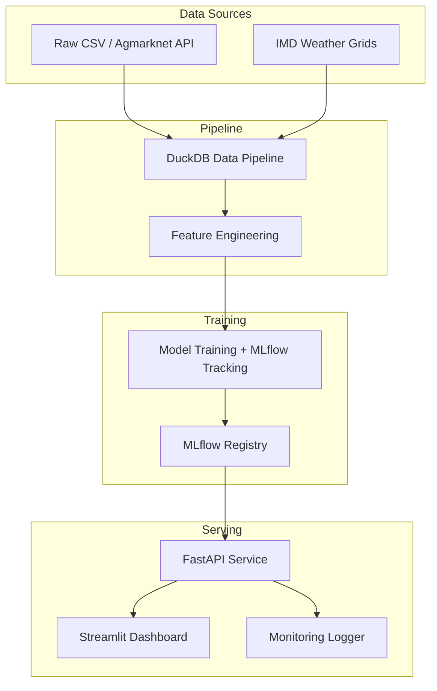

<h1 style="margin:0; font-size:2.2em; font-weight:700; color:#E0E0E0; letter-spacing:-0.5px;">
  
  System Design Document — Superstore Margin Intelligence Platform
</h1>
<h4 style="color:#94A3B8; font-weight:400; font-size:0.95em; margin:6px 0 0 0;">MandiIQ Documentation</h4>

<h2 style="font-family:-apple-system,BlinkMacSystemFont,'Segoe UI',Helvetica,Arial,sans-serif; font-size:1.5em; font-weight:600; color:#E0E0E0; display:flex; align-items:center; gap:10px; margin:0 0 16px 0; padding-bottom:8px; border-bottom:1px solid rgba(255,255,255,0.06);">
   1. Current Architecture
</h2>

 
<em style="color:#94A3B8;">Pre-rendered pipeline diagram — crisp at any zoom, identical on every platform</em>

<strong>Architecture source (Mermaid)</strong> — click to expand

<!-- Keep in sync with docs/assets/mermaid/system-design-architecture.mmd (regenerate the SVG with:
     npx mmdc -i docs/assets/mermaid/system-design-architecture.mmd -o docs/assets/svg/system-design-architecture.svg \
       -c docs/assets/mermaid/alche-config.json -p puppeteer.json -b "#0B0F1E" -s 2 -w 1600) -->

### Current tech stack
- **Data layer:** DuckDB (embedded analytical database), Python (pandas, numpy)
- **Orchestration:** Prefect (triggerable flows)
- **Experiment tracking:** MLflow (local file-store backend)
- **Serving:** FastAPI with Pydantic validation, auto-generated OpenAPI docs
- **Presentation:** Streamlit (dashboard), Plotly (visualizations)
- **Monitoring:** Custom request logging + drift detection (z-score based)
- **Deployment:** Docker Compose, Render (API), Streamlit Cloud (dashboard), Netlify (landing page)
- **CI/CD:** GitHub Actions (test + lint + build)

### Current data volume
- ~10K order lines (Superstore), ~27K crop records
- Feature dimensionality: 8 features for classifier
- Model size: ~2 MB (XGBoost)
- API inference latency: ~50-200ms on free-tier hosting

---

 

  

 

<h2 style="font-family:-apple-system,BlinkMacSystemFont,'Segoe UI',Helvetica,Arial,sans-serif; font-size:1.5em; font-weight:600; color:#E0E0E0; display:flex; align-items:center; gap:10px; margin:0 0 16px 0; padding-bottom:8px; border-bottom:1px solid rgba(255,255,255,0.06);">
   2. Scaling to 10M Orders/Day
</h2>

If this system needed to handle 10M orders/day instead of 10K total, the following changes would be required:

### 2.1 Ingestion &amp; Storage

| Current | At 10M/day |
|---|---|
| DuckDB (single-node, file-based) | Cloud warehouse (BigQuery / Snowflake / Redshift) |
| Batch CSV load | Streaming ingestion (Kafka / Kinesis) with real-time validation |
| Single-machine processing | Distributed processing (Spark / Beam) |
| SQLite log files | Cloud logging (CloudWatch / Stackdriver) |

**Data warehouse choice:** BigQuery would be preferred for this scale because:
- Serverless — no cluster management
- SQL-native — minimal migration from DuckDB patterns
- Built-in BI integration (Looker Studio)
- Streaming buffer for real-time inserts

### 2.2 Feature Engineering

| Current | At 10M/day |
|---|---|
| Single-machine pandas | Feature store (Feast / Tecton) |
| Ad-hoc feature computation | Point-in-time correct feature retrieval |
| One-off feature pipeline | Streaming feature computation |

**Feature store rationale:** At this scale, features need to be:
- Consistent across training and serving (point-in-time correctness)
- Reusable across models (no duplicate computation)
- Available with sub-100ms latency for online predictions
- Feast (open-source) or Tecton (managed) would serve this need.

### 2.3 Model Training &amp; Retraining

| Current | At 10M/day |
|---|---|
| Manual `python run_pipeline.py` | Scheduled retraining (Daily/Weekly) |
| One-off hyperparameter sweep | Automated HPO with Optuna + distributed execution |
| Single XGBoost model | Ensemble of models (per-category, per-region) |

**Retraining cadence:** With 10M new orders daily, a model trained on all historical data would become stale within weeks. A reasonable strategy:
- **Daily incremental training:** Update model with new day's data (warm-start from current weights)
- **Weekly full retrain:** Re-train from scratch on full historical window (sliding window of 90 days)
- **Champion/challenger:** Deploy new candidate model alongside current production, compare on a holdout

**Model architecture at scale:**
- Segmented models per category (Furniture, Technology, Office Supplies) — captures category-specific discount dynamics better than one global model
- Lightweight model for real-time inference (ONNX-runtime or TensorFlow Lite)
- Deep model for batch re-evaluations (e.g., hourly batch scoring)

### 2.4 API Serving

| Current | At 10M/day |
|---|---|
| Single FastAPI instance | Horizontal scaling (multiple instances behind load balancer) |
| In-process model loading | Model server (TorchServe / MLflow Serving / BentoML) |
| Synchronous inference | Async inference queue for complex models |
| 50-200ms latency | Target: <50ms p99 |

**Horizontal scaling setup:**
- Load balancer (ALB / Nginx) distributing across FastAPI instances
- Auto-scaling group based on CPU/memory utilization
- Model server sidecar (each instance loads model once from S3/GCS on startup)
- Redis cache for frequently requested predictions (e.g., common category × region combinations)

**Inference optimization:**
- Quantize XGBoost models (from float32 to float16/int8) for 2-4x speedup
- Batch inference for bulk scoring (e.g., overnight batch job for all open orders)
- Feature pre-computation for stable features (average discount per category only changes weekly)

### 2.5 Monitoring &amp; Observability

| Current | At 10M/day |
|---|---|
| Flat-file logging | Cloud logging + metrics (CloudWatch / Datadog) |
| Simple z-score drift detection | Evidently AI or WhyLabs for multivariate drift |
| Manual health check | Automated alerting (PagerDuty / Slack webhook) |
| Simulated traffic | Real user monitoring (RUM) |

**Monitoring dimensions:**
- **Operational:** Request volume, latency (p50/p95/p99), error rate, CPU/memory
- **Model:** Prediction distribution, feature drift, prediction drift, calibration
- **Business:** Average predicted loss probability over time, average recommended discount, forecast accuracy

### 2.6 Cost Estimate (10M orders/day)

| Component | Estimated monthly cost |
|---|---|
| BigQuery (storage + queries) | $500-2,000 |
| Compute (ECS/EKS, 10 instances) | $2,000-5,000 |
| Kafka/streaming | $500-1,500 |
| Feature store (Feast self-hosted) | $500-1,000 |
| Monitoring (Evidently + Datadog) | $1,000-3,000 |
| **Total** | **$4,500-12,500/mo** |

This is approximately $0.00015-0.00042 per prediction — within reasonable range for a B2B analytics product.

---

 

  

 

<h2 style="font-family:-apple-system,BlinkMacSystemFont,'Segoe UI',Helvetica,Arial,sans-serif; font-size:1.5em; font-weight:600; color:#E0E0E0; display:flex; align-items:center; gap:10px; margin:0 0 16px 0; padding-bottom:8px; border-bottom:1px solid rgba(255,255,255,0.06);">
   3. Failure Modes &amp; Mitigations
</h2>

### 3.1 Model Registry Unavailable at API Start
**Scenario:** MLflow server is down when FastAPI starts.
**Mitigation:** API loads the last-known-good model from a local fallback path (`models/loss_classifier_fallback.pkl`). The fallback is written by the pipeline after every successful training run.
**Degraded behavior:** The API serves predictions but cannot report model version or trigger retraining. Monitoring alerts on registry unavailability.

### 3.2 Drift Detected in Production
**Scenario:** Feature distribution shifts significantly (e.g., new product category added, discount behavior changes).
**Response:**
1. **Automated:** Monitoring system flags drift → triggers a Prefect retraining flow → new model auto-deployed to staging
2. **Human-in-the-loop:** Drift report sent to Slack → Data Scientist reviews → promotes to production (or rejects and investigates data quality issue)
3. **Fallback:** If drift is severe (>3σ on multiple features), API falls back to a simpler model (logistic regression) that is more robust to distribution shift

### 3.3 Training Pipeline Failure
**Scenario:** Data validation fails (unexpected schema, null violations).
**Response:**
1. Pipeline fails loudly (non-zero exit, logged error per FR-1.3)
2. Prefect retries with exponential backoff (max 3 retries)
3. If persistent failure: alert sent, last successful model remains in production
4. Root cause documented in pipeline run log

### 3.4 API Under Load
**Scenario:** Traffic spike exceeds instance capacity.
**Response:**
1. Auto-scaling (if containerized) or queue-based processing for async prediction
2. Rate limiting implemented at the API gateway (100 req/s per client)
3. Response caching for common prediction combinations
4. Graceful degradation: if model prediction unavailable, return heuristic baseline (average loss rate for category)

---

 

  

 

<h2 style="font-family:-apple-system,BlinkMacSystemFont,'Segoe UI',Helvetica,Arial,sans-serif; font-size:1.5em; font-weight:600; color:#E0E0E0; display:flex; align-items:center; gap:10px; margin:0 0 16px 0; padding-bottom:8px; border-bottom:1px solid rgba(255,255,255,0.06);">
   4. Trade-offs Made
</h2>

| Decision | Alternative | Why chosen |
|---|---|---|
| DuckDB over real warehouse | BigQuery / Snowflake | Cost: $0 vs $500+/mo. Data volume (10K rows) doesn't justify a warehouse. SQL compatibility means migration is straightforward. |
| Streamlit over custom frontend | React / Next.js | Build speed: one day vs one week. For a portfolio project, Streamlit's simplicity is a feature. The trade-off is UI flexibility. |
| Local MLflow over hosted | MLflow Cloud / Neptune | Cost: $0 vs $50+/mo. Local file-store is sufficient for a single-developer project. Cloud migration is zero-code (change tracking URI). |
| Simple z-score drift vs Evidently | Evidently / WhyLabs | Simplicity: 50 lines vs integrating a full monitoring platform. The drift check is functional and correct; Evidently can be added later. |
| Synthetic monitoring traffic | Real user traffic | Dataset is static — there are no real users. Labeling traffic as "simulated" is honest documentation, not a limitation. |
| Flat-file prediction logging | Logging database | For a portfolio project, CSV files are inspectable and sufficient. A real production system would use structured logging to CloudWatch/BigQuery. |
| One global model vs segmented | Per-category models | A single model with categorical features captures category effects via learned embeddings. Segmented models would improve accuracy but add deployment complexity. The trade-off is justified at this data volume. |
| Render free tier over Railway/Railway | Railway / Fly.io | Render's free tier (512MB RAM, 750 instance-hours/mo) is genuinely free with no card-required upgrades. Railway's free tier as of 2026 is $1/mo minimal-app-only. |

---

 

  

 

<h2 style="font-family:-apple-system,BlinkMacSystemFont,'Segoe UI',Helvetica,Arial,sans-serif; font-size:1.5em; font-weight:600; color:#E0E0E0; display:flex; align-items:center; gap:10px; margin:0 0 16px 0; padding-bottom:8px; border-bottom:1px solid rgba(255,255,255,0.06);">
   5. Interview Walkthrough
</h2>

If asked "Tell me about this system and how you'd scale it," the response should cover:

1. **One-sentence pitch:** "A margin intelligence system that predicts unprofitable discounts before approval — deployed as a decoupled API + dashboard with CI/CD and monitoring."

2. **Architecture walkthrough (60 seconds):** Data pipeline → Feature engineering → MLflow-tracked training → Model registry → FastAPI serving → Streamlit dashboard (point to diagram). Highlight the decoupling: "The dashboard never touches the model file — it calls the API, the same way any external service would."

3. **Scaling answer (90 seconds):** "At 10M orders/day, DuckDB becomes BigQuery, pandas becomes a feature store, one FastAPI instance becomes auto-scaled behind a load balancer, and flat-file monitoring becomes Datadog with Evidently-based drift detection. The cost would be roughly $0.0002 per prediction."

4. **Failure mode (30 seconds):** "If the model registry is down at startup, the API falls back to the last-known-good model. If drift is detected, it triggers automated retraining with a human-in-the-loop promotion gate."

5. **Trade-off (30 seconds):** "I chose DuckDB over a warehouse because for 10K rows, it's free and functionally equivalent. The SQL queries are identical — migrating to BigQuery later is a config change, not a rewrite."

The key is demonstrating that you've *thought* about each choice, not that you made the perfect one. Architecture is about trade-offs, and showing that you understand the trade-offs is what interviewers look for.

---

*End of System Design Document.*

 
<a href="#" style="display:inline-block; padding:8px 20px; border-radius:10px; background:linear-gradient(135deg, rgba(0,255,136,0.12) 0%, rgba(0,255,136,0.04) 100%); border:1px solid rgba(0,255,136,0.2); color:#00FF88; font-weight:500; text-decoration:none; font-size:14px;">&#x2191; Back to Top</a>
  

