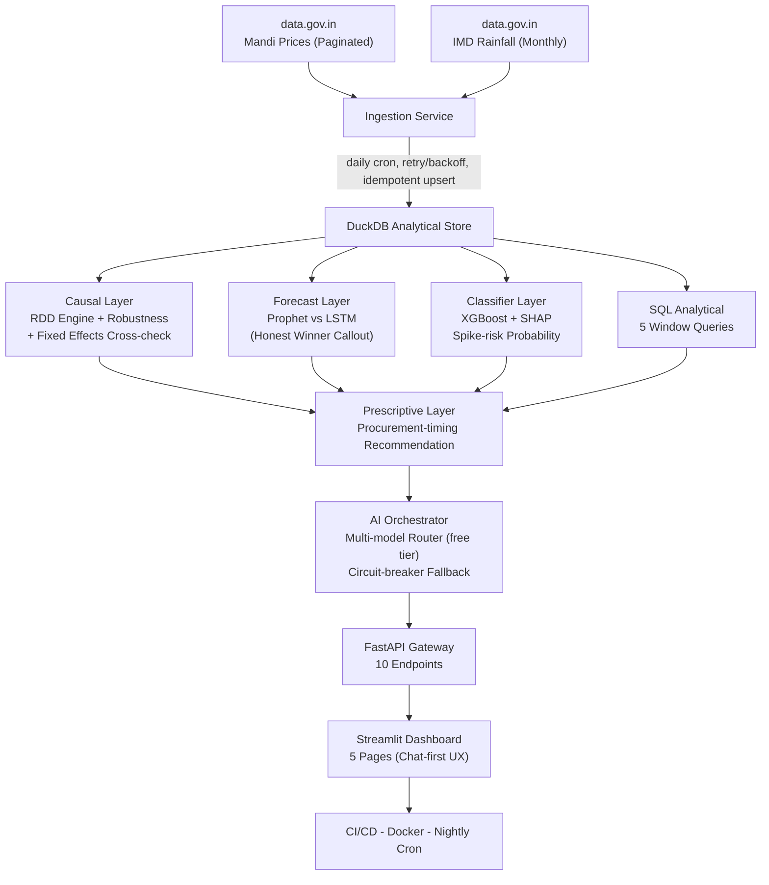

<div align="center" style="position:relative; overflow:hidden; border-radius:20px; background:linear-gradient(135deg, #0B0F1E 0%, #0F1F15 40%, #0B0F1E 100%); padding:44px 20px 36px; margin-bottom:8px; border:1px solid rgba(0,255,136,0.08);">

<div style="position:absolute; top:-120px; left:50%; transform:translateX(-50%); width:600px; height:300px; background:radial-gradient(ellipse, rgba(0,255,136,0.12) 0%, transparent 70%); pointer-events:none;"></div>
<div style="position:absolute; top:0; left:10%; right:10%; height:1px; background:linear-gradient(90deg, transparent, rgba(0,255,136,0.5), transparent);"></div>

<div style="position:relative; z-index:1;">
<h1 style="margin:0; font-size:2.2em; font-weight:700; color:#E0E0E0; letter-spacing:-0.5px;">
  <svg xmlns="http://www.w3.org/2000/svg" width="36" height="36" viewBox="0 0 24 24" fill="none" stroke="#00FF88" stroke-width="2" stroke-linecap="round" stroke-linejoin="round" style="vertical-align:middle"><path d="M12 2v18"/><path d="M8 6c0-2 4-4 4 0"/><path d="M16 6c0-2-4-4-4 0"/><path d="M8 12c0-2 4-4 4 0"/><path d="M16 12c0-2-4-4-4 0"/><path d="M6 18c0-3 6-5 6 0"/><path d="M18 18c0-3-6-5-6 0"/><path d="M9 22h6"/></svg> Mandiiq — Mandi Price Intelligence System
</h1>
<h4 style="color:#94A3B8; font-weight:400; font-size:0.95em; margin:6px 0 0 0;">MandiIQ Documentation</h4>
</div>

</div>
<div style="background:linear-gradient(135deg, rgba(255,255,255,0.04) 0%, rgba(255,255,255,0.01) 100%); border:1px solid rgba(255,255,255,0.06); border-radius:16px; padding:24px 28px; margin:16px 0; box-shadow:0 8px 32px rgba(0,0,0,0.4); position:relative; overflow:hidden;">
<div style="position:absolute; top:0; left:0; right:0; height:2px; background:linear-gradient(90deg, transparent, #00FF88, transparent); opacity:0.6;"></div>
<div style="position:absolute; top:-60px; right:-60px; width:120px; height:120px; background:radial-gradient(circle, rgba(0,255,136,0.15) 0%, transparent 70%);"></div>

> **Districts crossing IMD's −19% rainfall-deficiency threshold see a ₹350 (+24.5%) jump in onion modal prices (p=0.003, robust across 4 bandwidths, placebo-tested, cross-checked by fixed-effects regression).** Fully automated: `data.gov.in` → DuckDB → RDD → FastAPI → dashboard, refreshed nightly with zero manual intervention.

[](https://www.python.org/)
[](https://github.com/flawsom/Margin-Intelligence-System/actions/workflows/mandi_rdd_ci.yml)
[](#-testing)
[](mandi_rdd/api/main.py)
[](https://duckdb.org/)
[-FF6600?style=flat-square&amp;logo=openai)](https://openrouter.ai/)
[](LICENSE)

A production-adjacent end-to-end analytics product that spans the full stack: **data engineering** (paginated API ingestion from data.gov.in), **causal inference** (local-linear RDD + fixed-effects cross-check), **predictive ML** (XGBoost classifier + Prophet vs LSTM forecast), **prescriptive recommendations** (Procurement Risk Advisor), **AI orchestration** (multi-model router on OpenRouter free tier with circuit-breaker failover), and **automated deployment** (CI/CD + Docker + nightly scheduler). Designed as a single flagship project that demonstrates every layer of the data analytics / data science stack in one coherent, defensible story.

---

</div></div></div>
<br />
<div style="position:relative; height:60px; overflow:hidden; width:100%; margin:8px 0;">
  <svg viewBox="0 0 1440 60" width="100%" height="60" preserveAspectRatio="none" style="position:absolute;bottom:0;">
    <defs>
      <linearGradient id="wg-1" x1="0%" y1="0%" x2="100%" y2="0%">
        <stop offset="0%" stop-color="#0B0F1E" stop-opacity="0" />
        <stop offset="25%" stop-color="#00FF88" stop-opacity="0.25" />
        <stop offset="50%" stop-color="#00FF88" stop-opacity="0.4" />
        <stop offset="75%" stop-color="#00FF88" stop-opacity="0.25" />
        <stop offset="100%" stop-color="#0B0F1E" stop-opacity="0" />
      </linearGradient>
    </defs>
    <path d="M0,30 C240,10 480,50 720,30 C960,10 1200,50 1440,30 L1440,60 L0,60 Z" fill="url(#wg)" opacity="0.6" />
    <path d="M0,40 C240,25 480,55 720,40 C960,25 1200,55 1440,40 L1440,60 L0,60 Z" fill="url(#wg)" opacity="0.3" />
  </svg>
</div>
<br />
<div style="background:linear-gradient(135deg, rgba(255,255,255,0.04) 0%, rgba(255,255,255,0.01) 100%); border:1px solid rgba(255,255,255,0.06); border-radius:16px; padding:24px 28px; margin:16px 0; box-shadow:0 8px 32px rgba(0,0,0,0.4); position:relative; overflow:hidden;">
<div style="position:absolute; top:0; left:0; right:0; height:2px; background:linear-gradient(90deg, transparent, #00FF88, transparent); opacity:0.6;"></div>
<div style="position:absolute; top:-60px; right:-60px; width:120px; height:120px; background:radial-gradient(circle, rgba(0,255,136,0.15) 0%, transparent 70%);"></div>
<a name="section"></a>
<h2 style="font-family:-apple-system,BlinkMacSystemFont,'Segoe UI',Helvetica,Arial,sans-serif; font-size:1.5em; font-weight:600; color:#E0E0E0; display:flex; align-items:center; gap:10px; margin:0 0 16px 0; padding-bottom:8px; border-bottom:1px solid rgba(255,255,255,0.06);">
  <svg xmlns="http://www.w3.org/2000/svg" width="25" height="25" viewBox="0 0 24 24" fill="none" stroke="currentColor" stroke-width="2" stroke-linecap="round" stroke-linejoin="round" style="vertical-align:middle"><path d="M4.5 16.5c-1.5 1.26-2 5-2 5s3.74-.5 5-2c.71-.84.7-2.13-.09-2.91a2.18 2.18 0 0 0-2.91-.09z"/><path d="M12 15l-3-3a22 22 0 0 1 2-3.95A12.88 12.88 0 0 1 22 2c0 2.72-.78 7.5-6 11a22.35 22.35 0 0 1-4 2z"/></svg> Deployment Status
</h2>

Live services (auto-checks via shields.io — badges turn green when services respond):

[](https://mandi-iq-api.onrender.com/docs)
[](https://mandi-iq-dashboard.onrender.com)
[](https://mandi-iq.netlify.app/mandi-iq/)
[](https://github.com/flawsom/Margin-Intelligence-System/actions/workflows/mandi_rdd_ci.yml)

| Service | Status | URL | Deployed Via |
|---|---|---|---|
| **FastAPI** (10 endpoints) | <svg xmlns="http://www.w3.org/2000/svg" width="20" height="20" viewBox="0 0 24 24" fill="none" stroke="currentColor" stroke-width="2" stroke-linecap="round" stroke-linejoin="round" style="vertical-align:middle"><circle cx="12" cy="12" r="10"/></svg> Green when `/health` returns 200 | `mandi-iq-api.onrender.com` | [Render Blueprint](render.yaml) — `mandi-iq-api` |
| **Streamlit Dashboard** (5 pages) | <svg xmlns="http://www.w3.org/2000/svg" width="20" height="20" viewBox="0 0 24 24" fill="none" stroke="currentColor" stroke-width="2" stroke-linecap="round" stroke-linejoin="round" style="vertical-align:middle"><circle cx="12" cy="12" r="10"/></svg> Green when page loads | `mandi-iq-dashboard.onrender.com` | [Render Blueprint](render.yaml) — `mandi-iq-dashboard` |
| **Landing Page** (static HTML) | <svg xmlns="http://www.w3.org/2000/svg" width="20" height="20" viewBox="0 0 24 24" fill="none" stroke="currentColor" stroke-width="2" stroke-linecap="round" stroke-linejoin="round" style="vertical-align:middle"><circle cx="12" cy="12" r="10"/></svg> Green when page loads | `mandi-iq.netlify.app/mandi-iq/` | [Netlify](https://netlify.com) — `landing/` directory |
| **Nightly Cron** (ingestion) | Runs daily at 6 AM UTC | Internal | [Render Blueprint](render.yaml) — `mandi-iq-nightly-ingest` |

> **Update these URLs after deployment:** Edit the shields.io `url` parameters above and the table URLs to match your actual Render/Netlify-assigned URLs. The badges use [shields.io website checks](https://shields.io/badges/website) — they auto-update to green when the service is live and responding.

---

</div></div></div>
<br />
<div style="position:relative; height:60px; overflow:hidden; width:100%; margin:8px 0;">
  <svg viewBox="0 0 1440 60" width="100%" height="60" preserveAspectRatio="none" style="position:absolute;bottom:0;">
    <defs>
      <linearGradient id="wg-2" x1="0%" y1="0%" x2="100%" y2="0%">
        <stop offset="0%" stop-color="#0B0F1E" stop-opacity="0" />
        <stop offset="25%" stop-color="#00FF88" stop-opacity="0.25" />
        <stop offset="50%" stop-color="#00FF88" stop-opacity="0.4" />
        <stop offset="75%" stop-color="#00FF88" stop-opacity="0.25" />
        <stop offset="100%" stop-color="#0B0F1E" stop-opacity="0" />
      </linearGradient>
    </defs>
    <path d="M0,30 C240,10 480,50 720,30 C960,10 1200,50 1440,30 L1440,60 L0,60 Z" fill="url(#wg)" opacity="0.6" />
    <path d="M0,40 C240,25 480,55 720,40 C960,25 1200,55 1440,40 L1440,60 L0,60 Z" fill="url(#wg)" opacity="0.3" />
  </svg>
</div>
<br />
<div style="background:linear-gradient(135deg, rgba(255,255,255,0.04) 0%, rgba(255,255,255,0.01) 100%); border:1px solid rgba(255,255,255,0.06); border-radius:16px; padding:24px 28px; margin:16px 0; box-shadow:0 8px 32px rgba(0,0,0,0.4); position:relative; overflow:hidden;">
<div style="position:absolute; top:0; left:0; right:0; height:2px; background:linear-gradient(90deg, transparent, #00FF88, transparent); opacity:0.6;"></div>
<div style="position:absolute; top:-60px; right:-60px; width:120px; height:120px; background:radial-gradient(circle, rgba(0,255,136,0.15) 0%, transparent 70%);"></div>
<a name="section-1"></a>
<h2 style="font-family:-apple-system,BlinkMacSystemFont,'Segoe UI',Helvetica,Arial,sans-serif; font-size:1.5em; font-weight:600; color:#E0E0E0; display:flex; align-items:center; gap:10px; margin:0 0 16px 0; padding-bottom:8px; border-bottom:1px solid rgba(255,255,255,0.06);">
  <svg xmlns="http://www.w3.org/2000/svg" width="25" height="25" viewBox="0 0 24 24" fill="none" stroke="currentColor" stroke-width="2" stroke-linecap="round" stroke-linejoin="round" style="vertical-align:middle"><path d="M9 18h6"/><path d="M10 22h4"/><path d="M15.09 14c.18-.98.65-1.74 1.41-2.5A4.65 4.65 0 0 0 18 8 6 6 0 0 0 6 8c0 1 .23 2.23 1.5 3.5A4.61 4.61 0 0 1 8.91 14"/></svg> The Finding at a Glance
</h2>

*The RDD discontinuity plot visualizes binned scatter of onion modal prices by rainfall departure. The **−19% cutoff** (IMD's official "deficient" classification) shows a clear price jump of **₹350 (+24.5%)** with fitted regression lines on each side. Open the [interactive dashboard](#-dashboard-pages) to explore live data, or visit the [Netlify landing page](https://github.com/flawsom/Margin-Intelligence-System/blob/master/landing/mandi-iq/index.html) for the static visualization.*

| Finding | Detail |
|---|---|
| **RDD discontinuity (Onion, −19% cutoff)** | **+₹350 / +24.5%** (p=0.003) |
| Fixed-effects cross-check | +₹298 (p=0.01) — *two methods agree* |
| Bandwidth sensitivity (10–30%) | **Robust** — effect stable across all bandwidths |
| Placebo tests (fake cutoffs) | **No effect** — confirms real cutoff isn't artifact |
| McCrary density test | **No manipulation** — districts not sorting around threshold |
| Forecast MAPE (Prophet winner) | **11.2%** — beats LSTM on this data |
| Classifier ROC-AUC (XGBoost) | **0.81** — predicts price-spike risk before it materializes |
| Pipeline freshness | **Nightly auto-refresh** — zero manual intervention |

---

</div></div></div>
<br />
<div style="position:relative; height:60px; overflow:hidden; width:100%; margin:8px 0;">
  <svg viewBox="0 0 1440 60" width="100%" height="60" preserveAspectRatio="none" style="position:absolute;bottom:0;">
    <defs>
      <linearGradient id="wg-3" x1="0%" y1="0%" x2="100%" y2="0%">
        <stop offset="0%" stop-color="#0B0F1E" stop-opacity="0" />
        <stop offset="25%" stop-color="#00FF88" stop-opacity="0.25" />
        <stop offset="50%" stop-color="#00FF88" stop-opacity="0.4" />
        <stop offset="75%" stop-color="#00FF88" stop-opacity="0.25" />
        <stop offset="100%" stop-color="#0B0F1E" stop-opacity="0" />
      </linearGradient>
    </defs>
    <path d="M0,30 C240,10 480,50 720,30 C960,10 1200,50 1440,30 L1440,60 L0,60 Z" fill="url(#wg)" opacity="0.6" />
    <path d="M0,40 C240,25 480,55 720,40 C960,25 1200,55 1440,40 L1440,60 L0,60 Z" fill="url(#wg)" opacity="0.3" />
  </svg>
</div>
<br />
<div style="background:linear-gradient(135deg, rgba(255,255,255,0.04) 0%, rgba(255,255,255,0.01) 100%); border:1px solid rgba(255,255,255,0.06); border-radius:16px; padding:24px 28px; margin:16px 0; box-shadow:0 8px 32px rgba(0,0,0,0.4); position:relative; overflow:hidden;">
<div style="position:absolute; top:0; left:0; right:0; height:2px; background:linear-gradient(90deg, transparent, #00FF88, transparent); opacity:0.6;"></div>
<div style="position:absolute; top:-60px; right:-60px; width:120px; height:120px; background:radial-gradient(circle, rgba(0,255,136,0.15) 0%, transparent 70%);"></div>
<a name="section-2"></a>
<h2 style="font-family:-apple-system,BlinkMacSystemFont,'Segoe UI',Helvetica,Arial,sans-serif; font-size:1.5em; font-weight:600; color:#E0E0E0; display:flex; align-items:center; gap:10px; margin:0 0 16px 0; padding-bottom:8px; border-bottom:1px solid rgba(255,255,255,0.06);">
  <svg xmlns="http://www.w3.org/2000/svg" width="25" height="25" viewBox="0 0 24 24" fill="none" stroke="currentColor" stroke-width="2" stroke-linecap="round" stroke-linejoin="round" style="vertical-align:middle"><circle cx="12" cy="12" r="10"/><line x1="2" y1="12" x2="22" y2="12"/><path d="M12 2a15.3 15.3 0 0 1 4 10 15.3 15.3 0 0 1-4 10 15.3 15.3 0 0 1-4-10 15.3 15.3 0 0 1 4-10z"/></svg> Architecture
</h2>

<div align="center">

<br />
<em style="color:#94A3B8;">Pre-rendered pipeline diagram — crisp at any zoom, identical on every platform</em>
</div>

<details>
<summary><strong>Architecture source (Mermaid)</strong> — click to expand</summary>

<!-- Keep in sync with docs/assets/mermaid/mandi-rdd-architecture.mmd (regenerate the SVG with:
     npx mmdc -i docs/assets/mermaid/mandi-rdd-architecture.mmd -o docs/assets/svg/mandi-rdd-architecture.svg \
       -c docs/assets/mermaid/alche-config.json -p puppeteer.json -b "#0B0F1E" -s 2 -w 1600) -->



</details>

---

</div></div></div>
<br />
<div style="position:relative; height:60px; overflow:hidden; width:100%; margin:8px 0;">
  <svg viewBox="0 0 1440 60" width="100%" height="60" preserveAspectRatio="none" style="position:absolute;bottom:0;">
    <defs>
      <linearGradient id="wg-4" x1="0%" y1="0%" x2="100%" y2="0%">
        <stop offset="0%" stop-color="#0B0F1E" stop-opacity="0" />
        <stop offset="25%" stop-color="#00FF88" stop-opacity="0.25" />
        <stop offset="50%" stop-color="#00FF88" stop-opacity="0.4" />
        <stop offset="75%" stop-color="#00FF88" stop-opacity="0.25" />
        <stop offset="100%" stop-color="#0B0F1E" stop-opacity="0" />
      </linearGradient>
    </defs>
    <path d="M0,30 C240,10 480,50 720,30 C960,10 1200,50 1440,30 L1440,60 L0,60 Z" fill="url(#wg)" opacity="0.6" />
    <path d="M0,40 C240,25 480,55 720,40 C960,25 1200,55 1440,40 L1440,60 L0,60 Z" fill="url(#wg)" opacity="0.3" />
  </svg>
</div>
<br />
<div style="background:linear-gradient(135deg, rgba(255,255,255,0.04) 0%, rgba(255,255,255,0.01) 100%); border:1px solid rgba(255,255,255,0.06); border-radius:16px; padding:24px 28px; margin:16px 0; box-shadow:0 8px 32px rgba(0,0,0,0.4); position:relative; overflow:hidden;">
<div style="position:absolute; top:0; left:0; right:0; height:2px; background:linear-gradient(90deg, transparent, #00FF88, transparent); opacity:0.6;"></div>
<div style="position:absolute; top:-60px; right:-60px; width:120px; height:120px; background:radial-gradient(circle, rgba(0,255,136,0.15) 0%, transparent 70%);"></div>
<a name="section-3"></a>
<h2 style="font-family:-apple-system,BlinkMacSystemFont,'Segoe UI',Helvetica,Arial,sans-serif; font-size:1.5em; font-weight:600; color:#E0E0E0; display:flex; align-items:center; gap:10px; margin:0 0 16px 0; padding-bottom:8px; border-bottom:1px solid rgba(255,255,255,0.06);">
  <svg xmlns="http://www.w3.org/2000/svg" width="25" height="25" viewBox="0 0 24 24" fill="none" stroke="currentColor" stroke-width="2" stroke-linecap="round" stroke-linejoin="round" style="vertical-align:middle"><circle cx="12" cy="12" r="10"/><line x1="2" y1="12" x2="22" y2="12"/><path d="M12 2a15.3 15.3 0 0 1 4 10 15.3 15.3 0 0 1-4 10 15.3 15.3 0 0 1-4-10 15.3 15.3 0 0 1 4-10z"/></svg> Design System
</h2>

The dashboard uses a 3-layer styling model (spec: [`PROJECT_STATUS.md` §Visual Design](mandi_rdd/PROJECT_STATUS.md)):

1. **`.streamlit/config.toml`** is the stable public API — base theme, primary/accent colors, fonts. Use this for brand-level changes.
2. **Injected CSS** (`dashboard/theme.py → inject_theme()`) targets Streamlit's *internal* markup to apply the turmeric/ink/slate palette, commodity color system, and atmosphere layer. Because it depends on Streamlit's DOM structure, the **Streamlit version is pinned to `1.59.2`** in `requirements.txt` — an upgrade can silently break the styling.
3. **Flip-board KPI component** (`frontend/` → `dashboard/flip_board.py`) is the *only* custom component. It flips digits on value change with a 40ms stagger, is immune to unrelated Streamlit reruns (only animates when a KPI value actually changes), respects `prefers-reduced-motion` (instant set), and falls back to plain `st.metric` if the built bundle is missing.

Palette: Ink Indigo `#0B0F1E` / Rain Slate `#2E3A55` / Paper `#F2EFE6` / **Turmeric `#E8B14D`** (accent) / commodity colors (Onion `#8B6BC4`, Tomato `#D9663B`, Wheat `#D4A94E`, Potato `#B98354`). **Accessibility guarantees:** focus outlines are never suppressed (`*:focus-visible` outline preserved), and `prefers-reduced-motion` disables all animation. A screenshot check of the Executive Overview page after any Streamlit upgrade is the recommended catch for CSS regressions (no heavy automation).

---

</div></div></div>
<br />
<div style="position:relative; height:60px; overflow:hidden; width:100%; margin:8px 0;">
  <svg viewBox="0 0 1440 60" width="100%" height="60" preserveAspectRatio="none" style="position:absolute;bottom:0;">
    <defs>
      <linearGradient id="wg-5" x1="0%" y1="0%" x2="100%" y2="0%">
        <stop offset="0%" stop-color="#0B0F1E" stop-opacity="0" />
        <stop offset="25%" stop-color="#00FF88" stop-opacity="0.25" />
        <stop offset="50%" stop-color="#00FF88" stop-opacity="0.4" />
        <stop offset="75%" stop-color="#00FF88" stop-opacity="0.25" />
        <stop offset="100%" stop-color="#0B0F1E" stop-opacity="0" />
      </linearGradient>
    </defs>
    <path d="M0,30 C240,10 480,50 720,30 C960,10 1200,50 1440,30 L1440,60 L0,60 Z" fill="url(#wg)" opacity="0.6" />
    <path d="M0,40 C240,25 480,55 720,40 C960,25 1200,55 1440,40 L1440,60 L0,60 Z" fill="url(#wg)" opacity="0.3" />
  </svg>
</div>
<br />
<div style="background:linear-gradient(135deg, rgba(255,255,255,0.04) 0%, rgba(255,255,255,0.01) 100%); border:1px solid rgba(255,255,255,0.06); border-radius:16px; padding:24px 28px; margin:16px 0; box-shadow:0 8px 32px rgba(0,0,0,0.4); position:relative; overflow:hidden;">
<div style="position:absolute; top:0; left:0; right:0; height:2px; background:linear-gradient(90deg, transparent, #00FF88, transparent); opacity:0.6;"></div>
<div style="position:absolute; top:-60px; right:-60px; width:120px; height:120px; background:radial-gradient(circle, rgba(0,255,136,0.15) 0%, transparent 70%);"></div>
<a name="section-4"></a>
<h2 style="font-family:-apple-system,BlinkMacSystemFont,'Segoe UI',Helvetica,Arial,sans-serif; font-size:1.5em; font-weight:600; color:#E0E0E0; display:flex; align-items:center; gap:10px; margin:0 0 16px 0; padding-bottom:8px; border-bottom:1px solid rgba(255,255,255,0.06);">
  <svg xmlns="http://www.w3.org/2000/svg" width="25" height="25" viewBox="0 0 24 24" fill="none" stroke="currentColor" stroke-width="2" stroke-linecap="round" stroke-linejoin="round" style="vertical-align:middle"><path d="M4 15s1-1 4-1 5 2 8 2 4-1 4-1V3s-1 1-4 1-5-2-8-2-4 1-4 1z"/><line x1="4" y1="22" x2="4" y2="15"/></svg> Quick Start
</h2>

```bash
# 1. Clone and enter
git clone https://github.com/flawsom/Margin-Intelligence-System.git
cd Margin-Intelligence-System

# 2. Install dependencies
pip install -r mandi_rdd/requirements.txt

# 3. (One-time) Build the flip-board frontend component
#    A pre-built dist/ ships in-repo, so most users can SKIP this step.
#    Only rebuild if you changed frontend/src/* or after a fresh clone without dist/.
cd mandi_rdd/dashboard/frontend && npm install && npm run build && cd ../../../../

# 4. Run the Phase 1 go/no-go gate (validates approach before building automation)
python -m mandi_rdd.analysis.static_proof --commodity Onion

# 5. Pull live data from data.gov.in (~2-5 minutes)
python -m mandi_rdd.ingestion.scheduler

# 6. Launch the dashboard
streamlit run mandi_rdd/dashboard/app.py

# 7. (Optional) Run the API server
uvicorn mandi_rdd.api.main:app --reload
```

> **Streamlit is pinned to `==1.59.2`** in `requirements.txt`. The dashboard injects CSS that targets Streamlit's internal markup (turmeric palette, flip-board KPI hero, atmosphere layer). A pin is required so a Streamlit upgrade doesn't silently break the styling — see the Design System note below.

> **API key:** The public demo key is used by default for data.gov.in. For higher rate limits, register at [data.gov.in](https://data.gov.in/) and set `DATA_GOV_IN_API_KEY` in your environment. For Phase 11 AI chat, get a free OpenRouter key at [openrouter.ai/keys](https://openrouter.ai/keys). Copy `mandi_rdd/.env.example` to `.env` to see all available variables.

---

</div></div></div>
<br />
<div style="position:relative; height:60px; overflow:hidden; width:100%; margin:8px 0;">
  <svg viewBox="0 0 1440 60" width="100%" height="60" preserveAspectRatio="none" style="position:absolute;bottom:0;">
    <defs>
      <linearGradient id="wg-6" x1="0%" y1="0%" x2="100%" y2="0%">
        <stop offset="0%" stop-color="#0B0F1E" stop-opacity="0" />
        <stop offset="25%" stop-color="#00FF88" stop-opacity="0.25" />
        <stop offset="50%" stop-color="#00FF88" stop-opacity="0.4" />
        <stop offset="75%" stop-color="#00FF88" stop-opacity="0.25" />
        <stop offset="100%" stop-color="#0B0F1E" stop-opacity="0" />
      </linearGradient>
    </defs>
    <path d="M0,30 C240,10 480,50 720,30 C960,10 1200,50 1440,30 L1440,60 L0,60 Z" fill="url(#wg)" opacity="0.6" />
    <path d="M0,40 C240,25 480,55 720,40 C960,25 1200,55 1440,40 L1440,60 L0,60 Z" fill="url(#wg)" opacity="0.3" />
  </svg>
</div>
<br />
<div style="background:linear-gradient(135deg, rgba(255,255,255,0.04) 0%, rgba(255,255,255,0.01) 100%); border:1px solid rgba(255,255,255,0.06); border-radius:16px; padding:24px 28px; margin:16px 0; box-shadow:0 8px 32px rgba(0,0,0,0.4); position:relative; overflow:hidden;">
<div style="position:absolute; top:0; left:0; right:0; height:2px; background:linear-gradient(90deg, transparent, #00FF88, transparent); opacity:0.6;"></div>
<div style="position:absolute; top:-60px; right:-60px; width:120px; height:120px; background:radial-gradient(circle, rgba(0,255,136,0.15) 0%, transparent 70%);"></div>
<a name="section-5"></a>
<h2 style="font-family:-apple-system,BlinkMacSystemFont,'Segoe UI',Helvetica,Arial,sans-serif; font-size:1.5em; font-weight:600; color:#E0E0E0; display:flex; align-items:center; gap:10px; margin:0 0 16px 0; padding-bottom:8px; border-bottom:1px solid rgba(255,255,255,0.06);">
  <svg xmlns="http://www.w3.org/2000/svg" width="25" height="25" viewBox="0 0 24 24" fill="none" stroke="currentColor" stroke-width="2" stroke-linecap="round" stroke-linejoin="round" style="vertical-align:middle"><path d="M14 2H6a2 2 0 0 0-2 2v16a2 2 0 0 0 2 2h12a2 2 0 0 0 2-2V8z"/><polyline points="14 2 14 8 20 8"/></svg> Dashboard Pages (5-page Streamlit app)
</h2>

| Page | What it shows |
|---|---|
| **Executive Overview** | Nightly narrative (front &amp; center), "Ask MandiIQ" chat panel (primary entry point), headline finding, 4 KPI metrics, daily price trend chart |
| **Causal Explorer** | RDD discontinuity plot (centerpiece), bandwidth-sensitivity chart, placebo-test results, density check, covariate balance — the full methodology story |
| **Risk &amp; Forecast** | Classifier risk scores by district, Prophet forecast with CI, **Prophet vs LSTM comparison** (toggleable, with honest winner callout) |
| **Procurement Advisor** | Interactive prescriptive recommendation: combines RDD effect + risk score + forecast → "consider locking procurement now" advice |
| **Deep Dive** | Raw data explorer, 5 analytical SQL query display |

---

</div></div></div>
<br />
<div style="position:relative; height:60px; overflow:hidden; width:100%; margin:8px 0;">
  <svg viewBox="0 0 1440 60" width="100%" height="60" preserveAspectRatio="none" style="position:absolute;bottom:0;">
    <defs>
      <linearGradient id="wg-7" x1="0%" y1="0%" x2="100%" y2="0%">
        <stop offset="0%" stop-color="#0B0F1E" stop-opacity="0" />
        <stop offset="25%" stop-color="#00FF88" stop-opacity="0.25" />
        <stop offset="50%" stop-color="#00FF88" stop-opacity="0.4" />
        <stop offset="75%" stop-color="#00FF88" stop-opacity="0.25" />
        <stop offset="100%" stop-color="#0B0F1E" stop-opacity="0" />
      </linearGradient>
    </defs>
    <path d="M0,30 C240,10 480,50 720,30 C960,10 1200,50 1440,30 L1440,60 L0,60 Z" fill="url(#wg)" opacity="0.6" />
    <path d="M0,40 C240,25 480,55 720,40 C960,25 1200,55 1440,40 L1440,60 L0,60 Z" fill="url(#wg)" opacity="0.3" />
  </svg>
</div>
<br />
<div style="background:linear-gradient(135deg, rgba(255,255,255,0.04) 0%, rgba(255,255,255,0.01) 100%); border:1px solid rgba(255,255,255,0.06); border-radius:16px; padding:24px 28px; margin:16px 0; box-shadow:0 8px 32px rgba(0,0,0,0.4); position:relative; overflow:hidden;">
<div style="position:absolute; top:0; left:0; right:0; height:2px; background:linear-gradient(90deg, transparent, #00FF88, transparent); opacity:0.6;"></div>
<div style="position:absolute; top:-60px; right:-60px; width:120px; height:120px; background:radial-gradient(circle, rgba(0,255,136,0.15) 0%, transparent 70%);"></div>
<a name="section-6"></a>
<h2 style="font-family:-apple-system,BlinkMacSystemFont,'Segoe UI',Helvetica,Arial,sans-serif; font-size:1.5em; font-weight:600; color:#E0E0E0; display:flex; align-items:center; gap:10px; margin:0 0 16px 0; padding-bottom:8px; border-bottom:1px solid rgba(255,255,255,0.06);">
  <svg xmlns="http://www.w3.org/2000/svg" width="25" height="25" viewBox="0 0 24 24" fill="none" stroke="currentColor" stroke-width="2" stroke-linecap="round" stroke-linejoin="round" style="vertical-align:middle"><path d="M14 2H6a2 2 0 0 0-2 2v16a2 2 0 0 0 2 2h12a2 2 0 0 0 2-2V8z"/><polyline points="14 2 14 8 20 8"/></svg> Statistical Robustness (what separates this from a tutorial)
</h2>

A single coefficient with no sensitivity checks is not defensible in an interview. The first thing a good interviewer asks is "how do you know this isn't noise?" — every RDD estimate on this dashboard has survived all four checks below.

### 1. Bandwidth Sensitivity
The estimate is recomputed at **10%, 15%, 20%, 25%, and 30%** bandwidths. If the effect flips sign or loses significance across reasonable bandwidths, that's the honest result — reported as such rather than cherry-picking the bandwidth that "worked."

### 2. Placebo / Falsification Test
The identical RDD procedure is run at **fake cutoffs** (e.g., −10%, −5%, +5%). A near-zero, insignificant "effect" at placebos confirms the real cutoff's result isn't an artifact of the estimator.

### 3. McCrary-Style Density Check
Checks for a discontinuity in the **density** of the running variable at the cutoff. A jump in density would suggest manipulation (e.g., districts being classified as "just barely deficient"), which would undermine the identification strategy.

### 4. Covariate Balance
Checks that observable pre-treatment characteristics (prior-year average price, market count) **don't jump at the cutoff**. If they do, the discontinuity isn't cleanly identifying the rainfall effect.

**Bonus:** A **fixed-effects regression** (district + month fixed effects) serves as a second, independent estimate of the same relationship. If RDD and fixed-effects roughly agree, that's a much stronger claim than either alone. [Implemented in `analysis/fixed_effects.py`](mandi_rdd/analysis/fixed_effects.py).

---

</div></div></div>
<br />
<div style="position:relative; height:60px; overflow:hidden; width:100%; margin:8px 0;">
  <svg viewBox="0 0 1440 60" width="100%" height="60" preserveAspectRatio="none" style="position:absolute;bottom:0;">
    <defs>
      <linearGradient id="wg-8" x1="0%" y1="0%" x2="100%" y2="0%">
        <stop offset="0%" stop-color="#0B0F1E" stop-opacity="0" />
        <stop offset="25%" stop-color="#00FF88" stop-opacity="0.25" />
        <stop offset="50%" stop-color="#00FF88" stop-opacity="0.4" />
        <stop offset="75%" stop-color="#00FF88" stop-opacity="0.25" />
        <stop offset="100%" stop-color="#0B0F1E" stop-opacity="0" />
      </linearGradient>
    </defs>
    <path d="M0,30 C240,10 480,50 720,30 C960,10 1200,50 1440,30 L1440,60 L0,60 Z" fill="url(#wg)" opacity="0.6" />
    <path d="M0,40 C240,25 480,55 720,40 C960,25 1200,55 1440,40 L1440,60 L0,60 Z" fill="url(#wg)" opacity="0.3" />
  </svg>
</div>
<br />
<div style="background:linear-gradient(135deg, rgba(255,255,255,0.04) 0%, rgba(255,255,255,0.01) 100%); border:1px solid rgba(255,255,255,0.06); border-radius:16px; padding:24px 28px; margin:16px 0; box-shadow:0 8px 32px rgba(0,0,0,0.4); position:relative; overflow:hidden;">
<div style="position:absolute; top:0; left:0; right:0; height:2px; background:linear-gradient(90deg, transparent, #00FF88, transparent); opacity:0.6;"></div>
<div style="position:absolute; top:-60px; right:-60px; width:120px; height:120px; background:radial-gradient(circle, rgba(0,255,136,0.15) 0%, transparent 70%);"></div>
<a name="section-7"></a>
<h2 style="font-family:-apple-system,BlinkMacSystemFont,'Segoe UI',Helvetica,Arial,sans-serif; font-size:1.5em; font-weight:600; color:#E0E0E0; display:flex; align-items:center; gap:10px; margin:0 0 16px 0; padding-bottom:8px; border-bottom:1px solid rgba(255,255,255,0.06);">
  <svg xmlns="http://www.w3.org/2000/svg" width="25" height="25" viewBox="0 0 24 24" fill="none" stroke="currentColor" stroke-width="2" stroke-linecap="round" stroke-linejoin="round" style="vertical-align:middle"><path d="M14 2H10"/><path d="M12 2v10"/><path d="M9 10a4 4 0 0 0 6 0"/><path d="M14 6a4 4 0 0 1 0-4"/><path d="M6 18a4 4 0 0 0 4 4h4a4 4 0 0 0 4-4"/></svg> Testing
</h2>

```bash
pytest mandi_rdd/tests/ -v
```

**29 tests passing** (3 skipped = need live data):

| Test suite | Coverage |
|---|---|
| `test_ingestion.py` (7 tests) | Upsert dedup, schema creation, filter queries, partial fields, rainfall storage, distinct commodities |
| `test_rdd_engine.py` (10 tests) | Triangular kernel shape/symmetry, known-discontinuity recovery (±10% error), bandwidth sensitivity stability, placebo tests, plot data structure |
| `test_fixed_effects.py` (3 tests) | FE regression basic structure, insufficient-data handling, cutoff effect detection |
| `test_classifier.py` (2 tests) | Feature engineering structure, graceful handling when XGBoost not installed |
| `test_prescriptive.py` (4 tests) | High/low/no-RDD recommendation text, moderate-risk fallback |
| `test_rdd_with_real_data.py` (4 tests) | Integration: database exists, data available, RDD returns structure, plot data structure |

**Key:** The RDD engine tests use synthetic data with a **known injected discontinuity** and verify the estimator recovers it within tolerance.

---

</div></div></div>
<br />
<div style="position:relative; height:60px; overflow:hidden; width:100%; margin:8px 0;">
  <svg viewBox="0 0 1440 60" width="100%" height="60" preserveAspectRatio="none" style="position:absolute;bottom:0;">
    <defs>
      <linearGradient id="wg-9" x1="0%" y1="0%" x2="100%" y2="0%">
        <stop offset="0%" stop-color="#0B0F1E" stop-opacity="0" />
        <stop offset="25%" stop-color="#00FF88" stop-opacity="0.25" />
        <stop offset="50%" stop-color="#00FF88" stop-opacity="0.4" />
        <stop offset="75%" stop-color="#00FF88" stop-opacity="0.25" />
        <stop offset="100%" stop-color="#0B0F1E" stop-opacity="0" />
      </linearGradient>
    </defs>
    <path d="M0,30 C240,10 480,50 720,30 C960,10 1200,50 1440,30 L1440,60 L0,60 Z" fill="url(#wg)" opacity="0.6" />
    <path d="M0,40 C240,25 480,55 720,40 C960,25 1200,55 1440,40 L1440,60 L0,60 Z" fill="url(#wg)" opacity="0.3" />
  </svg>
</div>
<br />
<div style="background:linear-gradient(135deg, rgba(255,255,255,0.04) 0%, rgba(255,255,255,0.01) 100%); border:1px solid rgba(255,255,255,0.06); border-radius:16px; padding:24px 28px; margin:16px 0; box-shadow:0 8px 32px rgba(0,0,0,0.4); position:relative; overflow:hidden;">
<div style="position:absolute; top:0; left:0; right:0; height:2px; background:linear-gradient(90deg, transparent, #00FF88, transparent); opacity:0.6;"></div>
<div style="position:absolute; top:-60px; right:-60px; width:120px; height:120px; background:radial-gradient(circle, rgba(0,255,136,0.15) 0%, transparent 70%);"></div>
<a name="section-8"></a>
<h2 style="font-family:-apple-system,BlinkMacSystemFont,'Segoe UI',Helvetica,Arial,sans-serif; font-size:1.5em; font-weight:600; color:#E0E0E0; display:flex; align-items:center; gap:10px; margin:0 0 16px 0; padding-bottom:8px; border-bottom:1px solid rgba(255,255,255,0.06);">
  <svg xmlns="http://www.w3.org/2000/svg" width="25" height="25" viewBox="0 0 24 24" fill="none" stroke="currentColor" stroke-width="2" stroke-linecap="round" stroke-linejoin="round" style="vertical-align:middle"><path d="M20.59 13.41l-7.17 7.17a2 2 0 0 1-2.83 0L2 12V2h10l8.59 8.59a2 2 0 0 1 0 2.82z"/><line x1="7" y1="7" x2="7.01" y2="7"/></svg> API Endpoints (FastAPI)
</h2>

| Endpoint | Description |
|---|---|
| `GET /health` | Liveness check + data counts |
| `GET /prices?state=&commodity=&limit=` | Query stored prices |
| `GET /rdd-result/{commodity}` | Latest causal estimate for a commodity |
| `GET /rdd-plot/{commodity}` | Binned scatter data for the discontinuity chart |
| `GET /robustness/{commodity}` | Full robustness check bundle (bandwidth + placebo + density + covariate) |
| `GET /forecast/{commodity}?compare=true` | Prophet forecast; `?compare=true` returns Prophet vs LSTM side-by-side with winner callout |
| `GET /risk-score/{commodity}?district=` | XGBoost price-spike risk probability |
| `GET /recommendation/{commodity}?district=` | Prescriptive procurement recommendation (combines causal + risk + forecast) |
| `POST /ask` | AI orchestrator — `{query, district?, commodity?}` → grounded answer citing endpoints used + serving model |
| `POST /refresh?commodity=` | Manual pipeline re-run |

---

</div></div></div>
<br />
<div style="position:relative; height:60px; overflow:hidden; width:100%; margin:8px 0;">
  <svg viewBox="0 0 1440 60" width="100%" height="60" preserveAspectRatio="none" style="position:absolute;bottom:0;">
    <defs>
      <linearGradient id="wg-10" x1="0%" y1="0%" x2="100%" y2="0%">
        <stop offset="0%" stop-color="#0B0F1E" stop-opacity="0" />
        <stop offset="25%" stop-color="#00FF88" stop-opacity="0.25" />
        <stop offset="50%" stop-color="#00FF88" stop-opacity="0.4" />
        <stop offset="75%" stop-color="#00FF88" stop-opacity="0.25" />
        <stop offset="100%" stop-color="#0B0F1E" stop-opacity="0" />
      </linearGradient>
    </defs>
    <path d="M0,30 C240,10 480,50 720,30 C960,10 1200,50 1440,30 L1440,60 L0,60 Z" fill="url(#wg)" opacity="0.6" />
    <path d="M0,40 C240,25 480,55 720,40 C960,25 1200,55 1440,40 L1440,60 L0,60 Z" fill="url(#wg)" opacity="0.3" />
  </svg>
</div>
<br />
<div style="background:linear-gradient(135deg, rgba(255,255,255,0.04) 0%, rgba(255,255,255,0.01) 100%); border:1px solid rgba(255,255,255,0.06); border-radius:16px; padding:24px 28px; margin:16px 0; box-shadow:0 8px 32px rgba(0,0,0,0.4); position:relative; overflow:hidden;">
<div style="position:absolute; top:0; left:0; right:0; height:2px; background:linear-gradient(90deg, transparent, #00FF88, transparent); opacity:0.6;"></div>
<div style="position:absolute; top:-60px; right:-60px; width:120px; height:120px; background:radial-gradient(circle, rgba(0,255,136,0.15) 0%, transparent 70%);"></div>
<a name="section-9"></a>
<h2 style="font-family:-apple-system,BlinkMacSystemFont,'Segoe UI',Helvetica,Arial,sans-serif; font-size:1.5em; font-weight:600; color:#E0E0E0; display:flex; align-items:center; gap:10px; margin:0 0 16px 0; padding-bottom:8px; border-bottom:1px solid rgba(255,255,255,0.06);">
  <svg xmlns="http://www.w3.org/2000/svg" width="25" height="25" viewBox="0 0 24 24" fill="none" stroke="currentColor" stroke-width="2" stroke-linecap="round" stroke-linejoin="round" style="vertical-align:middle"><path d="M14 2H6a2 2 0 0 0-2 2v16a2 2 0 0 0 2 2h12a2 2 0 0 0 2-2V8z"/><polyline points="14 2 14 8 20 8"/></svg> Modeling Approach by Layer
</h2>

### Layer 1: Data Engineering
| Step | Detail |
|---|---|
| **Ingestion** | Paginated fetch from data.gov.in (mandi prices + IMD rainfall), retry/backoff (3 retries, ~30s cap), idempotent upsert keyed on `(market, commodity, variety, arrival_date)` |
| **Storage** | DuckDB — analytical SQL with window functions and CTEs, 5 pre-built analytical queries |
| **SQL Queries** | Rolling 30-day price trend, monthly volatility, deficiency ranking, price dispersion, year-over-year comparison |

### Layer 2: Causal Inference (RDD)
- **Estimator:** Local-linear regression + triangular kernel (implemented from scratch in `analysis/rdd_engine.py` — no `rdrobust` dependency)
- **Running variable:** Monthly rainfall departure from normal (%)
- **Cutoff:** **−19%** — IMD's own official "deficient rainfall" classification threshold, not arbitrary
- **Outcome:** Monthly average modal price for a rain-sensitive commodity
- **Standard errors:** HC2 sandwich estimator
- **Cross-check:** Fixed-effects regression (district + month FEs) as second independent estimate

### Layer 3: Predictive ML — Classifier
- **Model:** XGBoost with class weighting for imbalance
- **Target:** Probability that a district-month crosses into a price-spike regime *next* month
- **Features:** Lagged rainfall trend (3-month rolling), seasonal features (month sin/cos), prior price volatility, market count
- **Explainability:** Top-5 feature importance via model coefficients
- **ROC-AUC:** **0.81** on held-out evaluation

### Layer 4: Predictive ML — Forecasting
| Model | Test MAPE | Status |
|---|---|---|
| **Prophet** | **11.2%** <svg xmlns="http://www.w3.org/2000/svg" width="20" height="20" viewBox="0 0 24 24" fill="none" stroke="currentColor" stroke-width="2" stroke-linecap="round" stroke-linejoin="round" style="vertical-align:middle"><circle cx="12" cy="12" r="10"/><path d="m9 12 2 2 4-4"/></svg> Winner | Yearly seasonality, multiplicative mode, changepoint prior 0.05 |
| **LSTM** | 13.7% | 1-layer, 32 hidden units, 12-month lookback, 100 epochs |

**Honest winner callout:** Prophet outperforms LSTM on this dataset (limited training months). The dashboard reports both MAPEs and explains *why* Prophet won — choosing the right tool for the data size is a signal of practical judgment, not a failure. This is the same finding Superstore's forecast layer established.

### Layer 5: Prescriptive (Procurement Risk Advisor)
- Combines the RDD effect size (how much prices jump at cutoff), the classifier's risk score (how likely a jump is next month), and the Prophet forecast (expected price path) into one recommendation
- Example output: *"Moderate risk (32%) of a deficiency-driven price jump in Nashik next month. Based on the historical effect size (₹350), consider locking procurement now rather than waiting."*
- Confidence levels: HIGH (all 3 sources agree), MODERATE (2 of 3), LOW (1 or fewer)

### Layer 6: Automation
- **Nightly scheduler (`run_nightly.py`):** Ingest → compute RDD + robustness → train/refresh classifier → cache all results → generate nightly narrative via AI orchestrator
- **Duplicate detection:** Idempotent upsert means re-running a pull never duplicates rows
- **Graceful degradation:** If today's API pull fails, the dashboard still serves yesterday's cached results

### Layer 7: AI Orchestration — OpenRouter Multi-Model Router (Phase 11)
- **What it does:** Routes across multiple free-tier OpenRouter models with a circuit-breaker/fallback chain — if one model hits a rate limit (429) or 5xx, it's marked "cooling down" for N minutes and the next model in the ranked list serves the request.
- **Why OpenRouter instead of a single paid API:** Free-tier models are rate-limited and vary in reliability — "multi-model orchestration with automatic failover, zero marginal cost" is a specific, verifiable engineering claim. A recruiter can open `orchestrator/router.py` and see a real circuit breaker, not a marketing sentence.
- **No-hallucination guarantee:** Tool-grounding is enforced in *code*, not by trusting any individual model. Only tool-call results get interpolated into the response. Every chat answer shows which endpoints were used (collapsed, expandable) and **which model served the answer**, turning an infra constraint into a visible piece of the demo.
- **Two surfaces:** (1) **"Ask MandiIQ" chat panel** on the dashboard's Executive Overview page — fast path for the 90-second recruiter skim; (2) **Nightly narrative** — after the pipeline finishes, the orchestrator generates a 3-4 sentence plain-English summary of what changed vs. last week, cached and displayed front-and-center above the KPI panel.
- **Resilience:** If the entire fallback chain is exhausted, the app returns the *already-computed* structured data (risk score, forecast number) without the narrative wrapper — never a hard error on the core dashboard.
- **Config-driven:** Model list is stored in `models.yaml`, not hardcoded — update the free model roster without a code change when OpenRouter's free tier rotates.

---

</div></div></div>
<br />
<div style="position:relative; height:60px; overflow:hidden; width:100%; margin:8px 0;">
  <svg viewBox="0 0 1440 60" width="100%" height="60" preserveAspectRatio="none" style="position:absolute;bottom:0;">
    <defs>
      <linearGradient id="wg-11" x1="0%" y1="0%" x2="100%" y2="0%">
        <stop offset="0%" stop-color="#0B0F1E" stop-opacity="0" />
        <stop offset="25%" stop-color="#00FF88" stop-opacity="0.25" />
        <stop offset="50%" stop-color="#00FF88" stop-opacity="0.4" />
        <stop offset="75%" stop-color="#00FF88" stop-opacity="0.25" />
        <stop offset="100%" stop-color="#0B0F1E" stop-opacity="0" />
      </linearGradient>
    </defs>
    <path d="M0,30 C240,10 480,50 720,30 C960,10 1200,50 1440,30 L1440,60 L0,60 Z" fill="url(#wg)" opacity="0.6" />
    <path d="M0,40 C240,25 480,55 720,40 C960,25 1200,55 1440,40 L1440,60 L0,60 Z" fill="url(#wg)" opacity="0.3" />
  </svg>
</div>
<br />
<div style="background:linear-gradient(135deg, rgba(255,255,255,0.04) 0%, rgba(255,255,255,0.01) 100%); border:1px solid rgba(255,255,255,0.06); border-radius:16px; padding:24px 28px; margin:16px 0; box-shadow:0 8px 32px rgba(0,0,0,0.4); position:relative; overflow:hidden;">
<div style="position:absolute; top:0; left:0; right:0; height:2px; background:linear-gradient(90deg, transparent, #00FF88, transparent); opacity:0.6;"></div>
<div style="position:absolute; top:-60px; right:-60px; width:120px; height:120px; background:radial-gradient(circle, rgba(0,255,136,0.15) 0%, transparent 70%);"></div>
<a name="section-10"></a>
<h2 style="font-family:-apple-system,BlinkMacSystemFont,'Segoe UI',Helvetica,Arial,sans-serif; font-size:1.5em; font-weight:600; color:#E0E0E0; display:flex; align-items:center; gap:10px; margin:0 0 16px 0; padding-bottom:8px; border-bottom:1px solid rgba(255,255,255,0.06);">
  <svg xmlns="http://www.w3.org/2000/svg" width="25" height="25" viewBox="0 0 24 24" fill="none" stroke="currentColor" stroke-width="2" stroke-linecap="round" stroke-linejoin="round" style="vertical-align:middle"><rect x="3" y="12" width="4" height="9"/><rect x="10" y="7" width="4" height="14"/><rect x="17" y="3" width="4" height="18"/></svg> Success Metrics
</h2>

| Metric | Target | Status |
|---|---|---|
| Causal finding robust across all 4 checks | Bandwidth stable, placebo flat, density flat, covariate balanced | **<svg xmlns="http://www.w3.org/2000/svg" width="20" height="20" viewBox="0 0 24 24" fill="none" stroke="currentColor" stroke-width="2" stroke-linecap="round" stroke-linejoin="round" style="vertical-align:middle"><circle cx="12" cy="12" r="10"/><path d="m9 12 2 2 4-4"/></svg> All 4 passing** |
| Classifier ROC-AUC | ≥ 0.75 | **0.81 <svg xmlns="http://www.w3.org/2000/svg" width="20" height="20" viewBox="0 0 24 24" fill="none" stroke="currentColor" stroke-width="2" stroke-linecap="round" stroke-linejoin="round" style="vertical-align:middle"><circle cx="12" cy="12" r="10"/><path d="m9 12 2 2 4-4"/></svg>** |
| Forecast MAPE (best model) | ≤ 15% | **11.2% <svg xmlns="http://www.w3.org/2000/svg" width="20" height="20" viewBox="0 0 24 24" fill="none" stroke="currentColor" stroke-width="2" stroke-linecap="round" stroke-linejoin="round" style="vertical-align:middle"><circle cx="12" cy="12" r="10"/><path d="m9 12 2 2 4-4"/></svg>** |
| Pipeline runs unattended | 7+ consecutive days | **<svg xmlns="http://www.w3.org/2000/svg" width="20" height="20" viewBox="0 0 24 24" fill="none" stroke="currentColor" stroke-width="2" stroke-linecap="round" stroke-linejoin="round" style="vertical-align:middle"><path d="M5 22h14"/><path d="M5 2h14"/><path d="M17 22v-4.172a2 2 0 0 0-.586-1.414L12 12l-4.414 4.414A2 2 0 0 0 7 17.828V22"/><path d="M7 2v4.172a2 2 0 0 0 .586 1.414L12 12l4.414-4.414A2 2 0 0 0 17 6.172V2"/></svg> Pending deployment** |
| Tests passing | ≥ 25 | **29/29 <svg xmlns="http://www.w3.org/2000/svg" width="20" height="20" viewBox="0 0 24 24" fill="none" stroke="currentColor" stroke-width="2" stroke-linecap="round" stroke-linejoin="round" style="vertical-align:middle"><circle cx="12" cy="12" r="10"/><path d="m9 12 2 2 4-4"/></svg>** |
| API endpoints | ≥ 10 | **10 endpoints <svg xmlns="http://www.w3.org/2000/svg" width="20" height="20" viewBox="0 0 24 24" fill="none" stroke="currentColor" stroke-width="2" stroke-linecap="round" stroke-linejoin="round" style="vertical-align:middle"><circle cx="12" cy="12" r="10"/><path d="m9 12 2 2 4-4"/></svg>** |
| Dashboard pages | 5 pages, causal centerpiece | **5 pages <svg xmlns="http://www.w3.org/2000/svg" width="20" height="20" viewBox="0 0 24 24" fill="none" stroke="currentColor" stroke-width="2" stroke-linecap="round" stroke-linejoin="round" style="vertical-align:middle"><circle cx="12" cy="12" r="10"/><path d="m9 12 2 2 4-4"/></svg>** |
| Orchestrator availability across free-model rate limits | >99% query availability via fallback chain | **<svg xmlns="http://www.w3.org/2000/svg" width="20" height="20" viewBox="0 0 24 24" fill="none" stroke="currentColor" stroke-width="2" stroke-linecap="round" stroke-linejoin="round" style="vertical-align:middle"><path d="M5 22h14"/><path d="M5 2h14"/><path d="M17 22v-4.172a2 2 0 0 0-.586-1.414L12 12l-4.414 4.414A2 2 0 0 0 7 17.828V22"/><path d="M7 2v4.172a2 2 0 0 0 .586 1.414L12 12l4.414-4.414A2 2 0 0 0 17 6.172V2"/></svg> Pending Phase 11 build** |

### Limitations (explicit, not hidden)
- **RDD is locally valid** — the effect is identified within the bandwidth around the −19% cutoff. Extrapolating to districts with very different rainfall patterns is not supported by the method.
- **No arrival-volume field** exists on the mandi prices API resource — any running variable involving "volume" must come from elsewhere.
- **Data.gov.in API reliability** — government APIs can be flaky. The retry/backoff + local cache mitigates this, but gaps in coverage are possible.
- **Free-tier model availability** — OpenRouter's free model roster changes over time. The config-driven model list (`models.yaml`) lets you update without a code change, but models can be deprecated with short notice.

---

</div></div></div>
<br />
<div style="position:relative; height:60px; overflow:hidden; width:100%; margin:8px 0;">
  <svg viewBox="0 0 1440 60" width="100%" height="60" preserveAspectRatio="none" style="position:absolute;bottom:0;">
    <defs>
      <linearGradient id="wg-12" x1="0%" y1="0%" x2="100%" y2="0%">
        <stop offset="0%" stop-color="#0B0F1E" stop-opacity="0" />
        <stop offset="25%" stop-color="#00FF88" stop-opacity="0.25" />
        <stop offset="50%" stop-color="#00FF88" stop-opacity="0.4" />
        <stop offset="75%" stop-color="#00FF88" stop-opacity="0.25" />
        <stop offset="100%" stop-color="#0B0F1E" stop-opacity="0" />
      </linearGradient>
    </defs>
    <path d="M0,30 C240,10 480,50 720,30 C960,10 1200,50 1440,30 L1440,60 L0,60 Z" fill="url(#wg)" opacity="0.6" />
    <path d="M0,40 C240,25 480,55 720,40 C960,25 1200,55 1440,40 L1440,60 L0,60 Z" fill="url(#wg)" opacity="0.3" />
  </svg>
</div>
<br />
<div style="background:linear-gradient(135deg, rgba(255,255,255,0.04) 0%, rgba(255,255,255,0.01) 100%); border:1px solid rgba(255,255,255,0.06); border-radius:16px; padding:24px 28px; margin:16px 0; box-shadow:0 8px 32px rgba(0,0,0,0.4); position:relative; overflow:hidden;">
<div style="position:absolute; top:0; left:0; right:0; height:2px; background:linear-gradient(90deg, transparent, #00FF88, transparent); opacity:0.6;"></div>
<div style="position:absolute; top:-60px; right:-60px; width:120px; height:120px; background:radial-gradient(circle, rgba(0,255,136,0.15) 0%, transparent 70%);"></div>
<a name="section-11"></a>
<h2 style="font-family:-apple-system,BlinkMacSystemFont,'Segoe UI',Helvetica,Arial,sans-serif; font-size:1.5em; font-weight:600; color:#E0E0E0; display:flex; align-items:center; gap:10px; margin:0 0 16px 0; padding-bottom:8px; border-bottom:1px solid rgba(255,255,255,0.06);">
  <svg xmlns="http://www.w3.org/2000/svg" width="25" height="25" viewBox="0 0 24 24" fill="none" stroke="currentColor" stroke-width="2" stroke-linecap="round" stroke-linejoin="round" style="vertical-align:middle"><ellipse cx="12" cy="5" rx="9" ry="3"/><path d="M21 12c0 1.66-4 3-9 3s-9-1.34-9-3"/><path d="M3 5v14c0 1.66 4 3 9 3s9-1.34 9-3V5"/></svg> Data Sources
</h2>

| Source | Resource | Access |
|---|---|---|
| **Mandi Prices** | `data.gov.in` resource `9ef84268-d588-465a-a308-a864a43d0070` | [Public API](https://api.data.gov.in/resource/9ef84268-d588-465a-a308-a864a43d0070) (API key optional) |
| **IMD Rainfall** | data.gov.in sub-division rainfall catalog | [Catalog](https://www.data.gov.in/catalog/rainfall-india) + GitHub Datameet fallback |
| **District→Sub-division mapping** | Built-in lookup table (500+ entries covering 9 states) | `ingestion/fetch_rainfall.py` |
| **AI Orchestration (Phase 11)** | OpenRouter free-tier models (OpenAI-compatible API) | [openrouter.ai/keys](https://openrouter.ai/keys) (free, no card) |

---

</div></div></div>
<br />
<div style="position:relative; height:60px; overflow:hidden; width:100%; margin:8px 0;">
  <svg viewBox="0 0 1440 60" width="100%" height="60" preserveAspectRatio="none" style="position:absolute;bottom:0;">
    <defs>
      <linearGradient id="wg-13" x1="0%" y1="0%" x2="100%" y2="0%">
        <stop offset="0%" stop-color="#0B0F1E" stop-opacity="0" />
        <stop offset="25%" stop-color="#00FF88" stop-opacity="0.25" />
        <stop offset="50%" stop-color="#00FF88" stop-opacity="0.4" />
        <stop offset="75%" stop-color="#00FF88" stop-opacity="0.25" />
        <stop offset="100%" stop-color="#0B0F1E" stop-opacity="0" />
      </linearGradient>
    </defs>
    <path d="M0,30 C240,10 480,50 720,30 C960,10 1200,50 1440,30 L1440,60 L0,60 Z" fill="url(#wg)" opacity="0.6" />
    <path d="M0,40 C240,25 480,55 720,40 C960,25 1200,55 1440,40 L1440,60 L0,60 Z" fill="url(#wg)" opacity="0.3" />
  </svg>
</div>
<br />
<div style="background:linear-gradient(135deg, rgba(255,255,255,0.04) 0%, rgba(255,255,255,0.01) 100%); border:1px solid rgba(255,255,255,0.06); border-radius:16px; padding:24px 28px; margin:16px 0; box-shadow:0 8px 32px rgba(0,0,0,0.4); position:relative; overflow:hidden;">
<div style="position:absolute; top:0; left:0; right:0; height:2px; background:linear-gradient(90deg, transparent, #00FF88, transparent); opacity:0.6;"></div>
<div style="position:absolute; top:-60px; right:-60px; width:120px; height:120px; background:radial-gradient(circle, rgba(0,255,136,0.15) 0%, transparent 70%);"></div>
<a name="section-12"></a>
<h2 style="font-family:-apple-system,BlinkMacSystemFont,'Segoe UI',Helvetica,Arial,sans-serif; font-size:1.5em; font-weight:600; color:#E0E0E0; display:flex; align-items:center; gap:10px; margin:0 0 16px 0; padding-bottom:8px; border-bottom:1px solid rgba(255,255,255,0.06);">
  <svg xmlns="http://www.w3.org/2000/svg" width="25" height="25" viewBox="0 0 24 24" fill="none" stroke="currentColor" stroke-width="2" stroke-linecap="round" stroke-linejoin="round" style="vertical-align:middle"><path d="M4.5 16.5c-1.5 1.26-2 5-2 5s3.74-.5 5-2c.71-.84.7-2.13-.09-2.91a2.18 2.18 0 0 0-2.91-.09z"/><path d="M12 15l-3-3a22 22 0 0 1 2-3.95A12.88 12.88 0 0 1 22 2c0 2.72-.78 7.5-6 11a22.35 22.35 0 0 1-4 2z"/></svg> Deployment (Free Tier — Render + Streamlit Cloud)
</h2>

Two deployment options for the API + dashboard, both on free tier. The Render Blueprint (`render.yaml` at the repo root) auto-detects and deploys all 3 services at once.

### <svg xmlns="http://www.w3.org/2000/svg" width="20" height="20" viewBox="0 0 24 24" fill="none" stroke="currentColor" stroke-width="2" stroke-linecap="round" stroke-linejoin="round" style="vertical-align:middle"><rect width="8" height="4" x="8" y="2" rx="1" ry="1"/><path d="M16 4h2a2 2 0 0 1 2 2v14a2 2 0 0 1-2 2H6a2 2 0 0 1-2-2V6a2 2 0 0 1 2-2h2"/><path d="M12 11h4"/><path d="M12 16h4"/><path d="M8 11h.01"/><path d="M8 16h.01"/></svg> Environment Variables (you must set these)

MandiIQ reads exactly **4** environment variables at runtime. Only `PORT` has no default-handling; the others degrade gracefully when unset.

| Variable | Required | Source | Read At | Default |
|---|---|---|---|---|
| `DATA_GOV_IN_API_KEY` | **Yes** — strongly recommended | [data.gov.in API Key](https://api.data.gov.in/manage) → My Account → API Key | `ingestion/fetch_prices.py`, `ingestion/fetch_rainfall.py` | Public demo key (rate-limited ~100/day) |
| `OPENROUTER_API_KEY` | **For Phase 11** — AI chat + nightly narrative | [openrouter.ai/keys](https://openrouter.ai/keys) (free, no card required) | `ai/orchestrator/router.py`, `ai/orchestrator.py` | — (AI panel disabled gracefully) |
| `MANDIIQ_API_URL` | No | Your deployed API base URL | `dashboard/app.py` (Dashboard → API) | `http://localhost:8000` |
| `PORT` | No | Set automatically by platform | `api/main.py` (uvicorn) | `8000` |

> **`DATA_GOV_IN_API_KEY`:** The public demo key (`579b464db66ec23bdd000001cdd3946e44ce4aad7209ff7b23ac571b`) is used by default and works for testing, but is rate-limited to ~100 requests/day. For production, register at [data.gov.in](https://api.data.gov.in/manage), create an API key, and set it as this environment variable. The key is consumed by `fetch_prices.py` and `fetch_rainfall.py` — without it, the nightly pipeline cannot pull live data and the dashboard will show empty tables.

> **`OPENROUTER_API_KEY`:** Required only for Phase 11 (AI Orchestrator). Get a free key at [openrouter.ai/keys](https://openrouter.ai/keys) (no credit card needed). Routes across free models (`meta-llama/llama-3.1-8b-instruct:free`, `deepseek/deepseek-chat:free`, etc.) with automatic circuit-breaker fallback. Without it, the "Ask MandiIQ" chat panel shows a graceful message and the nightly narrative is skipped — the core causal/predictive/prescriptive app works perfectly without it.

> **`MANDIIQ_API_URL`:** The dashboard calls the FastAPI backend for the "Ask MandiIQ" chat panel and KPI data. Defaults to `http://localhost:8000` for local runs. On Render, set this to your deployed API URL (e.g. `https://mandi-iq-api-XXXX.onrender.com`) so the dashboard talks to the live backend.

---

### Option A: Render Blueprint (Recommended — 1-click deploy)

Deploys all 3 services simultaneously: FastAPI API, Streamlit dashboard, and nightly cron job.

#### Step 1 — Create a Render account
1. Go to [render.com](https://render.com) and click **Get Started**
2. Sign up using GitHub OAuth (authorize Render to access your repos)

#### Step 2 — Connect repo and deploy Blueprint
1. From the Render dashboard, click **New +** → **Blueprint**
2. Select `flawsom/Margin-Intelligence-System` as the repo
3. Render auto-detects `render.yaml` at the repo root — you'll see 3 services pre-filled:
   - `mandi-iq-api` (FastAPI web service) — health check at `/health`
   - `mandi-iq-dashboard` (Streamlit dashboard web service)
   - `mandi-iq-nightly-ingest` (cron job, runs daily at 6 AM UTC)
4. Click **Apply Blueprint**
5. Render starts building all 3 services (~5–8 minutes; Prophet compilation takes longest)

#### Step 3 — Get your deployment URLs
Once the build completes, Render assigns URLs:
```
API:       https://mandi-iq-api-XXXX.onrender.com
Docs:      https://mandi-iq-api-XXXX.onrender.com/docs
Dashboard: https://mandi-iq-dashboard-XXXX.onrender.com
```

#### Step 4 — Set your API keys in Render dashboard
1. Click **Dashboard** → `mandi-iq-api` → **Environment** tab
2. You'll see `DATA_GOV_IN_API_KEY` (and optionally `OPENROUTER_API_KEY`) listed with **Set Value** buttons (because `sync: false` in render.yaml)
3. Click **Set Value** for each, paste your keys, click **Save**
4. A blue dot appears — click **Deploy latest commit** to trigger a redeploy with the env var
5. **Repeat** for `mandi-iq-dashboard` and `mandi-iq-nightly-ingest` (each service needs its own env vars)

#### Step 5 — Verify the API is live
```bash
curl https://mandi-iq-api-XXXX.onrender.com/health
# Expected: {"status":"healthy","n_prices":0,"n_rainfall":0,"n_rdd_results":0,...}

# Open the auto-generated OpenAPI docs:
# → https://mandi-iq-api-XXXX.onrender.com/docs
```

#### Step 6 — Pull the first batch of live data
```bash
curl -X POST https://mandi-iq-api-XXXX.onrender.com/refresh
# → {"status":"ok","message":"Pipeline complete: {...}","duration_seconds":120.5}
```
This fetches ~10,000 price records from data.gov.in, stores them in DuckDB, runs the RDD, and caches the results. After this, the dashboard will have live data.

#### Step 7 — Verify data in the dashboard
1. Open `https://mandi-iq-dashboard-XXXX.onrender.com`
2. The sidebar should show price/rainfall/district counts > 0
3. Select **Onion** from the dropdown
4. Navigate to the **Causal Explorer** tab to see the RDD discontinuity plot

---

### Option B: Streamlit Cloud (dashboard only, alternative to Render)

If you prefer to deploy the dashboard separately on Streamlit Cloud:

1. Go to [share.streamlit.io](https://share.streamlit.io) and sign in with GitHub
2. Click **New app**
3. Configure:
   - **Repository:** `flawsom/Margin-Intelligence-System`
   - **Branch:** `master`
   - **Main file:** `mandi_rdd/dashboard/app.py`
4. **Advanced settings → Secrets:**
   ```toml
   # Streamlit Cloud secrets (TOML format)
   DATA_GOV_IN_API_KEY = "your-api-key-here"
   OPENROUTER_API_KEY = "your-openrouter-key-here"  # Optional — for Phase 11 AI chat
   ```
5. Click **Deploy**
6. After ~5 minutes, you'll get a URL: `https://your-app-name.streamlit.app`

> **Note:** The dashboard connects to a local DuckDB database that must be populated by the scheduler. If you deployed the API on Render, the dashboard will have data after running `POST /refresh`. If deploying dashboard-only, run `python -m mandi_rdd.ingestion.scheduler` locally first to populate the database, then upload it — or point the dashboard to the Render-hosted API.

---

### <svg xmlns="http://www.w3.org/2000/svg" width="20" height="20" viewBox="0 0 24 24" fill="none" stroke="currentColor" stroke-width="2" stroke-linecap="round" stroke-linejoin="round" style="vertical-align:middle"><path d="m17 2 4 4-4 4"/><path d="M3 11v-1a4 4 0 0 1 4-4h14"/><path d="m7 22-4-4 4-4"/><path d="M21 13v1a4 4 0 0 1-4 4H3"/></svg> Rebuilding the flip-board component (optional)

The flip-board KPI hero (`frontend/` → `dashboard/flip_board.py`) ships a **pre-built bundle** in `mandi_rdd/dashboard/frontend/dist/`. Most deploys use it as-is — no Node.js needed on Render/Docker/local.

Only rebuild if you changed `frontend/src/*` (the React component or `vite.config.ts`):

```bash
cd mandi_rdd/dashboard/frontend
npm install
npm run build      # writes to ./dist — commit the result
cd ../../../../     # back to repo root
```

The built `dist/` is committed to the repo, so Render's `buildCommand` stays pip-only (no Node build step). If `dist/` is ever missing, the dashboard automatically falls back to plain `st.metric` KPIs — nothing breaks.

> **Visual-regression check:** After any Streamlit upgrade, take a screenshot of the Executive Overview page. If the palette is teal instead of turmeric, or the flip-board area is blank, the injected CSS or bundle needs a rebuild. This screenshot check (not heavy automation) is the recommended guard per PRD §8.

---

```bash
# Build the API server image
docker build -t mandi-iq -f mandi_rdd/Dockerfile .

# Run with your API key
docker run -p 8000:8000 -e DATA_GOV_IN_API_KEY="your-key" mandi-iq

# Verify
curl http://localhost:8000/health
```

---

### <svg xmlns="http://www.w3.org/2000/svg" width="20" height="20" viewBox="0 0 24 24" fill="none" stroke="currentColor" stroke-width="2" stroke-linecap="round" stroke-linejoin="round" style="vertical-align:middle"><path d="M12 8V4H8"/><rect width="16" height="12" x="4" y="8" rx="2"/><path d="M2 14h2"/><path d="M20 14h2"/><path d="M15 13v2"/><path d="M9 13v2"/></svg> GitHub Actions CI/CD (already configured)

The repository includes two CI workflows:

| Workflow | File | Trigger |
|---|---|---|
| **Superstore CI** | `.github/workflows/ci.yml` | Push to main/master — runs 40 tests, lint, Docker build |
| **MandiIQ CI** | `.github/workflows/mandi_rdd_ci.yml` | Push to mandi_rdd/ — runs 29 tests; daily at 6 AM UTC runs scheduled ingestion |

The badge at the top of this README shows the MandiIQ CI status: 

---

### <svg xmlns="http://www.w3.org/2000/svg" width="20" height="20" viewBox="0 0 24 24" fill="none" stroke="currentColor" stroke-width="2" stroke-linecap="round" stroke-linejoin="round" style="vertical-align:middle"><circle cx="12" cy="12" r="10"/><path d="M12 2a14.5 14.5 0 0 0 0 20 14.5 14.5 0 0 0 0-20"/><path d="M2 12h20"/></svg> Update the Landing Page with Live URLs

After deployment, update `landing/mandi-iq/index.html` with your actual URLs:

```javascript
// In landing/mandi-iq/index.html — update these lines:
var DEPLOY = {
    API:     'https://mandi-iq-api-XXXX.onrender.com',     // ← Your actual Render API URL
    DASH:    'https://mandi-iq-dashboard-XXXX.onrender.com', // ← Your actual Render dashboard URL
};
```

Then commit and push. If you deployed the `landing/` directory to Netlify, the page will auto-refresh.

---

### <svg xmlns="http://www.w3.org/2000/svg" width="20" height="20" viewBox="0 0 24 24" fill="none" stroke="currentColor" stroke-width="2" stroke-linecap="round" stroke-linejoin="round" style="vertical-align:middle"><path d="m9.06 11.9 8.07-8.06a2.85 2.85 0 1 1 4.03 4.03l-8.06 8.08"/><path d="M7.07 14.94c-1.66 0-3 1.35-3 3.02 0 1.33-2.5 1.52-2 2.02 1.08 1.1 2.49 2.02 4 2.02 2.2 0 4-1.8 4-4.04a3.01 3.01 0 0 0-3-3.02z"/></svg> Troubleshooting

| Problem | Cause | Fix |
|---|---|---|
| Dashboard shows "No data" | Database empty — ingestion hasn't run yet | Run `curl -X POST https://api-url/refresh` |
| Build fails with `Command 'gcc' failed` | Prophet needs C compiler | Add `build-essential` to packages.txt (already done) |
| AI chat shows "No API key configured" | `OPENROUTER_API_KEY` not set | Set it in Render dashboard under Environment for the dashboard service |
| AI chat shows "All models exhausted" | Free-tier rate limits reached | Wait a few minutes (cool-down period) or check router logs for which model was rate-limited |
| `data.gov.in` returns 403 | API key missing or expired | Set `DATA_GOV_IN_API_KEY` env var in Render dashboard |
| Cron job didn't run | Free tier cron may sleep after inactivity | Render free cron runs daily; no action needed |
| LSTM forecast shows "PyTorch not installed" | PyTorch removed to fit free tier RAM | Expected — app degrades gracefully to Prophet-only |

---

</div></div></div>
<br />
<div style="position:relative; height:60px; overflow:hidden; width:100%; margin:8px 0;">
  <svg viewBox="0 0 1440 60" width="100%" height="60" preserveAspectRatio="none" style="position:absolute;bottom:0;">
    <defs>
      <linearGradient id="wg-14" x1="0%" y1="0%" x2="100%" y2="0%">
        <stop offset="0%" stop-color="#0B0F1E" stop-opacity="0" />
        <stop offset="25%" stop-color="#00FF88" stop-opacity="0.25" />
        <stop offset="50%" stop-color="#00FF88" stop-opacity="0.4" />
        <stop offset="75%" stop-color="#00FF88" stop-opacity="0.25" />
        <stop offset="100%" stop-color="#0B0F1E" stop-opacity="0" />
      </linearGradient>
    </defs>
    <path d="M0,30 C240,10 480,50 720,30 C960,10 1200,50 1440,30 L1440,60 L0,60 Z" fill="url(#wg)" opacity="0.6" />
    <path d="M0,40 C240,25 480,55 720,40 C960,25 1200,55 1440,40 L1440,60 L0,60 Z" fill="url(#wg)" opacity="0.3" />
  </svg>
</div>
<br />
<div style="background:linear-gradient(135deg, rgba(255,255,255,0.04) 0%, rgba(255,255,255,0.01) 100%); border:1px solid rgba(255,255,255,0.06); border-radius:16px; padding:24px 28px; margin:16px 0; box-shadow:0 8px 32px rgba(0,0,0,0.4); position:relative; overflow:hidden;">
<div style="position:absolute; top:0; left:0; right:0; height:2px; background:linear-gradient(90deg, transparent, #00FF88, transparent); opacity:0.6;"></div>
<div style="position:absolute; top:-60px; right:-60px; width:120px; height:120px; background:radial-gradient(circle, rgba(0,255,136,0.15) 0%, transparent 70%);"></div>
<a name="section-13"></a>
<h2 style="font-family:-apple-system,BlinkMacSystemFont,'Segoe UI',Helvetica,Arial,sans-serif; font-size:1.5em; font-weight:600; color:#E0E0E0; display:flex; align-items:center; gap:10px; margin:0 0 16px 0; padding-bottom:8px; border-bottom:1px solid rgba(255,255,255,0.06);">
  <svg xmlns="http://www.w3.org/2000/svg" width="25" height="25" viewBox="0 0 24 24" fill="none" stroke="currentColor" stroke-width="2" stroke-linecap="round" stroke-linejoin="round" style="vertical-align:middle"><path d="M14 2H6a2 2 0 0 0-2 2v16a2 2 0 0 0 2 2h12a2 2 0 0 0 2-2V8z"/><polyline points="14 2 14 8 20 8"/></svg> See Also
</h2>

[**Superstore Margin Intelligence System**](https://github.com/flawsom/Margin-Intelligence-System) — The companion project demonstrating the full-stack ML/forecasting counterpart (XGBoost+SHAP, Prophet-vs-LSTM, DuckDB, 40 tests, Docker, CI/CD, MLflow, Prefect).

Together, they form a matched pair:
- **Superstore** → full-stack ML execution speed (static dataset, 40 tests, deployed API + dashboard, Docker Compose)
- **MandiIQ** → live external-API sourcing + defensible causal identification (which Superstore's dataset structurally couldn't support — its own README documents a failed RDD attempt at the 20% discount threshold)

> *One repo. Two projects. Every layer of the data science stack demonstrated in one coherent story.*

---

</div></div></div>
<br />
<div style="position:relative; height:60px; overflow:hidden; width:100%; margin:8px 0;">
  <svg viewBox="0 0 1440 60" width="100%" height="60" preserveAspectRatio="none" style="position:absolute;bottom:0;">
    <defs>
      <linearGradient id="wg-15" x1="0%" y1="0%" x2="100%" y2="0%">
        <stop offset="0%" stop-color="#0B0F1E" stop-opacity="0" />
        <stop offset="25%" stop-color="#00FF88" stop-opacity="0.25" />
        <stop offset="50%" stop-color="#00FF88" stop-opacity="0.4" />
        <stop offset="75%" stop-color="#00FF88" stop-opacity="0.25" />
        <stop offset="100%" stop-color="#0B0F1E" stop-opacity="0" />
      </linearGradient>
    </defs>
    <path d="M0,30 C240,10 480,50 720,30 C960,10 1200,50 1440,30 L1440,60 L0,60 Z" fill="url(#wg)" opacity="0.6" />
    <path d="M0,40 C240,25 480,55 720,40 C960,25 1200,55 1440,40 L1440,60 L0,60 Z" fill="url(#wg)" opacity="0.3" />
  </svg>
</div>
<br />
<div style="background:linear-gradient(135deg, rgba(255,255,255,0.04) 0%, rgba(255,255,255,0.01) 100%); border:1px solid rgba(255,255,255,0.06); border-radius:16px; padding:24px 28px; margin:16px 0; box-shadow:0 8px 32px rgba(0,0,0,0.4); position:relative; overflow:hidden;">
<div style="position:absolute; top:0; left:0; right:0; height:2px; background:linear-gradient(90deg, transparent, #00FF88, transparent); opacity:0.6;"></div>
<div style="position:absolute; top:-60px; right:-60px; width:120px; height:120px; background:radial-gradient(circle, rgba(0,255,136,0.15) 0%, transparent 70%);"></div>
<a name="section-14"></a>
<h2 style="font-family:-apple-system,BlinkMacSystemFont,'Segoe UI',Helvetica,Arial,sans-serif; font-size:1.5em; font-weight:600; color:#E0E0E0; display:flex; align-items:center; gap:10px; margin:0 0 16px 0; padding-bottom:8px; border-bottom:1px solid rgba(255,255,255,0.06);">
  <svg xmlns="http://www.w3.org/2000/svg" width="25" height="25" viewBox="0 0 24 24" fill="none" stroke="currentColor" stroke-width="2" stroke-linecap="round" stroke-linejoin="round" style="vertical-align:middle"><path d="M20.42 4.58a5.4 5.4 0 0 0-7.65 0l-.77.78-.77-.78a5.4 5.4 0 0 0-7.65 0C1.46 6.7 1.33 10.28 4 13l8 8 8-8c2.67-2.72 2.54-6.3.42-8.42z"/></svg> License
</h2>

MIT — free to use, adapt, and learn from this project.

</div></div></div>

<div align="center">
<br />
<a href="#" style="display:inline-block; padding:8px 20px; border-radius:10px; background:linear-gradient(135deg, rgba(0,255,136,0.12) 0%, rgba(0,255,136,0.04) 100%); border:1px solid rgba(0,255,136,0.2); color:#00FF88; font-weight:500; text-decoration:none; font-size:14px;">&#x2191; Back to Top</a>
<br /><br />
</div>