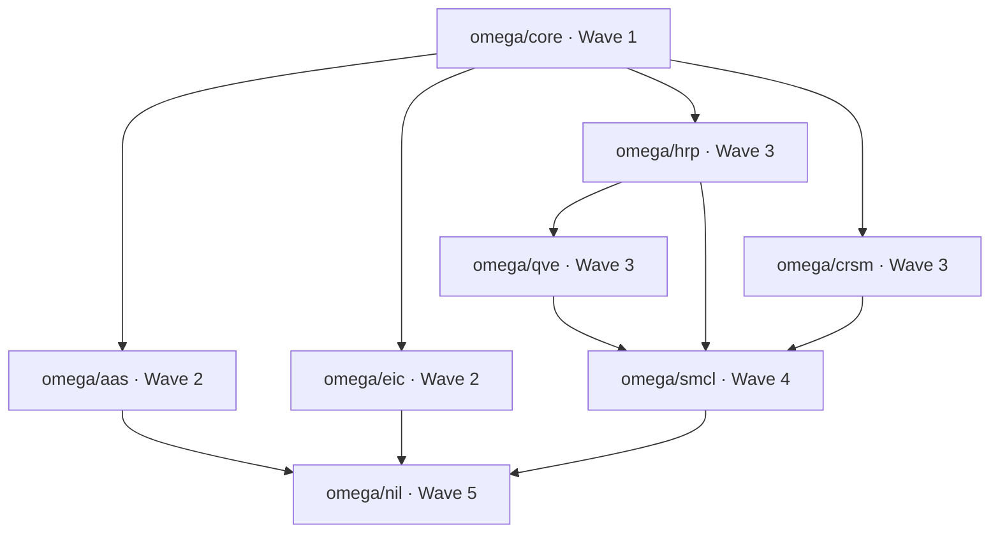

# Task Plan: MandiIQ Omega Implementation Roadmap

## Goal

Produce an implementation roadmap for **MandiIQ Omega** — the 7-layer intelligence stack (QVE / AAS / EIC / HRP / CRSM / SMCL / NIL) built on the existing FastAPI + Streamlit + DuckDB platform — including the module dependency graph, wave sequencing (with wave 2 = AAS/EIC unblocked for engineers), achievable-vs-aspirational prioritization, per-module definition-of-done, and ownership. Deliverables: `planning/task_plan.md`, `planning/findings.md`, `planning/progress.md`.

## Current Phase

Phase 2 (roadmap authored) — Phase 1 audit complete.

## Phases

### Phase 1: Requirements & Discovery ✅ complete

- [x] Understand leader intent (kickoff message + task board)
- [x] Audit repo: FastAPI / Streamlit / DuckDB / XGBoost / Prophet / RDD platform
- [x] Document audit in `findings.md`

### Phase 2: Roadmap Authoring 🚧 in_progress

- [x] Define Omega layer architecture (QVE/AAS/EIC/HRP/CRSM/SMCL/NIL)
- [x] Build module dependency graph + wave sequencing
- [x] Assign priority tiers (achievable vs aspirational) + DoD + ownership
- [x] Write `planning/task_plan.md`, `planning/findings.md`, `planning/progress.md`
- [ ] Report file paths + wave-2 dependency graph to leader

### Phase 3: Review & Handoff ⏳ pending

- [ ] Leader/engineers review dependency graph (esp. wave 2: AAS/EIC)
- [ ] Adjust wave sequencing on feedback
- [ ] Hand off wave 1–2 modules to engineers
- [ ] Tech PM picks up task `019fcc12-ee5f-7662-b231-0e0062924d08` (test suite expansion + integration verification)

## Omega Layer Architecture

Omega layers are new modules layered on the existing platform. Each layer maps to a **buildable Python module**; aspirational hardware (EEG, D-Wave, holograms) is **emulated** with classical/software equivalents.

| Layer | Name (working) | Purpose | Wave | Priority | Hardware reference → Emulation |
|---|---|---|---|---|---|
| **QVE** | Quantum Valuation Engine | Portfolio/procurement valuation & optimization | 3 | Tier 2 (achievable) | D-Wave annealer → **simulated annealing** + genetic search |
| **AAS** | Adaptive Alert System | Real-time anomaly/risk alerting (price, rainfall, NDVI, RDD) | 2 | Tier 1 (achievable) | — |
| **EIC** | Explainable Intelligence Core | SHAP/permutation explanations + causal narratives for every model output | 2 | Tier 1 (achievable) | — |
| **HRP** | Hierarchical Risk Parity | Hierarchical clustering + risk-parity commodity portfolio allocation | 3 | Tier 2 (achievable) | — |
| **CRSM** | Causal Risk Scenario Model | Scenario runner + Monte Carlo over RDD causal estimates | 3 | Tier 2 (achievable) | — |
| **SMCL** | Supply Market Clearing Layer | Market-clearing simulation → procurement quantity/price recommendations | 4 | Tier 3 (integration) | — |
| **NIL** | Neural Intelligence Layer | Neural forecasting, natural-language surface, immersive 3D visualization | 5 | Tier 4 (aspirational → emulated) | EEG → emulated neural-signal/attention models; hologram → **3D web (Three.js)** + Streamlit fallback |

## Module Dependency Graph

```
                       ┌─────────────────────────────┐
                       │  omega/core (Wave 1)        │
                       │  config · schema · registry │
                       └─────────────┬───────────────┘
                                     │ (unblocks all layers)
        ┌────────────────────────────┼────────────────────────────┐
        ▼                            ▼                            ▼
┌───────────────┐          ┌──────────────────┐        ┌───────────────────┐
│  omega/aas    │          │  omega/eic       │        │  omega/hrp        │
│  (Wave 2)     │          │  (Wave 2)        │        │  (Wave 3)         │
│  deps: core,  │          │  deps: core,     │        │  deps: core,      │
│  storage,     │          │  storage,        │        │  prices, forecast │
│  classifier,  │          │  classifier,     │        └─────────┬─────────┘
│  freshness    │          │  rdd_engine,     │                  │
└──────┬────────┘          │  ai/orchestrator │                  ▼
       │                   └────────┬─────────┘        ┌───────────────────┐
       │                            │                  │  omega/qve        │
       │                            │                  │  (Wave 3)         │
       │                            │                  │  deps: core, hrp, │
       │                            │                  │  forecast, storage│
       │                            │                  └─────────┬─────────┘
       │                            │                             │
       │                            ▼                             ▼
       │                   ┌──────────────────┐        ┌───────────────────┐
       │                   │  omega/crsm      │        │  omega/smcl       │
       │                   │  (Wave 3)        │        │  (Wave 4)         │
       │                   │  deps: core,     │        │  deps: qve, crsm, │
       │                   │  rdd_engine,     │        │  hrp, prescriptive│
       │                   │  robustness      │        └─────────┬─────────┘
       │                   └────────┬─────────┘                  │
       │                            │                            │
       └───────────────┬────────────┴────────────────────────────┘
                       ▼
              ┌───────────────────────────────┐
              │  omega/nil (Wave 5)           │
              │  deps: all layers +           │
              │  dashboard/frontend (Three.js)│
              └───────────────────────────────┘
```



### Adjacency (deps → dependent)

| Module | Depends on | Wave |
|---|---|---|
| omega/core | — (storage, api/main) | 1 |
| omega/aas | core, duckdb_store, classifier, freshness | 2 |
| omega/eic | core, duckdb_store, classifier, rdd_engine, ai/orchestrator | 2 |
| omega/hrp | core, duckdb_store, prices, forecast | 3 |
| omega/qve | core, hrp, forecast, storage | 3 |
| omega/crsm | core, rdd_engine, robustness, storage | 3 |
| omega/smcl | qve, crsm, hrp, prescriptive, forecast | 4 |
| omega/nil | smcl, eic, aas + dashboard/frontend (Three.js) | 5 |

## Wave Sequencing (12–16 weeks)

| Wave | Scope | Timing | Parallel-safe? |
|---|---|---|---|
| **1** | `omega/core` (config, schema, layer registry), CI hooks, `planning/` docs | W1–2 | — |
| **2** | **AAS + EIC** (leader's immediate need) | W3–5 | ✅ AAS ∥ EIC (no interdependency) |
| **3** | QVE (needs HRP) + HRP + CRSM | W6–9 | ⚠️ QVE blocked by HRP; CRSM independent |
| **4** | SMCL (consumes QVE/CRSM/HRP) | W10–12 | — |
| **5** | NIL (emulated; visualization can start early) | W13–16 | ⚠️ needs wave-2+ outputs |

## Priority Tiers

- **Tier 1 — Achievable, build now:** `omega/core`, AAS, EIC (pure software, existing data, high value).
- **Tier 2 — Achievable, build after:** QVE (simulated annealing — classical analog of quantum annealing), HRP, CRSM (all standard quant/stat methods on existing tables).
- **Tier 3 — Integration:** SMCL (composition layer; depends on Tier 2).
- **Tier 4 — Aspirational → Emulated:** NIL. EEG → emulated "neural-signal" attention models (LSTM/attention on price series) + synthetic signal dashboard; D-Wave → simulated annealing inside QVE; holograms → 3D web (Three.js already in repo) with Streamlit/2D fallback. **Hardware-gated features are explicitly out of scope; the roadmap ships software emulations only.**

## Definition of Done — Global (all modules)

1. Module lives in `mandi_rdd/omega/<layer>.py`, typed, no circular imports, imports cleanly.
2. Unit tests in `mandi_rdd/tests/test_omega_<layer>.py`; ≥80% coverage of pure logic; run under existing `pytest` (conftest.py present).
3. DuckDB tables created **idempotently** via `omega/core` schema, using INSERT OR REPLACE (avoids known DELETE+INSERT corruption pattern, see findings).
4. API endpoints registered in `mandi_rdd/api/omega.py` (FastAPI router) with OpenAPI docs + error handling.
5. Streamlit page surfaces module output (or documented integration point with the Visualization Engineer).
6. Data lineage + Prometheus metric where relevant.
7. Docs updated (this `planning/` + `docs/index.html`).

## Definition of Done — Per Module

| Module | Module-specific DoD |
|---|---|
| **core** | Layer registry lists all 7 layers with wave/status; schema applied idempotently; `/omega/status` endpoint reports layer health |
| **AAS** | Emits alerts on ≥1 signal class (price spike, rainfall deficit, NDVI anomaly, RDD significance); severity + dedup + persistence in `omega_alerts` table; alert history queryable via API |
| **EIC** | SHAP summary per commodity for classifier; causal narrative for RDD results (reuse orchestrator grounding); explanation stored per result row |
| **HRP** | Cluster dendrogram + risk-parity weights per portfolio; weights sum to 1; backtest Sharpe ≥ equal-weight baseline |
| **QVE** | Simulated-annealing optimizer returns feasible procurement portfolio with objective value; seed-reproducible; benchmark vs greedy baseline |
| **CRSM** | Scenario runner (rainfall shocks −20%/−30% …); Monte Carlo CIs on price impact using RDD point estimate + SE |
| **SMCL** | Clearing simulation (supply × demand) → recommended procurement qty/price band; integrates existing `prescriptive.py` |
| **NIL** | Neural forecast (LSTM/attention) comparison vs Prophet; NL surface reuses `/ask`; 3D viz via Three.js with Streamlit/2D fallback |

## Ownership

| Module | Owner (slot) | Role |
|---|---|---|
| omega/core, aas, eic, hrp, qve, crsm, smcl (backend) | Core Platform Engineer `019fcc12-690b-7442-bbbf-398818476369` | Backend + APIs + tests |
| omega/nil (presentation, 3D web, Streamlit pages) | Visualization Engineer `019fcc12-6e03-7801-a2eb-241fa4c6ca25` | Frontend/viz + data contracts |
| Omega design system, 3D fallbacks | Design Director `019fcc12-72ee-7100-b7dd-d22b3d0ae484` | UI/UX tokens + pages |
| Roadmap, dependency graph, integration verification, test expansion | Tech PM `019fcc12-7882-79c0-9912-92a1a55105cd` | PM + QA |

## Key Questions

1. Are the working layer names (QVE=Quantum Valuation Engine, etc.) the intended expansions, or does the leader have canonical definitions? (No Omega spec exists in the repo — verified.)
2. Should omega modules go in a new `mandi_rdd/omega/` package, or extend existing `analysis/`? (Recommend new package.)
3. Is there a target deadline that compresses wave 3/4?

## Decisions Made

| Decision | Rationale |
|---|---|
| Files written to `planning/` (root allowed by leader; `planning/` keeps repo root clean) | Leader: "root or /planning" |
| New `mandi_rdd/omega/` package | Keeps Omega separable from legacy analysis modules; clean import graph |
| Wave 2 = AAS + EIC, parallel-safe | Leader's explicit need for engineers now; zero interdependency between them |
| Aspirational hardware → software emulation only | EEG/D-Wave/holograms unavailable; simulated annealing + Three.js/Streamlit are drop-in stand-ins |
| INSERT OR REPLACE mandated in omega schema | Avoids known DuckDB DELETE+INSERT index corruption (HANDOFF §14.2) |

## Errors Encountered

| Error | Attempt | Resolution |
|---|---|---|
| `team_send_message` MCP → "local team tool returned an error" | 1–2 | CLI fallback also lacked runtime context (409); retried MCP later — subsequent calls succeeded (transient) |
| Grep for Omega/QVE in repo → no spec found | 1 | Layer definitions authored in this plan; flagged in Key Questions for leader confirmation |
