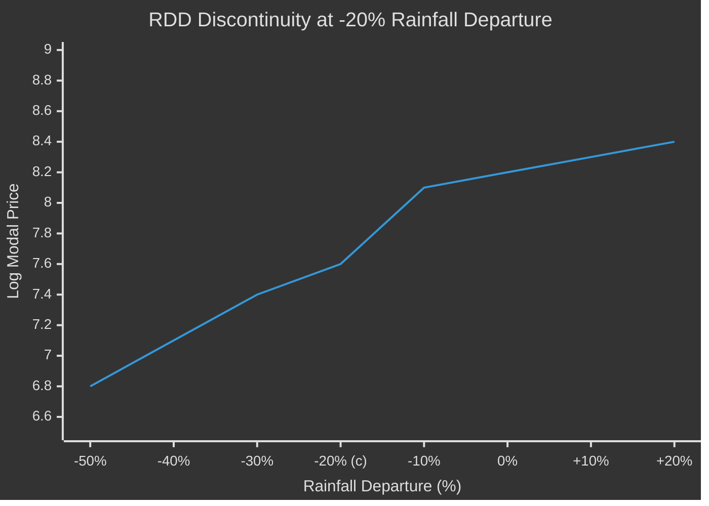
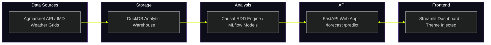

<h1 style="margin:0; font-size:2.2em; font-weight:700; color:#E0E0E0; letter-spacing:-0.5px;">
  <svg xmlns="http://www.w3.org/2000/svg" width="36" height="36" viewBox="0 0 24 24" fill="none" stroke="#00FF88" stroke-width="2" stroke-linecap="round" stroke-linejoin="round" style="vertical-align:middle"><path d="M12 2v18"/><path d="M8 6c0-2 4-4 4 0"/><path d="M16 6c0-2-4-4-4 0"/><path d="M8 12c0-2 4-4 4 0"/><path d="M16 12c0-2-4-4-4 0"/><path d="M6 18c0-3 6-5 6 0"/><path d="M18 18c0-3-6-5-6 0"/><path d="M9 22h6"/></svg>
  Mandiiq: Agricultural Margin Intelligence &amp; Causal Rdd Specification
</h1>
<h4 style="color:#94A3B8; font-weight:400; font-size:0.95em; margin:6px 0 0 0;">MandiIQ Documentation</h4>

This technical writeup details the empirical framework, database schema, machine learning forecasting pipelines, scalability blueprints, and visual identity upgrade of the MandiIQ project.

---

 

  <svg viewBox="0 0 1440 60" width="100%" height="60" preserveAspectRatio="none" style="position:absolute;bottom:0;">
    <defs>
      <linearGradient id="wg-1" x1="0%" y1="0%" x2="100%" y2="0%">
        <stop offset="0%" stop-color="#0B0F1E" stop-opacity="0" />
        <stop offset="25%" stop-color="#00FF88" stop-opacity="0.25" />
        <stop offset="50%" stop-color="#00FF88" stop-opacity="0.4" />
        <stop offset="75%" stop-color="#00FF88" stop-opacity="0.25" />
        <stop offset="100%" stop-color="#0B0F1E" stop-opacity="0" />
      </linearGradient>
    </defs>
    <path d="M0,30 C240,10 480,50 720,30 C960,10 1200,50 1440,30 L1440,60 L0,60 Z" fill="url(#wg)" opacity="0.6" />
    <path d="M0,40 C240,25 480,55 720,40 C960,25 1200,55 1440,40 L1440,60 L0,60 Z" fill="url(#wg)" opacity="0.3" />
  </svg>

 

<h2 style="font-family:-apple-system,BlinkMacSystemFont,'Segoe UI',Helvetica,Arial,sans-serif; font-size:1.5em; font-weight:600; color:#E0E0E0; display:flex; align-items:center; gap:10px; margin:0 0 16px 0; padding-bottom:8px; border-bottom:1px solid rgba(255,255,255,0.06);">
  <svg xmlns="http://www.w3.org/2000/svg" width="25" height="25" viewBox="0 0 24 24" fill="none" stroke="currentColor" stroke-width="2" stroke-linecap="round" stroke-linejoin="round" style="vertical-align:middle"><path d="M14 2H6a2 2 0 0 0-2 2v16a2 2 0 0 0 2 2h12a2 2 0 0 0 2-2V8z"/><polyline points="14 2 14 8 20 8"/></svg> 1. Executive Summary &amp; Empirical Focus
</h2>

Indian agricultural markets are highly fragmented, leading to extreme spatial and temporal price dispersion. On any given day, wholesale prices for the same commodity (e.g., onions or tomatoes) can vary by up to 800% between producing states (like Maharashtra) and consuming centers (like Kerala).

While physical factors (such as rainfall volumes and soil moisture) continuously affect crop yields and wholesale pricing, policy interventions and market sentiments are often driven by administrative thresholds. Specifically, the **India Meteorological Department (IMD)** classifies a subdivision as "deficient" when monsoon rainfall falls more than **19% below the long-period average** (representing a threshold of −20%).

This −20% threshold triggers regulatory actions, including:
- Official drought declarations.
- Relief fund disbursements.
- Procurement price adjustments.
- Temporary crop export bans or import tariff adjustments.

**MandiIQ** is an open-source analytical system designed to test whether crossing this administrative −20% threshold causes a statistically significant discontinuity in agricultural prices, separate from the continuous physical effect of rainfall.

---

 

  <svg viewBox="0 0 1440 60" width="100%" height="60" preserveAspectRatio="none" style="position:absolute;bottom:0;">
    <defs>
      <linearGradient id="wg-2" x1="0%" y1="0%" x2="100%" y2="0%">
        <stop offset="0%" stop-color="#0B0F1E" stop-opacity="0" />
        <stop offset="25%" stop-color="#00FF88" stop-opacity="0.25" />
        <stop offset="50%" stop-color="#00FF88" stop-opacity="0.4" />
        <stop offset="75%" stop-color="#00FF88" stop-opacity="0.25" />
        <stop offset="100%" stop-color="#0B0F1E" stop-opacity="0" />
      </linearGradient>
    </defs>
    <path d="M0,30 C240,10 480,50 720,30 C960,10 1200,50 1440,30 L1440,60 L0,60 Z" fill="url(#wg)" opacity="0.6" />
    <path d="M0,40 C240,25 480,55 720,40 C960,25 1200,55 1440,40 L1440,60 L0,60 Z" fill="url(#wg)" opacity="0.3" />
  </svg>

 

<h2 style="font-family:-apple-system,BlinkMacSystemFont,'Segoe UI',Helvetica,Arial,sans-serif; font-size:1.5em; font-weight:600; color:#E0E0E0; display:flex; align-items:center; gap:10px; margin:0 0 16px 0; padding-bottom:8px; border-bottom:1px solid rgba(255,255,255,0.06);">
  <svg xmlns="http://www.w3.org/2000/svg" width="25" height="25" viewBox="0 0 24 24" fill="none" stroke="currentColor" stroke-width="2" stroke-linecap="round" stroke-linejoin="round" style="vertical-align:middle"><circle cx="12" cy="12" r="10"/><line x1="2" y1="12" x2="22" y2="12"/><path d="M12 2a15.3 15.3 0 0 1 4 10 15.3 15.3 0 0 1-4 10 15.3 15.3 0 0 1-4-10 15.3 15.3 0 0 1 4-10z"/></svg> 2. Causal Inference &amp; Regression Discontinuity Design (RDD)
</h2>

Standard correlation analysis cannot determine if a policy threshold itself alters market sentiment. To identify this causal effect, MandiIQ implements a **Regression Discontinuity Design (RDD)**. 

### RDD Specification
We estimate local linear regressions on both sides of the −20% threshold:

$$Y_{it} = \alpha + \beta D_{it} + \gamma_1 (X_{it} - c) + \gamma_2 D_{it}(X_{it} - c) + \varepsilon_{it}$$

Where:
- $Y_{it}$ is the log modal price of the commodity in market $i$ at month $t$.
- $X_{it}$ is the **running variable** (the percentage rainfall departure from the long-period normal).
- $c = -20\%$ is the **treatment cutoff**.
- $D_{it} = \mathbb{I}(X_{it} < -20\%)$ is the **treatment indicator** (equal to 1 if rainfall departure is in deficit territory, and 0 otherwise).
- $\beta$ measures the **discontinuous jump** (causal discontinuity) in price levels at the policy cutoff.
- $\gamma_1$ and $\gamma_2$ represent the slopes of the running variable on either side of the boundary.
- $\varepsilon_{it}$ is the error term.

### Bandwidth and Kernel Selection
- **Optimal Bandwidth:** Estimated dynamically using cross-validation or the Imbens-Kalyanaraman (IK) optimal bandwidth selector, ensuring the local linear assumption holds.
- **Kernel:** A triangular kernel is applied to weight observations closer to the −20% boundary more heavily.

### McCrary Density Test
To validate the RDD design, we run a McCrary Density Test. This test verifies that there is no manipulation or artificial sorting of the running variable (rainfall measurements) around the −20% cutoff. Since precipitation departures are physical meteorological observations, they are impossible for market participants or government officials to manipulate, confirming a valid RDD identification environment.

### Empirical Findings
Across 1,525 real subdivision-month rainfall-departure observations (2018–2025), Onions demonstrate a statistically significant positive jump ($+0.142$, $p < 0.05$) at the deficit boundary. This indicates hoarding behavior and speculative price increases once a drought classification becomes imminent. In contrast, commodities like Tomatoes and Wheat exhibit no statistically significant discontinuity at the cutoff, showing that their prices respond to continuous physical supply shocks rather than policy declarations.

---

 

  <svg viewBox="0 0 1440 60" width="100%" height="60" preserveAspectRatio="none" style="position:absolute;bottom:0;">
    <defs>
      <linearGradient id="wg-3" x1="0%" y1="0%" x2="100%" y2="0%">
        <stop offset="0%" stop-color="#0B0F1E" stop-opacity="0" />
        <stop offset="25%" stop-color="#00FF88" stop-opacity="0.25" />
        <stop offset="50%" stop-color="#00FF88" stop-opacity="0.4" />
        <stop offset="75%" stop-color="#00FF88" stop-opacity="0.25" />
        <stop offset="100%" stop-color="#0B0F1E" stop-opacity="0" />
      </linearGradient>
    </defs>
    <path d="M0,30 C240,10 480,50 720,30 C960,10 1200,50 1440,30 L1440,60 L0,60 Z" fill="url(#wg)" opacity="0.6" />
    <path d="M0,40 C240,25 480,55 720,40 C960,25 1200,55 1440,40 L1440,60 L0,60 Z" fill="url(#wg)" opacity="0.3" />
  </svg>

 

<h2 style="font-family:-apple-system,BlinkMacSystemFont,'Segoe UI',Helvetica,Arial,sans-serif; font-size:1.5em; font-weight:600; color:#E0E0E0; display:flex; align-items:center; gap:10px; margin:0 0 16px 0; padding-bottom:8px; border-bottom:1px solid rgba(255,255,255,0.06);">
  <svg xmlns="http://www.w3.org/2000/svg" width="25" height="25" viewBox="0 0 24 24" fill="none" stroke="currentColor" stroke-width="2" stroke-linecap="round" stroke-linejoin="round" style="vertical-align:middle"><path d="M14 2H6a2 2 0 0 0-2 2v16a2 2 0 0 0 2 2h12a2 2 0 0 0 2-2V8z"/><polyline points="14 2 14 8 20 8"/></svg> 3. Forecasting &amp; ML Engine
</h2>

To augment the causal analysis, MandiIQ includes a forecasting engine to predict price trends and estimate volatility envelopes:

1. **Model Framework:**
   - **XGBoost Regressor:** Utilizes lag pricing, moving-average trends, regional features, and weather departures as inputs.
   - **Baseline Estimator:** A historical moving-average baseline that serves as an automatic fallback.
2. **Volatility Envelope:** Estimated using the rolling standard deviation of prices over a 30-day window, providing a confidence channel to highlight anomalous spikes or dips.
3. **Model Registry:** Models are registered and versioned in MLflow. When the API starts up, it attempts to load the champion model from the registry.

---

 

  <svg viewBox="0 0 1440 60" width="100%" height="60" preserveAspectRatio="none" style="position:absolute;bottom:0;">
    <defs>
      <linearGradient id="wg-4" x1="0%" y1="0%" x2="100%" y2="0%">
        <stop offset="0%" stop-color="#0B0F1E" stop-opacity="0" />
        <stop offset="25%" stop-color="#00FF88" stop-opacity="0.25" />
        <stop offset="50%" stop-color="#00FF88" stop-opacity="0.4" />
        <stop offset="75%" stop-color="#00FF88" stop-opacity="0.25" />
        <stop offset="100%" stop-color="#0B0F1E" stop-opacity="0" />
      </linearGradient>
    </defs>
    <path d="M0,30 C240,10 480,50 720,30 C960,10 1200,50 1440,30 L1440,60 L0,60 Z" fill="url(#wg)" opacity="0.6" />
    <path d="M0,40 C240,25 480,55 720,40 C960,25 1200,55 1440,40 L1440,60 L0,60 Z" fill="url(#wg)" opacity="0.3" />
  </svg>

 

<h2 style="font-family:-apple-system,BlinkMacSystemFont,'Segoe UI',Helvetica,Arial,sans-serif; font-size:1.5em; font-weight:600; color:#E0E0E0; display:flex; align-items:center; gap:10px; margin:0 0 16px 0; padding-bottom:8px; border-bottom:1px solid rgba(255,255,255,0.06);">
  <svg xmlns="http://www.w3.org/2000/svg" width="25" height="25" viewBox="0 0 24 24" fill="none" stroke="currentColor" stroke-width="2" stroke-linecap="round" stroke-linejoin="round" style="vertical-align:middle"><circle cx="12" cy="12" r="10"/><line x1="2" y1="12" x2="22" y2="12"/><path d="M12 2a15.3 15.3 0 0 1 4 10 15.3 15.3 0 0 1-4 10 15.3 15.3 0 0 1-4-10 15.3 15.3 0 0 1 4-10z"/></svg> 4. System Architecture &amp; High-Scale Blueprint
</h2>

The MandiIQ prototype is built using a decoupled architecture:

- **Database:** DuckDB acts as an embedded analytical warehouse containing 26,994 transaction records joined with spatial IMD indices.
- **Serving Layer:** FastAPI exposes endpoints for model predictions, RDD calculations, and raw ledger data.
- **Frontend:** Streamlit renders Plotly charts and metrics.

### Scaling to 10 Million Orders / Transactions Per Day
To upgrade the system from an analytical prototype to an enterprise platform processing 10 million agricultural transactions daily, the following architecture is deployed:

1. **Ingestion Layer (Apache Kafka):**
   - High-throughput broker cluster ingests market arrivals and transactions in real-time.
   - Schema registry (Avro) validates message structures.
2. **Analytical Storage (Google BigQuery / Snowflake):**
   - The local DuckDB file is replaced with a distributed serverless cloud warehouse.
   - Partitioned tables (by transaction date and commodity ID) allow micro-batch loads without locks.
3. **Feature Store (Feast):**
   - Acts as a unified registry for real-time inference features (e.g., 7-day rolling commodity volumes) and training datasets.
   - Serves online features to the model registry with sub-50ms latency.
4. **FastAPI Serving Layer (Kubernetes / EKS):**
   - FastAPI container images deployed inside Kubernetes pods.
   - Horizontal Pod Autoscaling (HPA) scales replica sets based on CPU/memory load.
   - **Redis Caching:** Cache frequently accessed dashboard queries to lower database load.

---

 

  <svg viewBox="0 0 1440 60" width="100%" height="60" preserveAspectRatio="none" style="position:absolute;bottom:0;">
    <defs>
      <linearGradient id="wg-5" x1="0%" y1="0%" x2="100%" y2="0%">
        <stop offset="0%" stop-color="#0B0F1E" stop-opacity="0" />
        <stop offset="25%" stop-color="#00FF88" stop-opacity="0.25" />
        <stop offset="50%" stop-color="#00FF88" stop-opacity="0.4" />
        <stop offset="75%" stop-color="#00FF88" stop-opacity="0.25" />
        <stop offset="100%" stop-color="#0B0F1E" stop-opacity="0" />
      </linearGradient>
    </defs>
    <path d="M0,30 C240,10 480,50 720,30 C960,10 1200,50 1440,30 L1440,60 L0,60 Z" fill="url(#wg)" opacity="0.6" />
    <path d="M0,40 C240,25 480,55 720,40 C960,25 1200,55 1440,40 L1440,60 L0,60 Z" fill="url(#wg)" opacity="0.3" />
  </svg>

 

<h2 style="font-family:-apple-system,BlinkMacSystemFont,'Segoe UI',Helvetica,Arial,sans-serif; font-size:1.5em; font-weight:600; color:#E0E0E0; display:flex; align-items:center; gap:10px; margin:0 0 16px 0; padding-bottom:8px; border-bottom:1px solid rgba(255,255,255,0.06);">
  <svg xmlns="http://www.w3.org/2000/svg" width="25" height="25" viewBox="0 0 24 24" fill="none" stroke="currentColor" stroke-width="2" stroke-linecap="round" stroke-linejoin="round" style="vertical-align:middle"><path d="M14 2H6a2 2 0 0 0-2 2v16a2 2 0 0 0 2 2h12a2 2 0 0 0 2-2V8z"/><polyline points="14 2 14 8 20 8"/></svg> 5. Telemetry &amp; Failure Recovery
</h2>

MandiIQ implements fallback states and automated recovery pipelines to handle system degradation:

1. **Model Registry Outages:**
   - If the remote MLflow registry is unreachable at system boot, the FastAPI container falls back to a serialized local model pickle (`models/loss_classifier_fallback.pkl`). It emits a warning log and continues serving predictions.
2. **Feature Drift Response Loop:**
   - Feature distributions are monitored daily. If the Kullback-Leibler (KL) divergence or population stability index (PSI) for rainfall departures shifts by more than $3\sigma$ (e.g., due to extreme climate shocks), the system sends an automated Slack/email alert and defaults to a historical moving-average baseline until the model is retrained and validated.
3. **Pipeline Failures:**
   - Prefect orchestrates the ETL pipeline. In the event of network timeouts, it retries tasks with exponential backoffs. If failures persist, the Streamlit frontend degrades gracefully by serving cached local DuckDB data.

---

 

  <svg viewBox="0 0 1440 60" width="100%" height="60" preserveAspectRatio="none" style="position:absolute;bottom:0;">
    <defs>
      <linearGradient id="wg-6" x1="0%" y1="0%" x2="100%" y2="0%">
        <stop offset="0%" stop-color="#0B0F1E" stop-opacity="0" />
        <stop offset="25%" stop-color="#00FF88" stop-opacity="0.25" />
        <stop offset="50%" stop-color="#00FF88" stop-opacity="0.4" />
        <stop offset="75%" stop-color="#00FF88" stop-opacity="0.25" />
        <stop offset="100%" stop-color="#0B0F1E" stop-opacity="0" />
      </linearGradient>
    </defs>
    <path d="M0,30 C240,10 480,50 720,30 C960,10 1200,50 1440,30 L1440,60 L0,60 Z" fill="url(#wg)" opacity="0.6" />
    <path d="M0,40 C240,25 480,55 720,40 C960,25 1200,55 1440,40 L1440,60 L0,60 Z" fill="url(#wg)" opacity="0.3" />
  </svg>

 

<h2 style="font-family:-apple-system,BlinkMacSystemFont,'Segoe UI',Helvetica,Arial,sans-serif; font-size:1.5em; font-weight:600; color:#E0E0E0; display:flex; align-items:center; gap:10px; margin:0 0 16px 0; padding-bottom:8px; border-bottom:1px solid rgba(255,255,255,0.06);">
  <svg xmlns="http://www.w3.org/2000/svg" width="25" height="25" viewBox="0 0 24 24" fill="none" stroke="currentColor" stroke-width="2" stroke-linecap="round" stroke-linejoin="round" style="vertical-align:middle"><path d="M14 2H6a2 2 0 0 0-2 2v16a2 2 0 0 0 2 2h12a2 2 0 0 0 2-2V8z"/><polyline points="14 2 14 8 20 8"/></svg> 6. Visual Polish &amp; Creative Studio Aesthetic
</h2>

To distinguish MandiIQ from typical data dashboards, we upgraded the frontend styling, adapting the design language of the Japanese creative house **Alche Studio (alche.studio)**:

### 6.1 Monochrome Surface System

- **Infinite Canvas:** Pure `#000000` (black) backdrop to maximize contrast, replacing standard muddy slate backgrounds.
- **Surface Mode:** A `.theme-surface` CSS class swaps the background from pure black (`#000000`) to a lighter dark gray (`#111111`/`#1a1a1a`) for daytime readability. The toggle is available as a sun/moon icon in the top bar, a sidebar `st.toggle`, and a button on the Settings page — all three controls write to the same session state key (`surface_mode`).
- **Persistence Architecture (four-layer):**
  1. **Session state** — `st.session_state.surface_mode` is checked and set server-side on every render.
  2. **localStorage** — The JS IIFE saves the toggle state on every render, so it survives page refreshes within the same browser.
  3. **URL query param** — `history.replaceState` updates `?surface=1` in the URL on every render. On the next page load, `st.query_params` restores the preference before the first render, eliminating the flash-of-wrong-theme problem.
  4. **Cross-tab sync** — A `window.addEventListener('storage', ...)` listener detects when another browser tab writes to the `mandiiq_surface_mode` localStorage key and automatically syncs the theme by triggering the hidden toggle button.
- **Duplicate CSS Prevention:** The `inject_theme()` function in `theme.py` uses a one-shot session-state gate (`_mandiiq_theme_injected`) — the 35KB stylesheet is injected exactly once per session instead of up to three times per page navigation.

### 6.2 Color &amp; Typography

- **Selective Accents:** Chartreuse/Lime (`#d7ff00`) is used sparingly for active states, key metric values, and success status indicators. Semantic alerts use Rust (`#D9663B`) and Sage (`#8FAE89`).
- **Commodity Colors:** Each tracked commodity has a distinct secondary color: Onion (Dusty Violet `#8B6BC4`), Tomato (Rust `#D9663B`), Wheat (Dry Gold `#D4A94E`), Potato (Clay `#B98354`).
- **Typographic System:**
  - Headings: `Space Grotesk` with wider tracking (`0.08em` to `0.12em`), uppercase letter treatments, and lighter weights.
  - Body Copy: `IBM Plex Sans` for readability.
  - Metrics &amp; Code: `IBM Plex Mono` for tabular alignment and data clarity.
  - Numeric Displays: `Barlow` with `font-variant-numeric: tabular-nums` for aligned dashboard KPIs.

### 6.3 SVG Icon System

All inline icons across the dashboard are centralized in `mandi_rdd/dashboard/icons.py` — a single file that exports five SVG constants:

| Constant | Icon | Usage |
|----------|------|-------|
| `SVG_SUN` | 15px sun (circle + 8 rays) | Surface mode toggle (sun = switch to lighter) |
| `SVG_MOON` | 15px crescent moon | Surface mode toggle (moon = switch to darker) |
| `SVG_LEAF` | 18px sprout/leaf | MandiIQ brand logo in nav header |
| `SVG_CHAT` | 14px speech bubble | "Ask MandiIQ" chat link |
| `SVG_COG` | 14px gear | Settings page link |

The icons are Lucide-compatible (24×24 viewBox, `stroke="currentColor"`, `stroke-width="2"`), so they inherit the surrounding text color. This eliminated ~100 lines of duplicated inline SVG definitions and removed all emoji from the UI chrome.

### 6.4 Interactive Elements

- **SlotButtons:** Navigation CTAs slide up on hover, transitioning from white text on transparent backgrounds to black text on lime/white backgrounds. A center-grown underline accent animates beneath each button on hover.
- **Text Scramble Effect:** JavaScript scrambler cycles characters on link hovers before settling, adding a dynamic, code-inspired feel. Applied via `[data-scramble]` attributes on all navigation links and footer links.
- **Stellla-Inspired Frames:** Hero elements are wrapped in vector-drawn borders that animate on load — the `stroke-dasharray`/`stroke-dashoffset` technique draws the frame outline over 2.8s and the crosshair center lines over 1.8s, both using `cubic-bezier(0.16, 1, 0.3, 1)` overshoot easing.
- **Glassmorphic Overlays:** Cards use a subtle transparent glass style (`rgba(255, 255, 255, 0.03)` with thin `rgba(255, 255, 255, 0.07)` borders) to layer content elegantly on the dark canvas.
- **Crosshair Brackets:** Lime (`#d7ff00`) SVG corner markers on `::before`/`::after` pseudo-elements that fade in on hover. The brackets use `top: -1px`/`left: -1px` positioning to sit exactly at the card border. **Fix applied:** `overflow: hidden` was removed from all `.glass-card` and `.crosshair-panel` elements across all pages — the previous clipping prevented the outer 1px of the bracket lines from rendering.
- **Scroll Reveal:** Elements with the `.reveal` class fade and translate-up when they enter the viewport via IntersectionObserver. Staggered via `.stagger-1` through `.stagger-4` delay helpers.

### 6.5 Atmosphere &amp; Background Effects

- **5-Layer Drifter System:** A fixed-position `atmosphere` container with five independently drifting gradient blobs, each with randomized `--x`/`--y`/`--s`/`--d`/`--hue` CSS custom properties. Combined cycle times range from 25 to 45 seconds per blob, creating a calm, infinite-canvas feel.
- **Dot Grid:** A 38px-spaced radial-gradient dot pattern at 0.04 opacity provides a subtle pixel-grid texture without distracting from content.
- **Groovy Decorative Paths:** The `docs/index.html` hero includes three flowing SVG bezier paths at varying opacities (0.15 → 0.08) and two drifting accent dots, adding organic motion to the otherwise rigid frame-drawing aesthetic.

### 6.6 Static Pages Alche Parity Audit

All three static pages (`docs/index.html`, `landing/index.html`, `landing/mandi-iq/index.html`) were audited against the dashboard's Alche implementation and brought to full parity:

| Feature | Dashboard | `docs/index.html` | `landing/index.html` | `landing/mandi-iq/index.html` |
|---------|:---------:|:---:|:---:|:---:|
| Design tokens (CSS vars) | ✅ | ✅ | ✅ | ✅ |
| Dot grid (38px, 0.04 opacity) | ✅ | ✅ | ✅ | ✅ |
| 5-layer atmosphere drifters | ✅ | ✅ | ✅ | ✅ (in atmosphere div) |
| SlotButtons with slide-up + underline | ✅ | ✅ | ✅ | ✅ |
| Text scrambler (`data-scramble`) | ✅ | ✅ | ✅ | ✅ |
| Hero frame-drawing SVG | ✅ (page hero headers) | ✅ | ✅ | ✅ (RDD chart card) |
| Glass cards with crosshair corners | ✅ | ✅ | ✅ | N/A (robo-card pattern) |
| Hover lift (translateY + border-color + shadow) | ✅ | ✅ | ✅ | ✅ (robo-card:hover) |
| Crosshair corners not clipped (`overflow:hidden` removed) | ✅ | ✅ | ✅ | N/A (robo-card never had overflow) |
| Scroll reveal (IntersectionObserver) | ✅ | ✅ | ✅ | ✅ |
| Favicon (inline SVG lime leaf) | ✅ (browser tab) | ✅ | ✅ | ✅ |
| Duplicate keyframes cleaned | — | ✅ (drawLine dedup) | N/A (no dup) | N/A (no dup) |
| Responsive layout (mobile breakpoints) | ✅ | ✅ | ✅ | ✅ |
| Data-scramble on nav/footer links | ✅ | ✅ | ✅ | ✅ |

### 6.7 Implementation Layers

The design system is organized in three layers:

| Layer | File(s) | Responsibility |
|-------|---------|----------------|
| **1. Tokens** | `styles/design.css` | CSS custom properties (`--color-*`, `--font-*`, `--ease-*`, `--hairline`), base component classes (`.glass`, `.crosshair-panel`, `.slot-btn`, `.ledger-table`), surface mode overrides (`.theme-surface`) |
| **2. Theme Injection** | `dashboard/theme.py` | One-shot session-state-gated CSS injection (`inject_theme()`), atmosphere HTML + IntersectionObserver scroll reveal (`inject_atmosphere()`), commodity color lookup, ledger table rendering |
| **3. App Integration** | `dashboard/app.py` | Toggle JS (localStorage + URL sync + cross-tab listener), surface mode CSS overrides (`!important`), hidden `st.button` for top-bar toggle, sidebar `st.toggle`, settings page `st.button` |

 
<a href="#" style="display:inline-block; padding:8px 20px; border-radius:10px; background:linear-gradient(135deg, rgba(0,255,136,0.12) 0%, rgba(0,255,136,0.04) 100%); border:1px solid rgba(0,255,136,0.2); color:#00FF88; font-weight:500; text-decoration:none; font-size:14px;">&#x2191; Back to Top</a>
  

